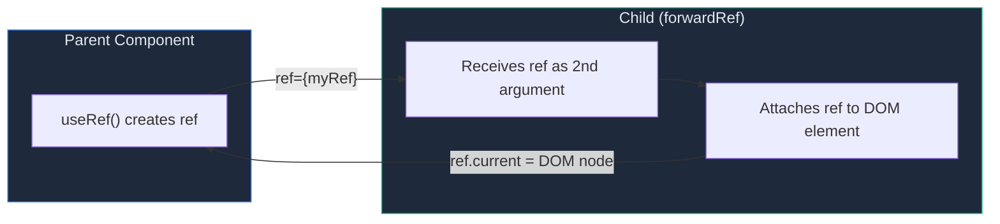
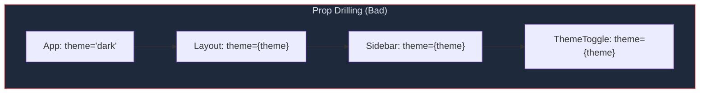
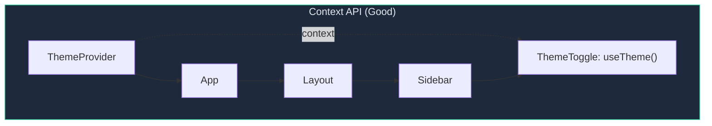
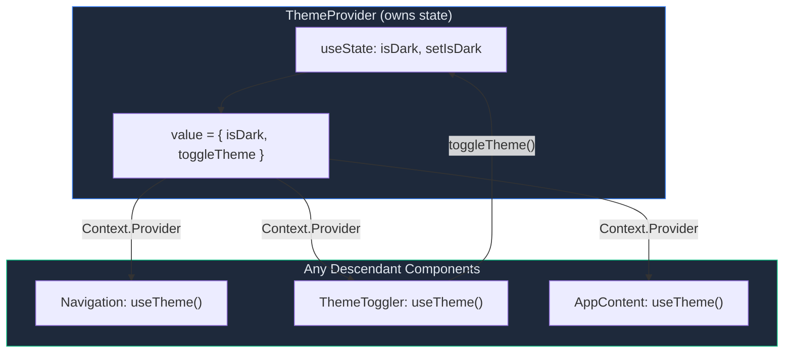
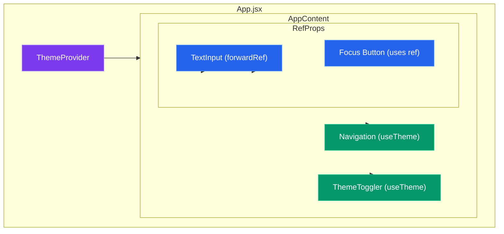
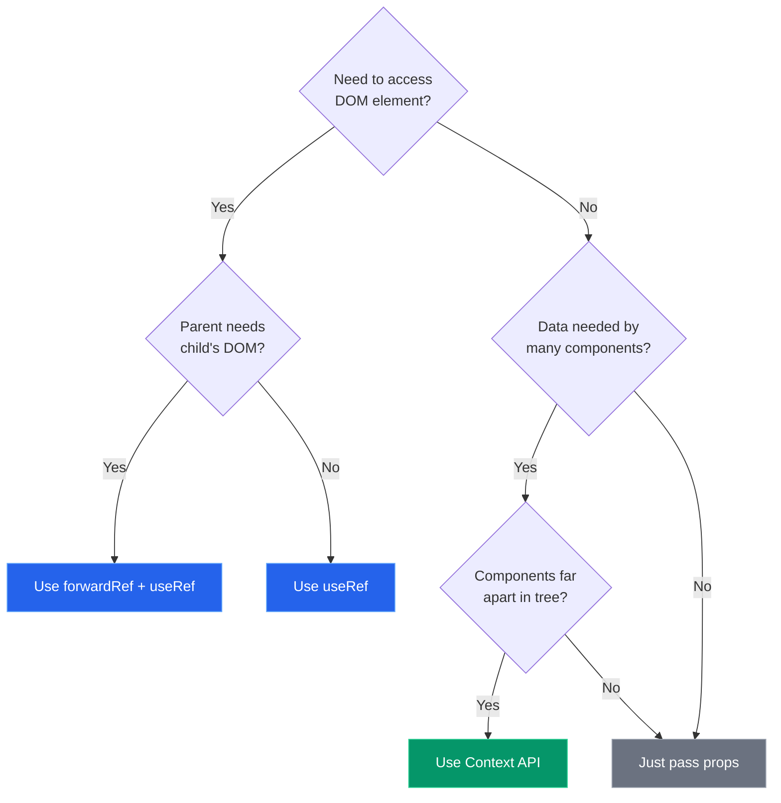

# Advanced Props & State in React - Master Revision Guide

> A comprehensive guide to **useRef**, **forwardRef**, and the **Context API** in React. This document serves as a standalone revision resource.

---

## Table of Contents

1. [Core Concepts Overview](#core-concepts-overview)
2. [useRef & forwardRef - DOM Access Across Components](#useref--forwardref---dom-access-across-components)
   - [Theory](#theory-refs)
   - [Code Pattern](#code-pattern-refs)
   - [Key Insights](#key-insights-refs)
3. [Context API - Global State Without Prop Drilling](#context-api---global-state-without-prop-drilling)
   - [Theory](#theory-context)
   - [Code Pattern](#code-pattern-context)
   - [Key Insights](#key-insights-context)
4. [Visual Diagrams](#visual-diagrams)
5. [Common Pitfalls](#common-pitfalls)
6. [Summary & Key Takeaways](#summary--key-takeaways)

---

## Core Concepts Overview

This module covers two essential React patterns for managing component communication:

| Pattern | Problem It Solves | When to Use |
|---------|-------------------|-------------|
| **useRef + forwardRef** | Parent needs to access child's DOM element | Focus management, scroll, animations, measuring elements |
| **Context API** | Passing data through many levels of components | Themes, auth state, locale, any "global" app state |

---

## useRef & forwardRef - DOM Access Across Components

### Theory (Refs)

#### What is `useRef`?

`useRef` is a React hook that creates a **mutable reference object** that persists across re-renders. Unlike state, changing a ref does **not** trigger a re-render.

```javascript
const myRef = useRef(initialValue)
// myRef.current holds the value
```

**Key Properties:**
- The ref object (`{ current: ... }`) remains the **same object** between renders
- Changes to `.current` do NOT cause re-renders
- Commonly used to store DOM node references
- Can also store any mutable value (timers, previous values, etc.)

#### What is `forwardRef`?

`forwardRef` is a React API that allows a component to **expose its internal DOM node** (or any ref) to its parent component.

**Why is it needed?**
- By default, `ref` is NOT passed as a prop - React handles it specially
- Regular function components cannot receive a `ref` prop
- `forwardRef` creates a "tunnel" for the ref to pass through



---

### Code Pattern (Refs)

#### Step 1: Create the Child Component with `forwardRef`

```jsx
import { forwardRef } from 'react'

// forwardRef wraps the component and provides `ref` as the SECOND argument
const TextInput = forwardRef(function TextInput(props, ref) {
    return (
        <div>
            <label>{props.label}</label>
            {/* Attach the forwarded ref to the actual DOM element */}
            <input
                ref={ref}  // <-- This connects parent's ref to THIS input
                type="text"
                placeholder={props.placeholder}
            />
        </div>
    )
})

export default TextInput
```

**Syntax Breakdown:**
- `forwardRef(function ComponentName(props, ref) { ... })` - The ref is the **second** parameter
- The ref is then attached to whichever DOM element you want to expose

#### Step 2: Use the Child Component in Parent with `useRef`

```jsx
import { useRef } from 'react'
import TextInput from './TextInput'

const ParentForm = () => {
    // Step 1: Create a ref object
    const firstNameInputRef = useRef(null)

    // Step 2: Define handler that uses the ref
    const handleFocusClick = () => {
        // After mount, ref.current points to the actual <input> DOM node
        if (firstNameInputRef.current) {
            firstNameInputRef.current.focus()  // Native DOM method!
        }
    }

    return (
        <div>
            {/* Step 3: Pass ref to the child component */}
            <TextInput
                ref={firstNameInputRef}  // <-- This goes to forwardRef's 2nd arg
                label="First name"
                placeholder="Type your name"
            />
            
            <button onClick={handleFocusClick}>
                Focus the input from parent
            </button>
        </div>
    )
}
```

---

### Key Insights (Refs)

| Insight | Explanation |
|---------|-------------|
| **Ref timeline** | `ref.current` is `null` before mount, then becomes the DOM node after mount |
| **No re-render** | Changing `ref.current` never triggers re-render (unlike `useState`) |
| **Escape hatch** | Refs let you "escape" React's declarative model for imperative DOM operations |
| **forwardRef naming** | Always name your forwardRef function for better debugging: `forwardRef(function MyComponent(...))` |

**Common Use Cases:**
- Focus management (forms, modals)
- Text selection
- Scroll to element
- Trigger animations
- Integrate with non-React libraries (D3, jQuery, etc.)

---

## Context API - Global State Without Prop Drilling

### Theory (Context)

#### The Problem: Prop Drilling

When you need to pass data through multiple component levels, you end up with "prop drilling":



Every intermediate component must pass the prop, even if it doesn't use it.

#### The Solution: Context API

Context provides a way to share values between components without explicitly passing props through every level.



Any component can **directly** access the context value, no matter how deep.

#### Three Parts of Context

1. **`createContext()`** - Creates the context object (the "shared box")
2. **`Provider`** - Component that holds the value and makes it available
3. **`useContext()` / custom hook** - How child components read the value

---

### Code Pattern (Context)

#### Step 1: Create the Context and Provider

```jsx
// ThemeContext.jsx
import { createContext, useState, useContext } from 'react'

// 1. Create the context - this is the "shared box"
export const ThemeContext = createContext(null)

// 2. Create the Provider component - this OWNS the state
export const ThemeProvider = ({ children }) => {
    // Single source of truth for theme state
    const [isDark, setIsDark] = useState(false)

    // Function to toggle the theme
    const toggleTheme = () => setIsDark((prev) => !prev)

    // Package state and actions together
    const value = { isDark, toggleTheme }

    return (
        // Provider makes `value` available to ALL descendants
        <ThemeContext.Provider value={value}>
            {children}
        </ThemeContext.Provider>
    )
}

// 3. Custom hook for cleaner consumption (optional but recommended)
export const useTheme = () => {
    const ctx = useContext(ThemeContext)

    // Helpful error if used outside Provider
    if (!ctx) {
        throw new Error('useTheme must be used inside a ThemeProvider')
    }

    return ctx
}
```

**Why the custom hook `useTheme`?**
- Cleaner syntax: `useTheme()` vs `useContext(ThemeContext)`
- Built-in error handling for misuse
- Encapsulates the context implementation detail

#### Step 2: Wrap Your App with the Provider

```jsx
// App.jsx
import { ThemeProvider } from './ThemeContext'

function App() {
    return (
        // Everything inside ThemeProvider can access the theme
        <ThemeProvider>
            <AppContent />
        </ThemeProvider>
    )
}
```

#### Step 3: Consume Context in Any Child Component

```jsx
// ThemeToggler.jsx
import { useTheme } from './ThemeContext'

const ThemeToggler = () => {
    // Read from context - NO props needed!
    const { isDark, toggleTheme } = useTheme()

    return (
        <div>
            <p>Current: {isDark ? 'Dark mode' : 'Light mode'}</p>
            <button onClick={toggleTheme}>
                Toggle theme
            </button>
        </div>
    )
}
```

```jsx
// Navigation.jsx - Another component reading the SAME context
import { useTheme } from './ThemeContext'

const Navigation = () => {
    const { isDark } = useTheme()  // Same value, different component!

    return (
        <nav className={isDark ? 'dark' : 'light'}>
            {/* navigation items */}
        </nav>
    )
}
```

---

### Key Insights (Context)

| Insight | Explanation |
|---------|-------------|
| **Single source of truth** | State lives in ONE place (Provider), consumed by many |
| **Re-renders** | When context value changes, ALL consumers re-render |
| **Provider placement** | Place Provider as high as needed, but not higher than necessary |
| **Multiple contexts** | You can have multiple independent contexts (theme, auth, locale) |
| **Default value** | `createContext(defaultValue)` - used only if no Provider is found |

**When to Use Context:**
- Theme switching (dark/light mode)
- User authentication state
- Language/locale preferences
- Shopping cart data
- Any data needed by many components at different nesting levels

**When NOT to Use Context:**
- Data only needed by 1-2 levels down (just use props)
- High-frequency updates (consider state management libraries)
- Data that doesn't need to be "global"

---

## Visual Diagrams

### useRef + forwardRef Flow

```mermaid
sequenceDiagram
    participant P as Parent Component
    participant R as useRef Hook
    participant C as Child (forwardRef)
    participant D as DOM Input

    P->>R: useRef(null)
    R-->>P: ref object { current: null }
    P->>C: <TextInput ref={ref} />
    C->>D: <input ref={ref} />
    D-->>R: ref.current = DOM node
    
    Note over P,D: Later, on button click...
    P->>R: ref.current.focus()
    R->>D: focus() called on DOM
```



### Context API Data Flow



### Component Tree with Both Patterns



**Legend:**
- Purple: Context Provider
- Green: Context Consumers (useTheme)
- Blue: Ref-related components

---

## Common Pitfalls

### Ref Pitfalls

| Pitfall | Problem | Solution |
|---------|---------|----------|
| Accessing ref before mount | `ref.current` is `null` initially | Always check `if (ref.current)` before using |
| Forgetting `forwardRef` | Ref won't reach child's DOM element | Wrap child component in `forwardRef` |
| Using ref for state | Changes don't trigger UI updates | Use `useState` for values that should update UI |

### Context Pitfalls

| Pitfall | Problem | Solution |
|---------|---------|----------|
| Using outside Provider | `useContext` returns `undefined`/`null` | Add error handling in custom hook |
| Overusing context | Causes unnecessary re-renders | Only use for truly "global" state |
| Putting everything in one context | All consumers re-render on any change | Split into multiple focused contexts |
| Mutable value objects | Can cause stale closure issues | Always create new object when value changes |

---

## Summary & Key Takeaways

### useRef + forwardRef

```
useRef  = "Create a persistent box that survives re-renders"
          └── Use for: DOM refs, timers, previous values

forwardRef = "Pass that box through a component to its internal DOM"
             └── Use for: Parent needs to control child's DOM element
```

**Quick Pattern:**
```jsx
// Child: wrap in forwardRef, attach ref to DOM
const Child = forwardRef((props, ref) => <input ref={ref} />)

// Parent: create ref, pass to child, use .current
const Parent = () => {
    const ref = useRef(null)
    return <Child ref={ref} />
}
```

### Context API

```
createContext  = "Create a shared channel for data"
Provider       = "Broadcast data to all descendants"  
useContext     = "Tune in to receive that data anywhere"
```

**Quick Pattern:**
```jsx
// 1. Create: const ThemeContext = createContext(null)
// 2. Provide: <ThemeContext.Provider value={...}>{children}</ThemeContext.Provider>
// 3. Consume: const value = useContext(ThemeContext)
```

### Decision Tree



---

### Quick Reference Card

| Hook/API | Import | Basic Usage |
|----------|--------|-------------|
| `useRef` | `import { useRef } from 'react'` | `const ref = useRef(null)` |
| `forwardRef` | `import { forwardRef } from 'react'` | `forwardRef((props, ref) => ...)` |
| `createContext` | `import { createContext } from 'react'` | `const Ctx = createContext(null)` |
| `useContext` | `import { useContext } from 'react'` | `const value = useContext(Ctx)` |

---

*This guide covers the essential patterns from the `advanced-props-state` module. Master these concepts to handle component communication effectively in React applications.*
