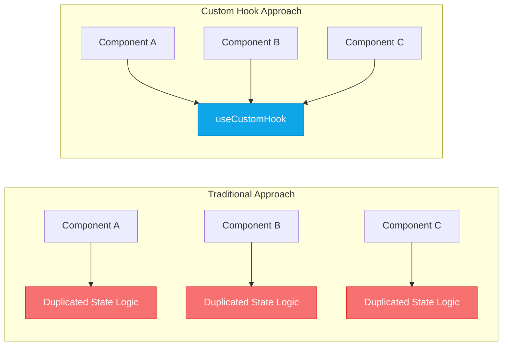
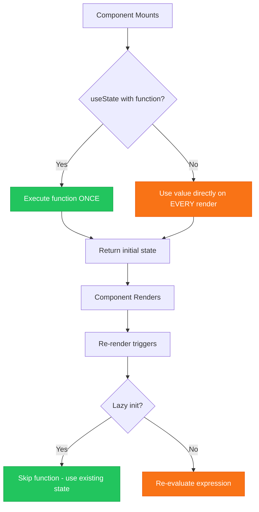
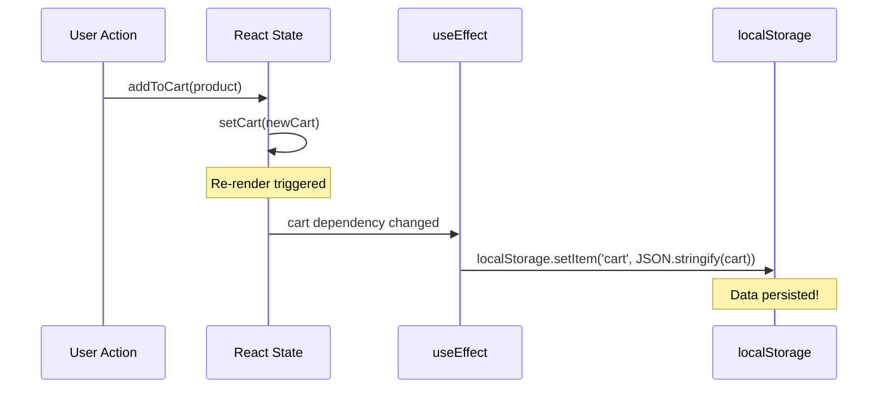
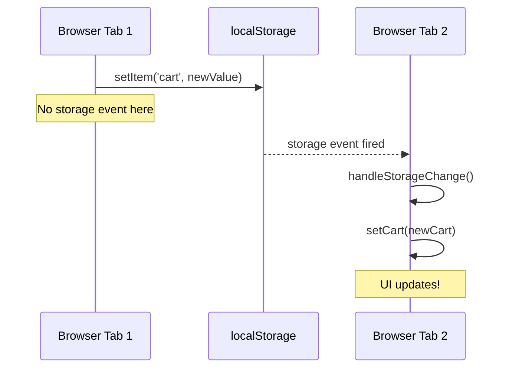
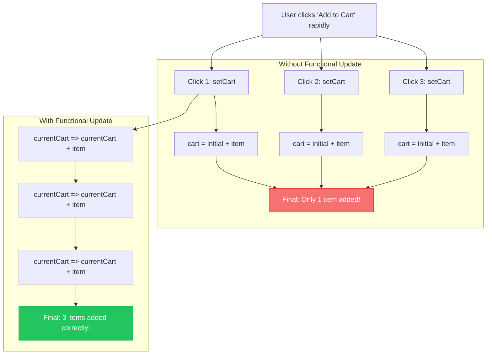
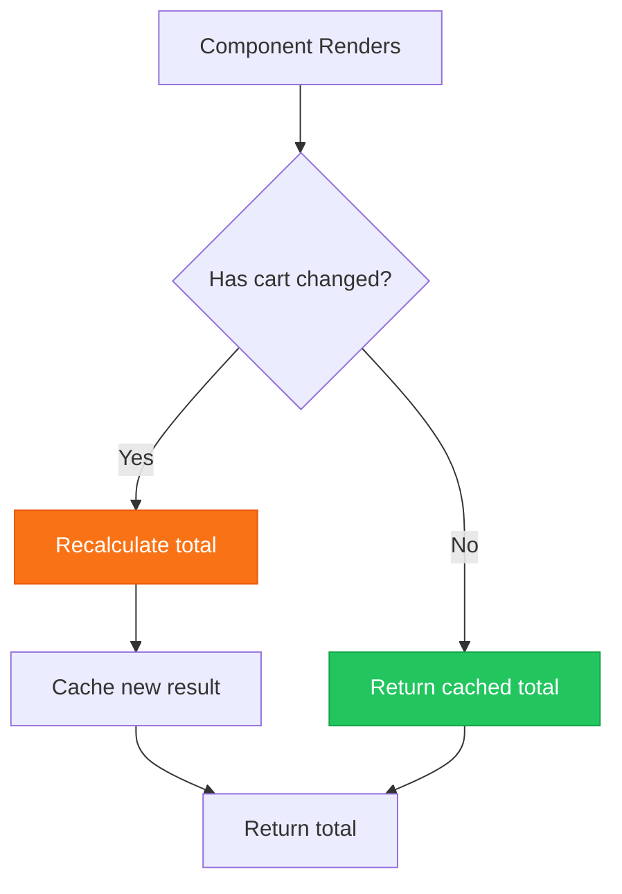
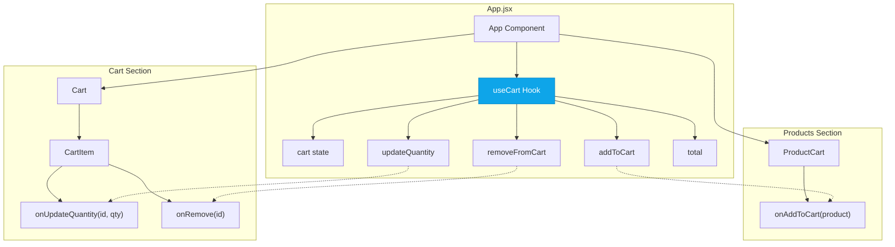
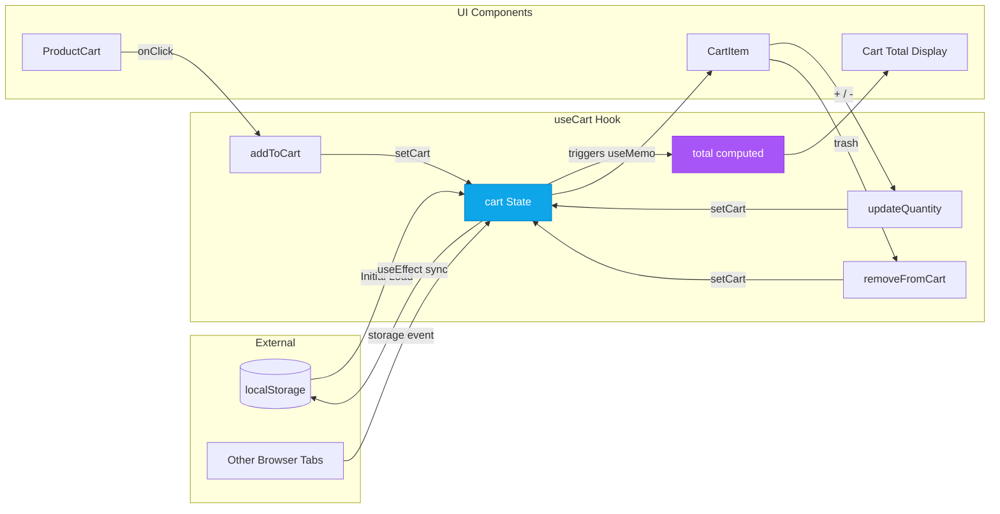

# React Custom Hooks - Complete Revision Guide

> **Section 07**: Building reusable, stateful logic with Custom Hooks in React

This guide covers everything you need to understand custom hooks—from theory to practical implementation patterns demonstrated through a shopping cart example.

---

## Table of Contents

1. [What Are Custom Hooks?](#what-are-custom-hooks)
2. [Why Custom Hooks Matter](#why-custom-hooks-matter)
3. [Rules of Hooks](#rules-of-hooks)
4. [The useCart Hook - Deep Dive](#the-usecart-hook---deep-dive)
   - [State Initialization with Lazy Loading](#1-state-initialization-with-lazy-loading)
   - [Persistence with useEffect](#2-persistence-with-useeffect)
   - [Cross-Tab Synchronization](#3-cross-tab-synchronization)
   - [Cart Operations (CRUD)](#4-cart-operations-crud)
   - [Computed Values with useMemo](#5-computed-values-with-usememo)
5. [Component Architecture](#component-architecture)
6. [Data Flow Visualization](#data-flow-visualization)
7. [Key Patterns & Techniques](#key-patterns--techniques)
8. [Common Pitfalls & Solutions](#common-pitfalls--solutions)
9. [Summary & Key Takeaways](#summary--key-takeaways)

---

## What Are Custom Hooks?

Custom Hooks are **JavaScript functions** that start with `use` and can call other hooks. They allow you to **extract component logic into reusable functions**.

```
Custom Hook = State + Side Effects + Logic → Reusable Package
```

### The Mental Model

Think of custom hooks as **"stateful utilities"**:
- Regular utility functions: Pure logic, no state
- Custom hooks: Logic **with** React state and lifecycle awareness



---

## Why Custom Hooks Matter

| Problem | Solution with Custom Hooks |
|---------|---------------------------|
| **Code Duplication** | Extract shared logic once, use everywhere |
| **Complex Components** | Split logic into focused, testable units |
| **Testing Difficulty** | Test hook logic independently from UI |
| **Readability** | Component focuses on "what", hook handles "how" |

### Before vs After

**Without Custom Hook** (logic mixed in component):
```jsx
function Cart() {
  const [cart, setCart] = useState([]);
  
  useEffect(() => {
    localStorage.setItem('cart', JSON.stringify(cart));
  }, [cart]);
  
  const addToCart = (product) => { /* ... */ };
  const removeFromCart = (id) => { /* ... */ };
  
  // UI rendering mixed with business logic
  return <div>{/* ... */}</div>;
}
```

**With Custom Hook** (separation of concerns):
```jsx
function Cart() {
  const { cart, addToCart, removeFromCart } = useCart();
  
  // Component only handles UI
  return <div>{/* ... */}</div>;
}
```

---

## Rules of Hooks

These are **non-negotiable** rules enforced by React:

### Rule 1: Only Call Hooks at the Top Level

```jsx
// BAD - hooks inside conditions
function Component() {
  if (someCondition) {
    const [state, setState] = useState(); // React can't track this
  }
}

// GOOD - hooks at top level
function Component() {
  const [state, setState] = useState();
  
  if (someCondition) {
    // use state here
  }
}
```

### Rule 2: Only Call Hooks from React Functions

```jsx
// BAD - regular function
function regularFunction() {
  const [state, setState] = useState(); // Won't work
}

// GOOD - React component or custom hook
function useMyHook() {
  const [state, setState] = useState(); // Works!
}
```

### Rule 3: Custom Hooks Must Start with `use`

```jsx
// BAD - React won't recognize this as a hook
function cartManager() { /* ... */ }

// GOOD - prefix with "use"
function useCart() { /* ... */ }
```

---

## The useCart Hook - Deep Dive

Let's break down the complete `useCart` hook implementation:

```javascript
import { useState, useEffect, useMemo } from "react";

export function useCart() {
    // 1. State with lazy initialization
    const [cart, setCart] = useState(() => {
        try {
            const savedCart = localStorage.getItem('cart');
            return savedCart ? JSON.parse(savedCart) : [];
        } catch (error) {
            console.error('Error loading cart from localStorage:', error);
            return [];
        }
    });

    // 2. Persist to localStorage on change
    useEffect(() => {
        try {
            localStorage.setItem('cart', JSON.stringify(cart));
        } catch (error) {
            console.error('Error saving cart to localStorage:', error);
        }
    }, [cart]);

    // 3. Sync across browser tabs
    useEffect(() => {
        const handleStorageChange = (event) => {
            if (event.key === 'cart') {
                try {
                    const newCart = JSON.parse(event.newValue);
                    setCart(newCart);
                } catch (error) {
                    console.error('Error parsing cart from localStorage:', error);
                }
            }
        };

        window.addEventListener('storage', handleStorageChange);
        return () => window.removeEventListener('storage', handleStorageChange);
    }, []);

    // 4. Cart operations
    const addToCart = (product) => {
        setCart(currentCart => {
            const existingItem = currentCart.find(item => item.id === product.id);
            if (existingItem) {
                return currentCart.map(item => 
                    item.id === product.id 
                        ? { ...item, quantity: item.quantity + 1 } 
                        : item
                );
            }
            return [...currentCart, { ...product, quantity: 1 }];
        });
    };

    const removeFromCart = (productId) => {
        setCart(currentCart => currentCart.filter(item => item.id !== productId));
    };

    const updateQuantity = (productId, quantity) => {
        if (quantity < 1) {
            removeFromCart(productId);
            return;
        }
        setCart(currentCart => 
            currentCart.map(item => 
                item.id === productId ? { ...item, quantity } : item
            )
        );
    };

    // 5. Computed value with memoization
    const total = useMemo(() => {
        return Number((cart.reduce((sum, item) => 
            sum + item.price * item.quantity, 0
        )).toFixed(2));
    }, [cart]);

    return { cart, addToCart, removeFromCart, updateQuantity, total };
}
```

---

### 1. State Initialization with Lazy Loading

```javascript
const [cart, setCart] = useState(() => {
    try {
        const savedCart = localStorage.getItem('cart');
        return savedCart ? JSON.parse(savedCart) : [];
    } catch (error) {
        console.error('Error loading cart from localStorage:', error);
        return [];
    }
});
```

#### Key Insight

The **arrow function** passed to `useState` is called **lazy initialization**. It only runs **once** during the initial render.



**Why This Matters:**

```javascript
// BAD - localStorage.getItem runs on EVERY render
const [cart, setCart] = useState(
  JSON.parse(localStorage.getItem('cart')) || []
);

// GOOD - localStorage.getItem runs ONLY on first render
const [cart, setCart] = useState(() => 
  JSON.parse(localStorage.getItem('cart')) || []
);
```

**Performance Impact:** If your initial state computation is expensive (like reading from localStorage, computing large datasets), lazy initialization prevents that work from repeating unnecessarily.

---

### 2. Persistence with useEffect

```javascript
useEffect(() => {
    try {
        localStorage.setItem('cart', JSON.stringify(cart));
    } catch (error) {
        console.error('Error saving cart to localStorage:', error);
    }
}, [cart]);
```

#### Key Insight

This creates a **synchronization** between React state and external storage:



**The Dependency Array `[cart]`:**
- Effect runs **after** every render where `cart` has changed
- Empty `[]` = run once on mount
- No array = run after every render (rarely what you want)

---

### 3. Cross-Tab Synchronization

```javascript
useEffect(() => {
    const handleStorageChange = (event) => {
        if (event.key === 'cart') {
            try {
                const newCart = JSON.parse(event.newValue);
                setCart(newCart);
            } catch (error) {
                console.error('Error parsing cart from localStorage:', error);
            }
        }
    };

    window.addEventListener('storage', handleStorageChange);
    return () => window.removeEventListener('storage', handleStorageChange);
}, []);
```

#### Key Insight

The `storage` event fires when localStorage is modified **from another tab/window**. It does NOT fire in the tab that made the change.



**Cleanup Function Pattern:**

```javascript
return () => window.removeEventListener('storage', handleStorageChange);
```

This is the **cleanup function**—it runs:
1. Before the effect runs again (if dependencies change)
2. When the component unmounts

**Why cleanup matters:** Without it, you'd add a new listener on every render, leading to memory leaks and multiple event handlers firing.

---

### 4. Cart Operations (CRUD)

#### Add to Cart - Functional Update Pattern

```javascript
const addToCart = (product) => {
    setCart(currentCart => {
        const existingItem = currentCart.find(item => item.id === product.id);
        if (existingItem) {
            return currentCart.map(item => 
                item.id === product.id 
                    ? { ...item, quantity: item.quantity + 1 } 
                    : item
            );
        }
        return [...currentCart, { ...product, quantity: 1 }];
    });
};
```

#### Key Insight: Functional Updates

```javascript
// BAD - uses stale closure
const addToCart = (product) => {
    setCart([...cart, product]); // `cart` may be stale!
};

// GOOD - always has latest state
const addToCart = (product) => {
    setCart(currentCart => [...currentCart, product]); // `currentCart` is guaranteed fresh
};
```

**When to use functional updates:**
- When new state depends on previous state
- When the function might be called rapidly (like click handlers)
- When the function is passed to child components (prevents stale closures)



#### Immutable Update Patterns

```javascript
// Adding item
return [...currentCart, { ...product, quantity: 1 }];

// Updating item
return currentCart.map(item => 
    item.id === productId ? { ...item, quantity } : item
);

// Removing item
return currentCart.filter(item => item.id !== productId);
```

**Never mutate state directly:**

```javascript
// BAD
currentCart.push(product);
return currentCart;

// BAD
currentCart[0].quantity = 5;
return currentCart;

// GOOD - always return new references
return [...currentCart, product];
return currentCart.map(item => ({ ...item, quantity: 5 }));
```

---

### 5. Computed Values with useMemo

```javascript
const total = useMemo(() => {
    return Number((cart.reduce((sum, item) => 
        sum + item.price * item.quantity, 0
    )).toFixed(2));
}, [cart]);
```

#### Key Insight

`useMemo` caches the result of a calculation and only recomputes when dependencies change.



**Note from the code comment:**

```javascript
//this is not required in react 19 or later
const total = useMemo(() => { ... }, [cart]);
```

React 19 introduces the **React Compiler** which automatically memoizes values, making manual `useMemo` often unnecessary. However, understanding it remains valuable for:
- Working with older React versions
- Understanding React's optimization model
- Cases where the compiler can't optimize

---

## Component Architecture



### Component Responsibilities

| Component | Responsibility |
|-----------|---------------|
| **App** | Orchestrator - connects hook to UI components |
| **useCart** | All cart business logic and state |
| **ProductCart** | Display product, fire `addToCart` |
| **Cart** | Display cart summary, delegate to CartItem |
| **CartItem** | Single item controls (quantity, remove) |

### The Prop Drilling Pattern

```jsx
// App.jsx - Hook provides everything
const { cart, addToCart, removeFromCart, updateQuantity, total } = useCart();

// Pass down what each component needs
<ProductCart product={product} onAddToCart={addToCart} />
<Cart 
    cart={cart} 
    onUpdateQuantity={updateQuantity} 
    onRemove={removeFromCart} 
    total={total} 
/>
```

**When prop drilling becomes painful** (many levels deep), consider:
- React Context
- State management libraries (Zustand, Redux)
- Component composition patterns

---

## Data Flow Visualization



---

## Key Patterns & Techniques

### Pattern 1: Error Boundaries in Data Operations

```javascript
try {
    const savedCart = localStorage.getItem('cart');
    return savedCart ? JSON.parse(savedCart) : [];
} catch (error) {
    console.error('Error loading cart from localStorage:', error);
    return []; // Graceful fallback
}
```

**Why:** localStorage can throw errors (quota exceeded, parsing invalid JSON, private browsing mode). Always handle these cases.

### Pattern 2: Conditional Remove via Update

```javascript
const updateQuantity = (productId, quantity) => {
    if (quantity < 1) {
        removeFromCart(productId); // Reuse existing function
        return;
    }
    // ... update logic
};
```

**Why:** DRY principle—don't duplicate removal logic. When quantity drops below 1, delegate to the existing remove function.

### Pattern 3: Returning a Clean API

```javascript
return { cart, addToCart, removeFromCart, updateQuantity, total };
```

**Why:** The hook returns exactly what consumers need—nothing more. This creates a clear contract:
- `cart`: Current state (read)
- `addToCart`, `removeFromCart`, `updateQuantity`: Actions (write)
- `total`: Derived/computed value (read)

### Pattern 4: Icon Components for Actions

```jsx
import { FaTrash, FaPlus, FaMinus, FaShoppingCart } from 'react-icons/fa'

<button onClick={() => onUpdateQuantity(item.id, item.quantity - 1)}>
    <FaMinus />
</button>
```

**Why:** Icons communicate action intent faster than text. The `react-icons` library provides consistent, scalable SVG icons.

---

## Common Pitfalls & Solutions

### Pitfall 1: Stale Closures

```javascript
// WRONG - addToCart captures old `cart` value
const addToCart = (product) => {
    setCart([...cart, product]);
};

// RIGHT - always use functional updates
const addToCart = (product) => {
    setCart(currentCart => [...currentCart, product]);
};
```

### Pitfall 2: Missing useEffect Cleanup

```javascript
// WRONG - memory leak!
useEffect(() => {
    window.addEventListener('storage', handler);
}, []);

// RIGHT - clean up listeners
useEffect(() => {
    window.addEventListener('storage', handler);
    return () => window.removeEventListener('storage', handler);
}, []);
```

### Pitfall 3: Direct State Mutation

```javascript
// WRONG - mutates state directly
cart.push(newItem);
setCart(cart);

// RIGHT - create new array
setCart([...cart, newItem]);
```

### Pitfall 4: Expensive Computations on Every Render

```javascript
// WRONG - runs on every render
const total = cart.reduce((sum, item) => sum + item.price * item.quantity, 0);

// RIGHT - only recalculates when cart changes
const total = useMemo(() => 
    cart.reduce((sum, item) => sum + item.price * item.quantity, 0),
    [cart]
);
```

---

## Summary & Key Takeaways

### Core Concepts Checklist

- [ ] **Custom Hooks** extract reusable stateful logic from components
- [ ] **Naming Convention**: Always prefix with `use` (e.g., `useCart`)
- [ ] **Rules of Hooks**: Top-level only, React functions only
- [ ] **Lazy Initialization**: Use function in `useState` for expensive initial values
- [ ] **Functional Updates**: Use callback form of setState when new state depends on old
- [ ] **Effect Cleanup**: Always clean up subscriptions/listeners in useEffect return
- [ ] **useMemo**: Cache expensive computations (less needed in React 19+)
- [ ] **Immutability**: Never mutate state directly—always create new references

### The Custom Hook Mental Checklist

When creating a custom hook, ask:

1. **What state does it manage?** → `useState`
2. **What side effects does it have?** → `useEffect`
3. **What computed values does it derive?** → `useMemo`
4. **What actions does it expose?** → Functions that call setState
5. **What does the consumer need?** → Return object/array

### Quick Reference Card

```javascript
// Custom Hook Template
export function useMyFeature() {
    // 1. State
    const [state, setState] = useState(initialValue);
    
    // 2. Side Effects
    useEffect(() => {
        // setup
        return () => { /* cleanup */ };
    }, [dependencies]);
    
    // 3. Computed Values
    const derived = useMemo(() => compute(state), [state]);
    
    // 4. Actions
    const doSomething = () => setState(prev => /* new state */);
    
    // 5. Return API
    return { state, derived, doSomething };
}
```

### Project Structure Reference

```
07-custom-hooks/
├── src/
│   ├── hooks/
│   │   └── useCart.js      # Custom hook (all cart logic)
│   ├── components/
│   │   ├── Cart.jsx        # Cart container
│   │   ├── CartItem.jsx    # Individual cart item
│   │   └── ProductCart.jsx # Product display card
│   ├── data/
│   │   └── products.js     # Static product data
│   ├── App.jsx             # Main app (orchestrator)
│   └── main.jsx            # React entry point
```

---

> **Remember**: Custom hooks are about **separation of concerns**. Your component asks "what to render", the hook answers "what's the current state and how to change it". Keep this boundary clean, and your code will be testable, reusable, and maintainable.
