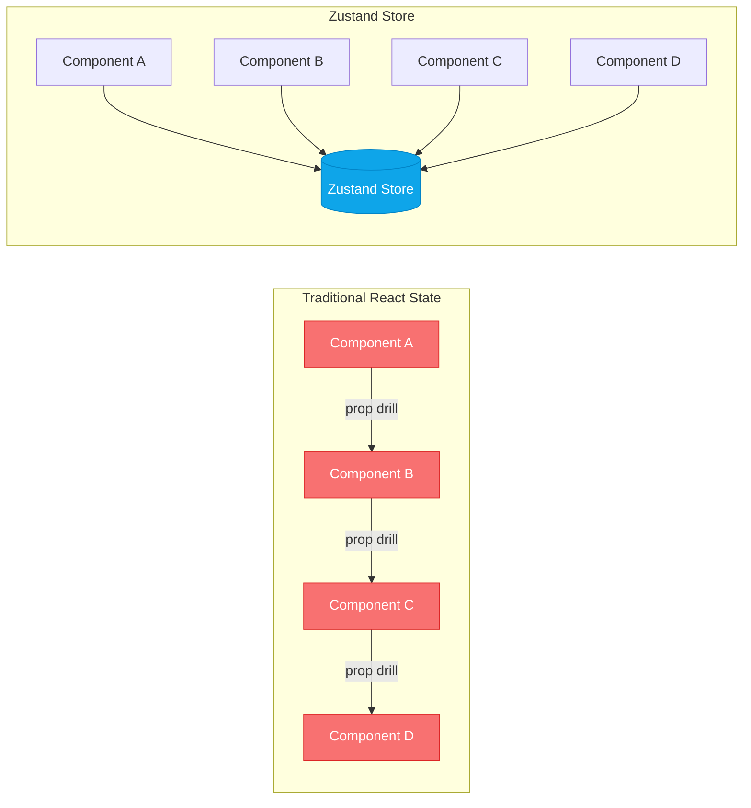
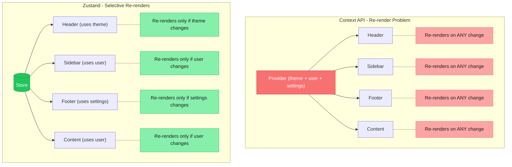
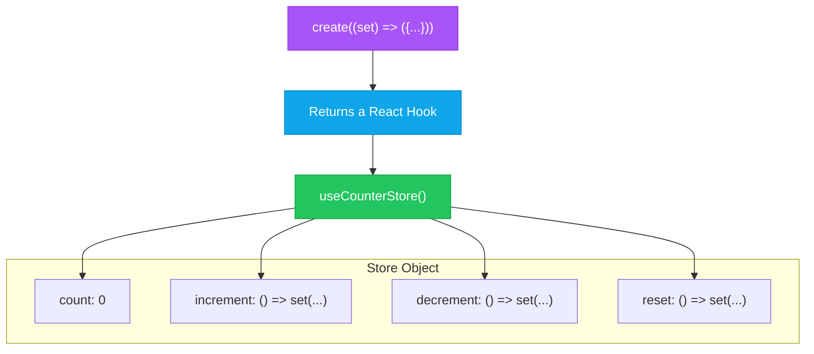
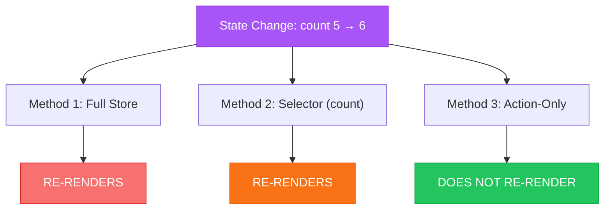
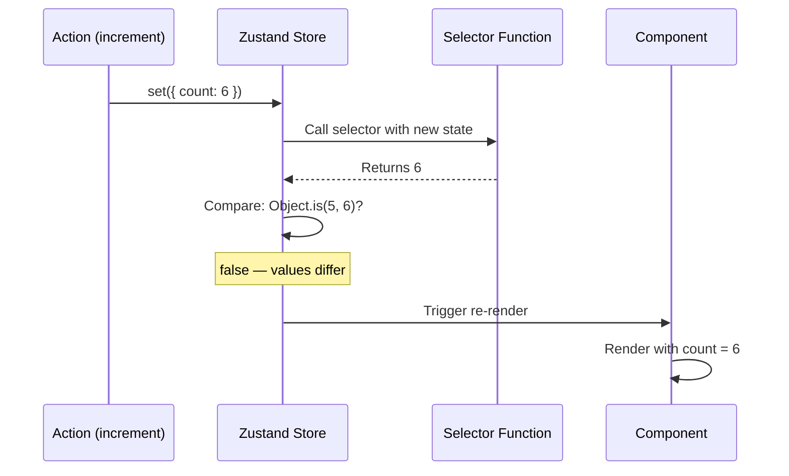
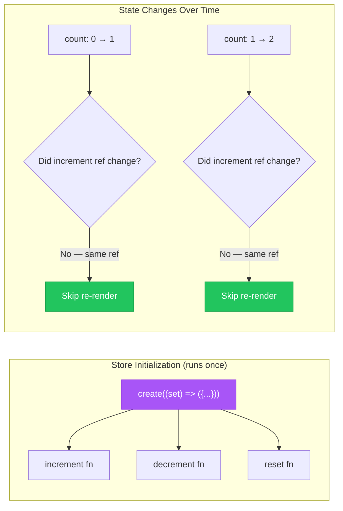
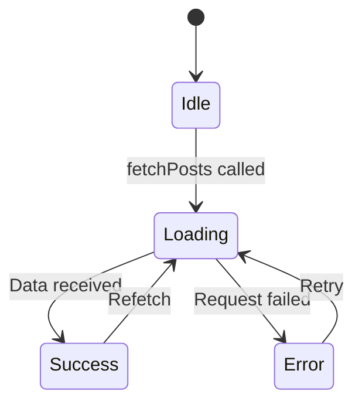
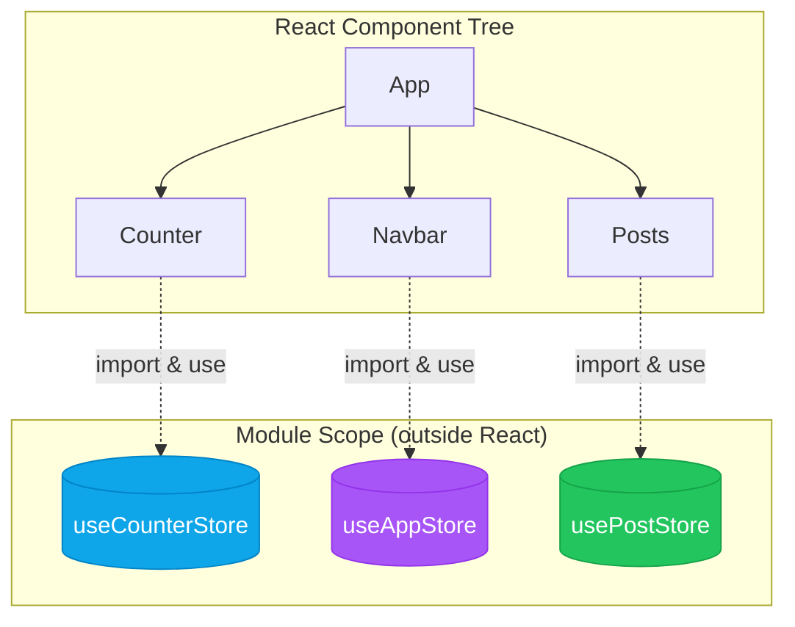
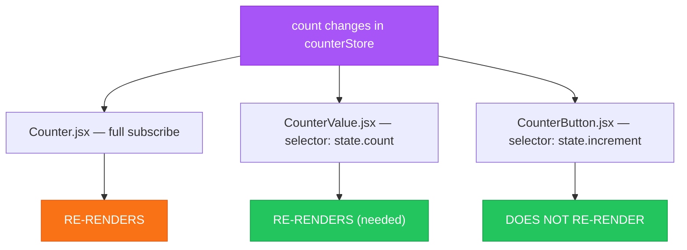

# Zustand State Management - Complete Revision Guide

> **Section 08**: Global state management with Zustand — the minimal, unopinionated alternative to Redux and Context API

This guide covers everything you need to understand Zustand — from core theory to advanced optimization patterns — all demonstrated through a counter, theme/auth, and async API fetching example.

---

## Table of Contents

1. [What is Zustand?](#what-is-zustand)
2. [Zustand vs Redux vs Context API](#zustand-vs-redux-vs-context-api)
3. [Creating a Store — The `create` Function](#creating-a-store--the-create-function)
4. [Two Ways to Update State with `set()`](#two-ways-to-update-state-with-set)
5. [Consuming Stores in Components](#consuming-stores-in-components)
6. [Selector Pattern — Performance Optimization](#selector-pattern--performance-optimization)
7. [Action-Only Subscription — Referential Stability](#action-only-subscription--referential-stability)
8. [Slice Pattern — Organizing Multiple Concerns](#slice-pattern--organizing-multiple-concerns)
9. [Async Actions — No Middleware Needed](#async-actions--no-middleware-needed)
10. [Loading / Error State Pattern](#loading--error-state-pattern)
11. [No Provider Required](#no-provider-required)
12. [Component Re-render Optimization Strategies](#component-re-render-optimization-strategies)
13. [Common Pitfalls & Solutions](#common-pitfalls--solutions)
14. [Summary & Key Takeaways](#summary--key-takeaways)

---

## What is Zustand?

Zustand (German for "state") is a **small, fast, and unopinionated** state management library for React. It gives you global state without boilerplate.

```
Zustand Store = State + Actions → A Hook
```

### The Mental Model

Think of a Zustand store as a **global `useState`** that any component can tap into — no providers, no reducers, no action types.



### Why Zustand?

- **Tiny** — ~1 KB bundle size
- **No boilerplate** — No action types, reducers, or dispatchers
- **No Provider** — No wrapping your app in `<Provider>`
- **Async built-in** — No middleware for async operations
- **Selector-based** — Components only re-render when *their* slice of state changes
- **Framework agnostic core** — Works outside React too

---

## Zustand vs Redux vs Context API

| Feature | Zustand | Redux | Context API |
|---------|---------|-------|-------------|
| **Bundle Size** | ~1 KB | ~7 KB + middleware | Built-in (0 KB) |
| **Boilerplate** | Minimal | Heavy (actions, reducers, types) | Moderate |
| **Provider Required** | No | Yes (`<Provider store={store}>`) | Yes (`<Context.Provider>`) |
| **Async Support** | Native (just use `async`) | Needs middleware (thunk/saga) | Manual |
| **Re-render Optimization** | Built-in selectors | Requires `useSelector` + `memo` | Re-renders all consumers |
| **DevTools** | Optional middleware | Built-in | None |
| **Learning Curve** | Low | High | Low-Medium |
| **Best For** | Small-to-large apps wanting simplicity | Large apps needing strict patterns | Simple shared state |

### The Context API Problem



---

## Creating a Store — The `create` Function

The `create` function is the only API you need to build a store. It takes a callback that receives `set` and returns an object containing **state + actions**.

```javascript
import { create } from 'zustand'

export const useCounterStore = create((set) => ({
    // State
    count: 0,

    // Actions
    increment: () => set((state) => ({ count: state.count + 1 })),
    decrement: () => set((state) => ({ count: state.count - 1 })),
    reset: () => set({ count: 0 }),
}));
```

#### Key Insight

`create()` returns a **React hook** (that's why we name it `useCounterStore`). The callback you pass receives `set` — a function Zustand provides to update state. The returned object is your store's initial shape: state values and action functions live side-by-side as a flat object.



**What makes this elegant:**
- State and actions are **co-located** — no separate files for actions/reducers
- Actions have **direct access** to `set` via closure — no dispatch needed
- The returned hook is **self-contained** — import and use anywhere

---

## Two Ways to Update State with `set()`

Zustand's `set` function accepts two forms:

### Form 1: Direct Object (for fixed values)

```javascript
// When you don't need the current state
reset: () => set({ count: 0 })
```

This **merges** the object with the current state (like `setState` in class components). Any properties you don't include remain unchanged.

### Form 2: Updater Function (when new state depends on old state)

```javascript
// When you need the current state to compute the new state
increment: () => set((state) => ({ count: state.count + 1 }))
```

Zustand passes the **current state** to your function. You return an object with only the properties you want to update.

#### Key Insight

| Use This Form | When |
|---------------|------|
| `set({ key: value })` | Setting a fixed/known value (reset, clear, assign) |
| `set((state) => ({ ... }))` | New value depends on current state (increment, toggle) |

```javascript
// Toggle example - MUST use updater because we read current theme
toggleTheme: () => set((state) => ({
    theme: state.theme === 'light' ? 'dark' : 'light'
}))

// Login example - CAN use direct because value comes from outside
login: (user) => set({ user })
```

> **Important:** `set` does a **shallow merge** by default. It only merges top-level keys — it does NOT deep merge nested objects.

---

## Consuming Stores in Components

The store hook can be called in **three ways**, each with different re-render characteristics:

### Method 1: Full Store Subscription (Simple but Less Optimal)

```jsx
const { count, increment, decrement, reset } = useCounterStore()
```

Subscribes to the **entire** store. The component re-renders whenever **any** state in the store changes.

### Method 2: Selector Subscription (Optimal)

```jsx
const count = useCounterStore((state) => state.count)
```

Subscribes to **only `count`**. The component re-renders only when `count` changes.

### Method 3: Action-Only Subscription (Zero Re-renders)

```jsx
const increment = useCounterStore((state) => state.increment)
```

Subscribes to a **function reference** that never changes. The component **never** re-renders from state changes.



---

## Selector Pattern — Performance Optimization

The selector pattern is Zustand's primary tool for preventing unnecessary re-renders.

```jsx
// Subscribes to EVERYTHING — re-renders on any store change
const { count } = useCounterStore()

// Subscribes to ONLY count — re-renders only when count changes
const count = useCounterStore((state) => state.count)
```

### CounterValue Component — Selector in Action

```jsx
import { useCounterStore } from '../store/counterStore'

export const CounterValue = () => {
    // Selector: only extract what you need
    const count = useCounterStore((state) => state.count)

    return <h2>Counter Value: {count}</h2>
}
```

#### Key Insight

**How Zustand decides to re-render:**

1. A state change happens (e.g., `count` goes from 5 to 6)
2. Zustand calls your selector with the new state: `(state) => state.count` → returns `6`
3. Zustand compares the new result (`6`) with the previous result (`5`) using `Object.is()`
4. If different → component re-renders. If same → skip.



**Note:** The selector returns a **value directly** (`const count = ...`), not a destructured object (`const { count } = ...`). This is because Zustand compares the return value using `Object.is()` — if you returned a new object each time, it would always re-render.

### Selecting Multiple Values — The `shallow` Comparison

When you need multiple values from a selector, returning an object creates a **new reference** every time, defeating the purpose. Use `shallow` from Zustand:

```javascript
import { shallow } from 'zustand/shallow'

// Shallow compares each property individually
const { increment, decrement, reset } = useCounterStore(
    (state) => ({
        increment: state.increment,
        decrement: state.decrement,
        reset: state.reset,
    }),
    shallow  // Compares by property values, not object reference
)
```

Without `shallow`, the object `{ increment, decrement, reset }` is recreated on every state change (new reference), so the component would **always** re-render — even if the values inside are identical.

---

## Action-Only Subscription — Referential Stability

This is an advanced optimization pattern demonstrated in `CounterButton.jsx`.

```jsx
export const CounterButton = () => {
    // Each selector extracts ONLY an action function
    const increment = useCounterStore((state) => state.increment)
    const decrement = useCounterStore((state) => state.decrement)
    const reset = useCounterStore((state) => state.reset)

    return (
        <div className="counter-button">
            <button onClick={increment}>Increment</button>
            <button onClick={decrement}>Decrement</button>
            <button onClick={reset}>Reset</button>
        </div>
    )
}
```

#### Key Insight

Actions (functions) defined in the store are **created once** when the store initializes. They are **referentially stable** — the same function reference persists across all state changes. Since Zustand uses `Object.is()` to compare selector results, and the function reference never changes, **this component never re-renders when `count` changes**.



**Use this pattern when:**
- A component only **triggers** state changes (buttons, forms)
- A component doesn't **display** state values
- You want to minimize re-renders in performance-critical areas

**Contrast with Counter.jsx** which uses the full store subscription:
```jsx
// Counter.jsx — re-renders on EVERY count change (needed to display count)
const { count, increment, decrement, reset } = useCounterStore()

// CounterButton.jsx — NEVER re-renders on count change (only triggers actions)
const increment = useCounterStore((state) => state.increment)
```

---

## Slice Pattern — Organizing Multiple Concerns

When a store manages multiple domains (auth, theme, settings), you can organize them as logical "slices" within a single store.

```javascript
import { create } from 'zustand'

export const useAppStore = create((set) => ({
    // ──── Auth Slice ────
    user: null,
    login: (user) => set({ user }),
    logout: () => set({ user: null }),

    // ──── Theme Slice ────
    theme: 'light',
    toggleTheme: () => set((state) => ({
        theme: state.theme === 'light' ? 'dark' : 'light'
    })),
}));
```

#### Key Insight

Slices are a **logical grouping convention** — Zustand doesn't enforce them. All state lives in a single flat object. The benefit is **organizational clarity**: developers can see which state and actions belong together.

### Using Slices in Components — Mixed Subscription Styles

The `Navbar` component demonstrates using both full destructuring and selectors in the same component:

```jsx
export const Navbar = () => {
    // Destructure theme state + action together (both needed for display)
    const { theme, toggleTheme } = useAppStore()

    // Individual selectors for auth (separate concern)
    const user = useAppStore((state) => state.user)
    const login = useAppStore((state) => state.login)
    const logout = useAppStore((state) => state.logout)

    return (
        <nav className={theme}>
            <h1>Navbar</h1>
            <p>Theme: {theme}</p>
            <button onClick={toggleTheme}>Toggle Theme</button>
            {user ? (
                <div>
                    <span>Welcome, {user.name || 'User'}</span>
                    <button onClick={logout}>Logout</button>
                </div>
            ) : (
                <button onClick={() => login({ name: 'Guest' })}>Login</button>
            )}
        </nav>
    )
}
```

#### Key Insight

You can **mix subscription styles** in a single component. Use full destructuring for tightly coupled state+action pairs, and individual selectors for separate concerns. In a production app, you'd lean toward selectors for all reads to minimize re-renders.

### When to Use One Store vs Multiple Stores

| Approach | When to Use |
|----------|-------------|
| **Single store with slices** | Related state that shares actions or is read together |
| **Multiple stores** | Completely independent domains (e.g., `useAuthStore`, `useCartStore`) |
| **Zustand slice pattern utility** | Very large apps needing modular store composition |

---

## Async Actions — No Middleware Needed

This is one of Zustand's biggest advantages over Redux. Async operations are **just async functions** — no thunks, no sagas, no middleware configuration.

```javascript
import { create } from 'zustand'

export const usePostStore = create((set) => ({
    posts: [],
    loading: false,
    error: null,

    fetchPosts: async () => {
        // Step 1: Start loading, clear previous errors
        set({ loading: true, error: null })

        try {
            // Step 2: Make API call
            const response = await fetch(
                'https://jsonplaceholder.typicode.com/posts?_limit=10'
            )

            // Step 3: Validate response
            if (!response.ok) {
                throw new Error(`Failed to fetch posts (${response.status})`)
            }

            // Step 4: Update state with data
            const data = await response.json()
            set({ posts: data })

        } catch (error) {
            // Step 5: Capture error
            set({ error: error.message })

        } finally {
            // Step 6: Always stop loading
            set({ loading: false })
        }
    }
}))
```

#### Key Insight

**Redux requires this setup for async:**
```
npm install redux-thunk     // or redux-saga
// Configure middleware in store setup
// Create action creators that return functions
// Dispatch thunks from components
```

**Zustand requires:** literally nothing extra. Just write `async` and call `set()` whenever you want. The `set` function is available via closure — you can call it multiple times, at any point, in any order.

```mermaid
flowchart TD
    subgraph "Redux Async Flow"
        A1[Component] -->|dispatch| A2[Action Creator]
        A2 -->|returns thunk| A3[Redux-Thunk Middleware]
        A3 -->|dispatch| A4[Reducer]
        A4 --> A5[Store Update]
        A5 --> A6[Component Re-render]
    end

    subgraph "Zustand Async Flow"
        B1[Component] -->|call| B2["store.fetchPosts()"]
        B2 -->|"set()"| B3[Store Update]
        B3 --> B4[Component Re-render]
    end

    style A3 fill:#f87171,stroke:#dc2626,color:#ffffff
    style A4 fill:#f87171,stroke:#dc2626,color:#ffffff
    style B2 fill:#22c55e,stroke:#16a34a,color:#ffffff
    style B3 fill:#22c55e,stroke:#16a34a,color:#ffffff
```



---

## Loading / Error State Pattern

The `Posts` component demonstrates the standard pattern for consuming async store data:

```jsx
import React, { useEffect } from 'react'
import { usePostStore } from '../store/postStore'

const Posts = () => {
    const { posts, loading, error, fetchPosts } = usePostStore()

    // Trigger fetch on mount
    useEffect(() => {
        fetchPosts()
    }, [fetchPosts])

    // Loading state
    if (loading) return <div>Loading posts...</div>

    // Error state
    if (error) return <div>Error: {error}</div>

    // Success state
    return (
        <div className="posts">
            <h2>Posts</h2>
            {posts.length === 0 ? (
                <p>No posts available</p>
            ) : (
                <ul>
                    {posts.map((post) => (
                        <li key={post.id}>
                            <h3>{post.title}</h3>
                            <p>{post.body}</p>
                        </li>
                    ))}
                </ul>
            )}
        </div>
    )
}
```

#### Key Insight

The **Loading → Success/Error → Complete** pattern is a universal async UI pattern:



**State shape for async operations:**

```javascript
{
    data: [],        // The fetched data
    loading: false,  // Is a request in flight?
    error: null,     // Error message (string) or null
}
```

**Why `error.message` instead of the error object?** Error objects don't serialize well in state. Storing the message string is simpler and sufficient for UI display.

**Why `fetchPosts` in the dependency array?** Zustand's action references are stable (never change), so this effectively behaves like `[]` — runs once on mount. But including it satisfies the exhaustive-deps lint rule.

---

## No Provider Required

One of Zustand's most elegant features: **zero setup in your component tree**.

```jsx
// main.jsx — NO Provider wrapper needed!
import { StrictMode } from 'react'
import { createRoot } from 'react-dom/client'
import App from './App.jsx'

createRoot(document.getElementById('root')).render(
  <StrictMode>
    <App />
  </StrictMode>,
)
```

#### Key Insight

| Library | Setup Required |
|---------|----------------|
| **Redux** | `<Provider store={store}>` wrapping entire app |
| **Context API** | `<MyContext.Provider value={...}>` for each context |
| **Zustand** | Nothing. Just import the hook and use it. |

Zustand stores live **outside the React tree** — they're module-level singletons. When you call `create()`, it creates a store in module scope. Any component that imports the hook can access it immediately.



This means:
- No "provider hell" (nested providers wrapping your app)
- Stores are accessible from **anywhere** — components, utilities, even outside React
- Testing is simpler — no wrapping components in providers

---

## Component Re-render Optimization Strategies

Here's a complete summary of when each component in this project re-renders:



### Strategy Guide

| Strategy | How | When to Use |
|----------|-----|-------------|
| **Full subscription** | `useStore()` | Quick prototyping, small stores |
| **Individual selectors** | `useStore(s => s.value)` | Display-only components needing one value |
| **Action selectors** | `useStore(s => s.action)` | Components that only trigger actions |
| **Shallow multi-select** | `useStore(s => ({...}), shallow)` | Components needing multiple values |

### The Decision Tree

```
Does your component display state values?
├── YES → Does it display ALL store values?
│   ├── YES → Full subscription is fine
│   └── NO → Use selectors for only what you display
└── NO (only triggers actions) → Use action-only selectors
```

---

## Common Pitfalls & Solutions

### Pitfall 1: Returning Objects from Selectors Without `shallow`

```javascript
// WRONG — creates new object every time → always re-renders
const { user, theme } = useAppStore((state) => ({
    user: state.user,
    theme: state.theme,
}))

// RIGHT — shallow compares each property
import { shallow } from 'zustand/shallow'
const { user, theme } = useAppStore((state) => ({
    user: state.user,
    theme: state.theme,
}), shallow)
```

### Pitfall 2: Using Full Subscription for Action-Only Components

```javascript
// WRONG — re-renders on every count change, but never displays count
const { increment } = useCounterStore()

// RIGHT — stable reference, never re-renders from state changes
const increment = useCounterStore((state) => state.increment)
```

### Pitfall 3: Mutating State Directly

```javascript
// WRONG — mutating the state object directly
set((state) => {
    state.count = state.count + 1  // Mutation!
    return state
})

// RIGHT — return a new object with updated values
set((state) => ({ count: state.count + 1 }))
```

### Pitfall 4: Forgetting `set` Merges Shallowly

```javascript
// Store: { user: { name: 'Alice', age: 25 }, theme: 'light' }

// WRONG — this REPLACES user, doesn't merge nested properties
set({ user: { age: 26 } })
// Result: { user: { age: 26 }, theme: 'light' } — name is GONE!

// RIGHT — spread the nested object to preserve other properties
set((state) => ({
    user: { ...state.user, age: 26 }
}))
// Result: { user: { name: 'Alice', age: 26 }, theme: 'light' }
```

### Pitfall 5: Not Handling Errors in Async Actions

```javascript
// WRONG — unhandled rejection, loading stuck at true
fetchPosts: async () => {
    set({ loading: true })
    const res = await fetch('/api/posts')  // What if this fails?
    const data = await res.json()
    set({ posts: data, loading: false })
}

// RIGHT — try/catch/finally pattern
fetchPosts: async () => {
    set({ loading: true, error: null })
    try {
        const res = await fetch('/api/posts')
        if (!res.ok) throw new Error(`HTTP ${res.status}`)
        const data = await res.json()
        set({ posts: data })
    } catch (error) {
        set({ error: error.message })
    } finally {
        set({ loading: false })  // Always runs — loading never gets stuck
    }
}
```

---

## Summary & Key Takeaways

### Core Concepts Checklist

- [ ] **Zustand** is a minimal state management library — ~1 KB, no boilerplate
- [ ] **`create()`** takes a callback with `set` and returns a React hook
- [ ] **`set()`** has two forms: direct object (fixed values) or updater function (derived values)
- [ ] **`set()` shallow merges** — only top-level keys are merged, nested objects are replaced
- [ ] **Selectors** prevent unnecessary re-renders by subscribing to specific slices of state
- [ ] **Action references are stable** — selecting actions doesn't cause re-renders
- [ ] **`shallow`** comparison is needed when a selector returns an object with multiple values
- [ ] **Slices** are a convention for organizing related state/actions in one store
- [ ] **Async actions** work natively — just use `async/await` and call `set()` anywhere
- [ ] **No Provider needed** — stores live in module scope, import and use anywhere
- [ ] **Loading/Error pattern**: `set loading → try/catch → finally stop loading`

### Zustand Store Template

```javascript
import { create } from 'zustand'

export const useMyStore = create((set) => ({
    // State
    data: [],
    loading: false,
    error: null,

    // Sync action (direct object)
    reset: () => set({ data: [], error: null }),

    // Sync action (updater function)
    addItem: (item) => set((state) => ({
        data: [...state.data, item]
    })),

    // Async action
    fetchData: async () => {
        set({ loading: true, error: null })
        try {
            const res = await fetch('/api/data')
            const data = await res.json()
            set({ data })
        } catch (err) {
            set({ error: err.message })
        } finally {
            set({ loading: false })
        }
    },
}))
```

### Quick Selector Reference

```javascript
// Full subscription (simple, re-renders on any change)
const { count, increment } = useStore()

// Single value selector (optimal for display components)
const count = useStore((state) => state.count)

// Single action selector (zero re-renders)
const increment = useStore((state) => state.increment)

// Multi-value selector with shallow compare
import { shallow } from 'zustand/shallow'
const { name, age } = useStore(
    (state) => ({ name: state.name, age: state.age }),
    shallow
)
```

### Project Structure Reference

```
08-state-management-zustand/
├── src/
│   ├── store/
│   │   ├── counterStore.js   # Basic counter (state + sync actions)
│   │   ├── postStore.js      # Async API fetching (loading/error pattern)
│   │   └── appStore.js       # Multi-slice store (auth + theme)
│   ├── components/
│   │   ├── Counter.jsx       # Full store subscription example
│   │   ├── CounterValue.jsx  # Selector pattern (subscribe to value only)
│   │   ├── CounterButton.jsx # Action-only subscription (zero re-renders)
│   │   ├── Navbar.jsx        # Slice pattern + mixed subscription styles
│   │   └── Posts.jsx         # Async data fetching with loading/error UI
│   ├── App.jsx               # Root component (no Provider needed!)
│   └── main.jsx              # Entry point (StrictMode, no store setup)
├── package.json              # zustand ^5.0.11, react ^19.2.0
└── README.md                 # This file
```

---

> **Remember**: Zustand's philosophy is *"less is more"*. Where Redux asks you to define action types, action creators, reducers, middleware, and providers — Zustand asks you to write `create((set) => ({ ... }))`. The store IS the hook. Import it, use it, done.
