# 🗺️ Next.js App Router — Complete Routing Master Guide

> **A standalone revision guide.** After reading this document you should understand every routing concept, code pattern, and design decision in this project — without opening a single source file.

**Project Stack:** Next.js `16.1.6` (App Router) · React `19` · TypeScript · Tailwind CSS v4

---

## 📑 Table of Contents

| #   | Section                                                         | What You'll Learn                                         |
| --- | --------------------------------------------------------------- | --------------------------------------------------------- |
| 1   | [The Big Picture](#1-the-big-picture)                           | How the App Router thinks & project structure at a glance |
| 2   | [Theoretical Concepts](#2-theoretical-concepts)                 | Deep-dive into all 10 routing features                    |
| 3   | [Code & Patterns](#3-code--patterns)                            | Annotated snippets with "Key Insight" + "Syntax Tricks"   |
| 4   | [Visual Aids (Mermaid)](#4-visual-aids-mermaid)                 | Flowcharts, sequence diagrams, state machines             |
| 5   | [Summary / Key Takeaways](#5-summary--key-takeaways)            | Rapid-review bullet points                                |
| 6   | [Practical Revision Checklist](#6-practical-revision-checklist) | What to test & questions to answer                        |
| 7   | [Source Files Covered](#7-source-files-covered)                 | Full inventory of every file analyzed                     |

---

## 1) The Big Picture

### 1.1 How the App Router Works (Mental Model)

In the Next.js App Router every **folder** is a potential URL segment and every **special file** defines behavior. Think of it as a filesystem-driven router:

| File Name       | Purpose                                                     |
| --------------- | ----------------------------------------------------------- |
| `page.tsx`      | Makes the folder a routable page                            |
| `layout.tsx`    | Wraps children with shared UI (persists across navigations) |
| `not-found.tsx` | Custom 404 page for that segment                            |
| `error.tsx`     | Error boundary (must be `"use client"`)                     |
| `loading.tsx`   | Suspense fallback for the segment                           |
| `default.tsx`   | Default content for parallel route slots                    |

> 🧠 **Visual Analogy:** Imagine your `app/` folder as a tree. Each branch (folder) is a URL segment. Leaves (`page.tsx`) are actual pages the user can visit. Wrapping bark (`layout.tsx`) provides shared chrome that stays even when leaves change.

### 1.2 Complete Project File Tree

Here is what the filesystem looks like and what every section teaches:

```
app/
├── layout.tsx                         ← 🔵 Root Layout: Nav + Main + Footer shell
├── page.tsx                           ← 🏠 Home page (/)
├── globals.css                        ← 🎨 Global styles
│
├── (auth)/                            ← 🟢 ROUTE GROUP (not in URL)
│   ├── login/page.tsx                     URL: /login
│   ├── signup/page.tsx                    URL: /signup
│   └── forgot-password/page.tsx           URL: /forgot-password
│
├── _components/                       ← 🔴 PRIVATE FOLDER (no route)
│   └── AuthCard.tsx                       Reusable auth card component
├── _lib/                              ← 🔴 PRIVATE FOLDER (no route)
│   └── utils.ts                           validateEmail, validatePassword, etc.
│
├── products/[id]/page.tsx             ← 🟡 SIMPLE SLUG [id]
├── blog/[...slug]/page.tsx            ← 🟡 CATCH-ALL [...slug]
├── docs/[[...slug]]/page.tsx          ← 🟡 OPTIONAL CATCH-ALL [[...slug]]
│
├── about/page.tsx                     ← 📄 Static page with grid layouts
├── contact/page.tsx                   ← 📄 Client form with state management
│
├── @modal/                            ← ⚡ PARALLEL ROUTE SLOT for modals
│   ├── (.)gallery/[id]/page.tsx           Intercept: SAME level
│   ├── (..)/store/products/[id]/...       Intercept: ONE level up
│   └── (...)/team/members/[id]/...        Intercept: TWO levels up
│
├── gallery/                           ← 🖼️ Gallery (interception source)
│   ├── page.tsx                           Photo grid
│   └── [id]/page.tsx                      Full-page photo view
│
├── store/products/                    ← 🛒 Store (interception source)
│   ├── page.tsx                           Product grid
│   └── [id]/page.tsx                      Full-page product view
│
├── dashboard/                         ← 📊 Dashboard hub
│   ├── page.tsx                           Quick-access cards
│   └── team/members/
│       ├── page.tsx                        Team table (interception source)
│       └── [id]/page.tsx                  Full-page member profile
│
├── examples/page.tsx                  ← 📚 Examples hub
├── routing-guide/page.tsx             ← 📚 Routing concept guide
├── folder-structure-guide/page.tsx    ← 📚 Folder naming guide
├── intercepting-routes-guide/page.tsx ← 📚 Interception deep-dive
└── test-intercepting-routes/page.tsx  ← 🧪 Interactive test page
```

### 1.3 How the Root Layout Creates the App Shell

Every page in this project is wrapped by the same global shell. The root layout creates a persistent navigation bar at the top, a growing content area in the middle, and a footer at the bottom.

```
┌──────────────────────────────────────────┐
│  📌 Navigation  (sticky, top-0, z-50)   │  ← Always visible
├──────────────────────────────────────────┤
│                                          │
│         {children}                       │  ← Page content swaps here
│         (flex: grow)                     │
│                                          │
├──────────────────────────────────────────┤
│  Footer  (mt-auto)                       │  ← Pushed to bottom
└──────────────────────────────────────────┘
```

> **Why this matters:** Because `layout.tsx` wraps children, the `<Navigation>` and `<Footer>` **never re-render** when you navigate between pages. Only the `{children}` slot swaps — this is the key performance advantage of the App Router over the old Pages Router.

---

## 2) Theoretical Concepts

### 2.1 Dynamic Routes — The Three Flavors

Dynamic routes map **URL segments** into runtime parameters. The bracket syntax tells Next.js "this segment is variable."

#### 🟡 Simple Slug `[id]` — Exactly one segment

```
Folder:  app/products/[id]/page.tsx
URL:     /products/42       → params.id = "42"
URL:     /products/laptop   → params.id = "laptop"
URL:     /products           → ❌ Does NOT match (no segment)
URL:     /products/a/b       → ❌ Does NOT match (too many segments)
```

**When to use:** Product pages, user profiles, single resource views — any time you need exactly one variable segment.

#### 🟡 Catch-All `[...slug]` — One or more segments (required)

```
Folder:  app/blog/[...slug]/page.tsx
URL:     /blog/my-post               → params.slug = ["my-post"]
URL:     /blog/2024/january/post     → params.slug = ["2024", "january", "post"]
URL:     /blog                        → ❌ Does NOT match (slug is required)
```

**When to use:** Blog posts with date-based URLs, category hierarchies, breadcrumb-based navigation — any time you have **nested** variable depth but need at least one segment.

#### 🟡 Optional Catch-All `[[...slug]]` — Zero or more segments

```
Folder:  app/docs/[[...slug]]/page.tsx
URL:     /docs                        → params.slug = undefined  ← this IS the docs home
URL:     /docs/getting-started        → params.slug = ["getting-started"]
URL:     /docs/api/auth/jwt           → params.slug = ["api", "auth", "jwt"]
```

**When to use:** Documentation sites, wikis, settings pages — where the **root path** itself is also a valid page and you need to support arbitrary nesting depths.

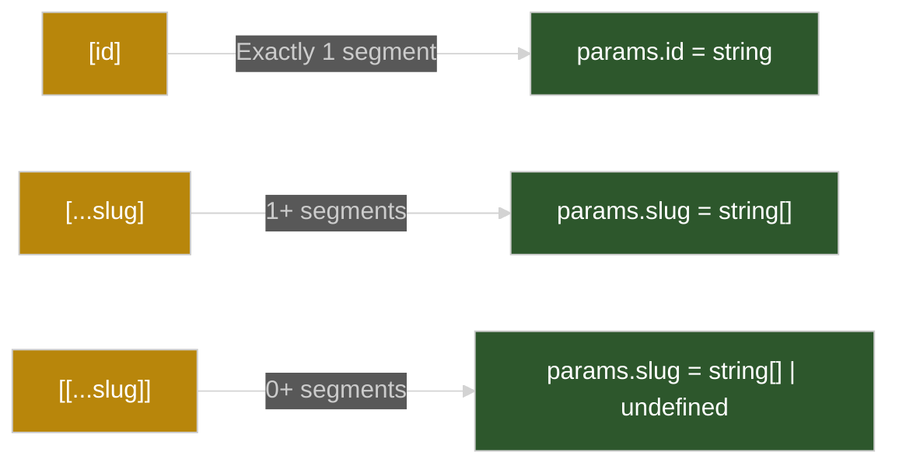

---

### 2.2 Route Groups `(name)` — Organization Without URL Impact

Route groups use **parentheses** to logically group files without adding to the URL path. The `(auth)` folder in this project is the primary example:

```
File System Path                    → Generated URL
─────────────────────────────────────────────────────
app/(auth)/login/page.tsx           → /login          ✅
app/(auth)/signup/page.tsx          → /signup          ✅
app/(auth)/forgot-password/page.tsx → /forgot-password ✅

❌ NOT /auth/login — the (auth) part is stripped
```

**Why route groups exist:**

- 📁 **Organization:** Group related routes (auth, admin, marketing) without polluting URLs.
- 🎨 **Shared Layouts:** You can add a `layout.tsx` inside `(auth)/` to give _only_ auth pages a special layout (e.g., centered card with gradient background).
- 🔀 **Separation of Concerns:** Engineers working on auth don't need to touch the public/marketing routes.

> 🧠 **Think of it this way:** Parentheses `()` in the folder name say "I'm invisible to the URL, but I help humans organize code."

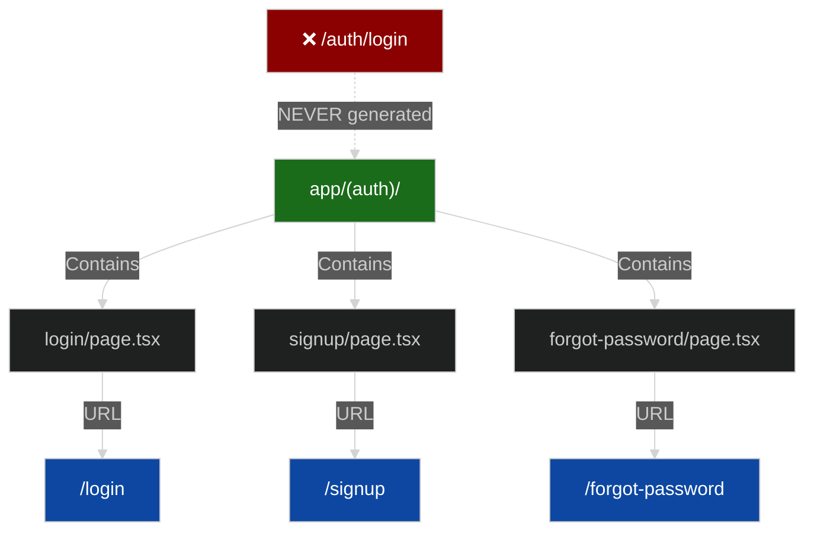

---

### 2.3 Private Folders `_name` — Hidden From Routing

Folders prefixed with `_` are **excluded from route generation entirely**. They exist only for co-locating code near routes.

This project uses two private folders:

| Private Folder     | Contains       | Purpose                                         |
| ------------------ | -------------- | ----------------------------------------------- |
| `app/_components/` | `AuthCard.tsx` | A reusable card wrapper for auth pages          |
| `app/_lib/`        | `utils.ts`     | Helper functions (validation, formatting, etc.) |

**What happens if you remove the underscore?**

```
✅ app/_components/AuthCard.tsx  → No URL generated, import-only
❌ app/components/AuthCard.tsx   → Would try to create /components/AuthCard route!
```

> 🧠 **Rule of thumb:** If a file is not a page but lives inside `app/`, prefix its parent folder with `_`. This prevents accidental route creation and makes your intent explicit.

---

### 2.4 Intercepting Routes — Modal UX Without Losing URL Semantics

This is the most powerful and complex pattern in the project. Intercepting routes let you **hijack a navigation** and render alternate UI (typically a modal) while keeping the URL accurate.

#### The Core Idea

Imagine a photo gallery at `/gallery`. When the user clicks a photo, the URL changes to `/gallery/3` and a **modal overlay** appears — the gallery list stays visible behind it. But if someone opens `/gallery/3` directly (bookmark, share link, page refresh), they see a **full-page** detail view instead.

**This dual behavior is what intercepting routes enable.**

#### The Three Interception Levels

| Pattern | Meaning       | Example in this project        |
| ------- | ------------- | ------------------------------ |
| `(.)`   | Same level    | Gallery photos → modal         |
| `(..)`  | One level up  | Store products → modal         |
| `(...)` | Two levels up | Dashboard team members → modal |

#### How Navigation vs. Direct Access Differs

```
┌─────────────────────────────────────────────────────┐
│  SCENARIO A: User clicks link FROM gallery page     │
│                                                     │
│  /gallery ──click──▶ /gallery/3                     │
│                                                     │
│  What happens:                                      │
│  1. Next.js sees @modal/(.)gallery/[id] EXISTS      │
│  2. Intercepts the navigation                       │
│  3. Renders the MODAL component instead             │
│  4. URL bar shows /gallery/3                        │
│  5. Back button → returns to /gallery               │
└─────────────────────────────────────────────────────┘

┌─────────────────────────────────────────────────────┐
│  SCENARIO B: User types /gallery/3 directly         │
│                                                     │
│  What happens:                                      │
│  1. No interception (hard navigation, not SPA nav)  │
│  2. Renders gallery/[id]/page.tsx (full page)       │
│  3. User sees complete photo detail page            │
└─────────────────────────────────────────────────────┘
```

> 🧠 **Key mental model:** Interception only happens during **client-side navigation** (clicking `<Link>`). Direct URL access, page refreshes, and shared links always render the original `page.tsx`.

---

### 2.5 Parallel Routes `@slot` — Multiple Content Streams in One Layout

Parallel routes use the `@` prefix to define **named slots** that render simultaneously in the same layout. Each slot is independent and can have its own navigation state.

In this project, `@modal` is the primary parallel route slot. The root layout receives it as a prop:

```tsx
// Conceptual root layout with @modal slot
export default function RootLayout({
  children, // Normal page content
  modal, // Content from @modal/ directory
}: {
  children: React.ReactNode;
  modal: React.ReactNode; // ← Parallel route slot
}) {
  return (
    <html>
      <body>
        <Navigation />
        <main>{children}</main>
        {modal} {/* Modal renders over the page when active */}
        <Footer />
      </body>
    </html>
  );
}
```

> ⚠️ **Current project status:** The actual `layout.tsx` in this snapshot only accepts `children` (no `modal` prop). `layout-modal.tsx` shows the full modal-enabled version as a reference. To enable intercepting route modals, you must update the root layout to include the `modal` slot.

**Parallel routes vs. intercepting routes:**

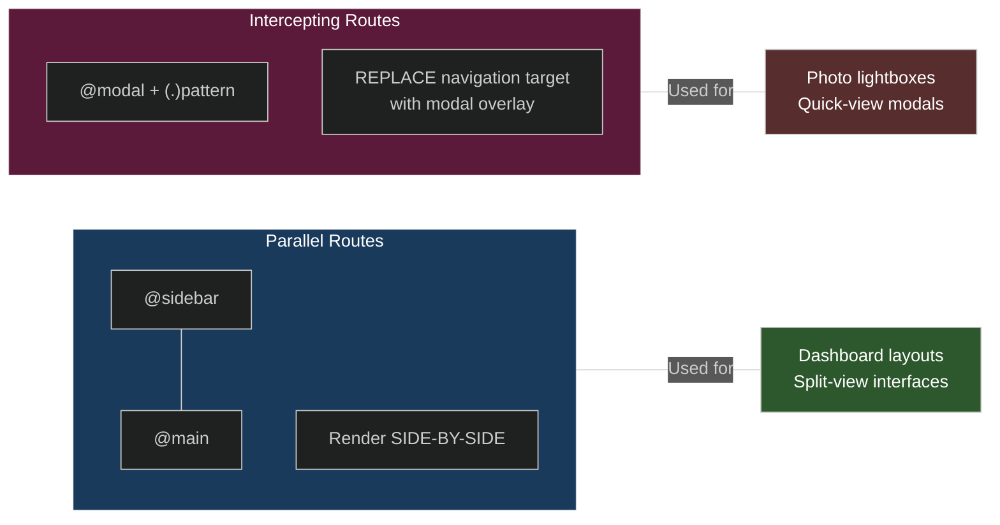

---

### 2.6 Error Handling — `not-found.tsx` and `error.tsx`

Next.js provides two special files for graceful failure handling:

#### `not-found.tsx` — Custom 404 Page

| Property       | Value                                |
| -------------- | ------------------------------------ |
| Component type | Server Component (no `"use client"`) |
| Props received | None                                 |
| HTTP status    | 404                                  |
| Triggered by   | Unmatched route or `notFound()` call |
| Can be nested? | Yes — closest ancestor wins          |

**Example trigger:**

```tsx
import { notFound } from "next/navigation";

export default async function ProductPage({ params }) {
  const product = await getProduct(params.id);
  if (!product) notFound(); // ← Renders nearest not-found.tsx
  return <div>{product.name}</div>;
}
```

#### `error.tsx` — Runtime Error Boundary

| Property       | Value                                         |
| -------------- | --------------------------------------------- |
| Component type | **Must be** Client Component (`"use client"`) |
| Props received | `{ error: Error; reset: () => void }`         |
| HTTP status    | 500                                           |
| Triggered by   | Uncaught JS errors, failed API calls          |
| Can be nested? | Yes — closest ancestor wins                   |

**Example:**

```tsx
"use client";

export default function ErrorPage({
  error,
  reset,
}: {
  error: Error;
  reset: () => void;
}) {
  return (
    <div>
      <h1>Something went wrong!</h1>
      <p>{error.message}</p>
      <button onClick={() => reset()}>Try Again</button>
    </div>
  );
}
```

> 🧠 **Why must `error.tsx` be a client component?** Because it needs to use `onClick` handlers (for the reset button) and potentially `useEffect` for error logging. Server Components can't handle browser events.

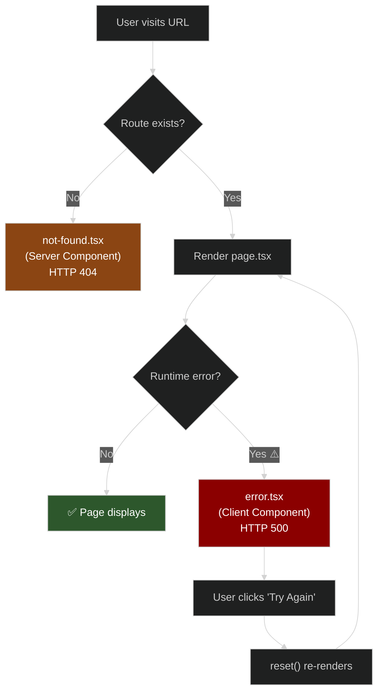

#### Error Hierarchy — Nested Resolution

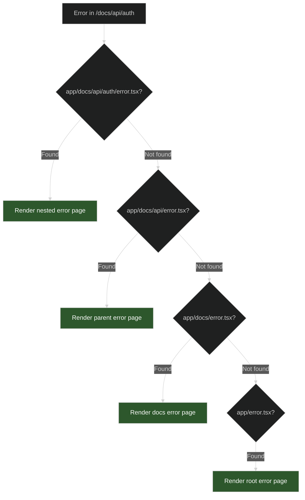

---

### 2.7 The Navigation Component — Client vs. Server

The `<Navigation>` component demonstrates why `"use client"` exists:

```
Server Component (default)           Client Component ("use client")
─────────────────────────            ──────────────────────────────
✅ Can access databases               ✅ Can use React hooks (useState)
✅ Can use async/await                 ✅ Can handle browser events (onClick)
✅ Smaller JS bundle                   ✅ Can use browser APIs
❌ Cannot use useState/useEffect       ❌ Larger JS bundle
❌ Cannot handle onClick               ❌ Cannot directly access databases
```

The Navigation needs `"use client"` because it uses `useState` for the mobile hamburger menu toggle. Without it, React would throw an error.

---

### 2.8 Responsive UI Patterns With Tailwind

This project uses several repeating layout patterns worth memorizing:

| Pattern         | Classes                          | What It Does                              |
| --------------- | -------------------------------- | ----------------------------------------- |
| Responsive grid | `grid md:grid-cols-2 gap-8`      | 1 col on mobile, 2 on desktop             |
| Span-2 hero     | `col-span-2`                     | First child stretches across both columns |
| Desktop-only    | `hidden md:grid`                 | Visible only on md+ screens               |
| Mobile-only     | `grid md:hidden`                 | Visible only below md                     |
| Sticky sidebar  | `sticky top-24`                  | Stays fixed while scrolling               |
| Footer push     | `flex flex-col` + `grow` on main | Pushes footer to bottom on short content  |

---

## 3) Code & Patterns

Each section includes the **crucial snippet**, a **"Key Insight"** explaining why it works, and **"Syntax Tricks"** highlighting patterns to memorize.

---

### 3.1 Root Layout + Global Shell

```tsx
// app/layout.tsx
import Navigation from "@/components/Navigation";
import Footer from "@/components/Footer";

export default function RootLayout({
  children,
}: Readonly<{ children: React.ReactNode }>) {
  return (
    <html lang="en">
      <body
        className={`${geistSans.variable} ${geistMono.variable} antialiased min-h-screen flex flex-col`}
      >
        <Navigation />
        <main className="grow">{children}</main>
        <Footer />
      </body>
    </html>
  );
}
```

> **Key Insight:** The `flex flex-col` on `<body>` + `grow` on `<main>` creates a classic sticky-footer layout. Even on pages with very short content, the footer sticks to the bottom of the viewport because `<main>` expands to fill remaining space.

> **Syntax Tricks:**
>
> - `Readonly<{...}>` makes props immutable at the TypeScript level.
> - `@/components/...` is a path alias configured in `tsconfig.json` to avoid relative path hell (`../../..`).
> - `antialiased` applies font smoothing for crisper text rendering.

**What the user sees:**

```
┌────────────────────────────────────────────┐
│  🔗 MyWebsite    Home  About  Contact  ... │  ← Navigation (sticky)
├────────────────────────────────────────────┤
│                                            │
│            Page Content Here               │  ← {children} swaps
│                                            │
├────────────────────────────────────────────┤
│  © 2026 MyWebsite. All Rights Reserved     │  ← Footer (pushed down)
└────────────────────────────────────────────┘
```

---

### 3.2 Dynamic Route: Simple Slug `[id]`

```tsx
// app/products/[id]/page.tsx
const ProductPage = async ({ params }: { params: Promise<{ id: string }> }) => {
  const { id } = await params; // ← Must await in Next.js 15+

  // Mock data using Record for fast O(1) lookup by key
  const products: Record<
    string,
    { name: string; price: string; description: string }
  > = {
    "1": {
      name: "Laptop",
      price: "$999",
      description: "High-performance laptop",
    },
    "2": {
      name: "Keyboard",
      price: "$129",
      description: "Mechanical keyboard",
    },
    "3": { name: "Monitor", price: "$349", description: "4K curved monitor" },
  };

  const product = products[id];

  return product ? (
    <div>
      <h2>{product.name}</h2>
      <p className="font-mono text-blue-600">id = "{id}"</p>
    </div>
  ) : (
    <div className="bg-red-50">Product "{id}" not found.</div>
  );
};
```

> **Key Insight:** The `[id]` folder matches **exactly one** URL segment. The value is passed via `params.id` as a **string** (even if the URL looks like a number). In Next.js 15+, `params` is a `Promise` that must be `await`ed.

> **Syntax Tricks:**
>
> - `Record<string, {...}>` creates a typed dictionary — great for mock data lookups.
> - Conditional rendering (`product ? ... : ...`) provides graceful fallback without crashing.
> - `async` component at the top level — server components can be async functions.

**Visual: What the user sees at `/products/2`:**

```
┌──────────────────────────────────────────┐
│  Product Details                         │
│                                          │
│  ┌────────────────┐  Keyboard            │
│  │   📦 (image)   │  ────────────────    │
│  │                │  Dynamic Parameter:  │
│  └────────────────┘  id = "2"            │
│                                          │
│                      $129                │
│                      Mechanical keyboard │
│                                          │
│  ┌──────┐ ┌──────┐ ┌──────┐             │
│  │ Pr 1 │ │ Pr 2 │ │ Pr 3 │  ← Links   │
│  └──────┘ └──────┘ └──────┘             │
└──────────────────────────────────────────┘
```

---

### 3.3 Dynamic Route: Catch-All `[...slug]`

```tsx
// app/blog/[...slug]/page.tsx
const BlogPage = async ({
  params,
}: {
  params: Promise<{ slug: string[] }>;
}) => {
  const { slug } = await params;

  // Join array → single key for map lookup
  const currentPath = slug.join("/");
  // e.g., ["2024", "january", "new-year-post"] → "2024/january/new-year-post"

  const post = blogPosts[currentPath];

  // Generate breadcrumbs from slug segments
  const breadcrumbs = slug.map((segment, index) => ({
    label: segment
      .split("-")
      .map((w) => w.charAt(0).toUpperCase() + w.slice(1))
      .join(" "),
    path: "/blog/" + slug.slice(0, index + 1).join("/"),
  }));
};
```

> **Key Insight:** The `[...slug]` pattern collects **all remaining segments** into an array. Joining them with `/` creates a stable key for content lookup. This is perfect for hierarchical content like `year/month/post-title`.

> **Syntax Tricks:**
>
> - `slug.join("/")` converts `["2024", "jan", "post"]` → `"2024/jan/post"` for map lookup.
> - `slug.slice(0, index + 1)` builds progressive breadcrumb paths.
> - `segment.split("-").map(w => w.charAt(0).toUpperCase() + w.slice(1)).join(" ")` prettifies `"new-year-post"` → `"New Year Post"`.

**Visual: Blog at `/blog/2024/january/new-year-post`:**

```
┌──────────────────────────────────────────────┐
│  Blog > 2024 > January > New Year Post       │  ← Breadcrumbs from slug
│                                              │
│  ┌──────────┐  ┌────────────────────────────┐│
│  │ Sidebar  │  │  New Year, New Projects     ││
│  │          │  │  ─────────────────────────  ││
│  │ • Post 1 │  │  By Jane Smith · Jan 1, 24  ││
│  │ • Post 2 │  │                              ││
│  │ •★Post 3 │  │  Slug: ["2024","january",   ││
│  │ • Post 4 │  │         "new-year-post"]     ││
│  │ • Post 5 │  │  Segments: 3                 ││
│  └──────────┘  └────────────────────────────┘│
└──────────────────────────────────────────────┘
```

---

### 3.4 Dynamic Route: Optional Catch-All `[[...slug]]`

```tsx
// app/docs/[[...slug]]/page.tsx
const DocsPage = async ({
  params,
}: {
  params: Promise<{ slug?: string[] }>;
}) => {
  const { slug } = await params;

  // Handle the OPTIONAL nature: slug can be undefined
  const currentPath = slug ? slug.join("/") : "";
  //   /docs               → currentPath = ""     (slug is undefined)
  //   /docs/api/auth       → currentPath = "api/auth"

  const currentDoc = docStructure[currentPath];
};
```

> **Key Insight:** The `?` in `slug?: string[]` is the critical difference from catch-all. This **one file** handles both `/docs` (the root) and `/docs/api/auth/jwt` (4-deep nesting). Without optional catch-all, you'd need a separate `page.tsx` for the root.

> **Syntax Tricks:**
>
> - `slug ? slug.join("/") : ""` safely handles the undefined case.
> - The docs sidebar uses conditional class names based on `currentPath` to highlight the active page.

**Visual: Docs page with sidebar navigation:**

```
┌────────────────────────────────────────────────────┐
│  Docs > API > Authentication                       │
│                                                    │
│  ┌─────────┐  ┌──────────────────────────────────┐│
│  │ 📚 Home │  │  Authentication                   ││
│  │─────────│  │  ──────────────────────────────   ││
│  │ Getting │  │  Learn how to authenticate users  ││
│  │ Started │  │  and manage sessions securely.     ││
│  │  ▸ Inst │  │                                    ││
│  │ API     │  │  ┌── Route Info ──────────────┐   ││
│  │ ▸ Ref   │  │  │ URL: /docs/api/auth        │   ││
│  │ ★▸ Auth │  │  │ Slug: ["api","auth"]        │   ││
│  │   ▸ JWT │  │  │ Path: "api/authentication"  │   ││
│  │ Guides  │  │  └────────────────────────────┘   ││
│  └─────────┘  └──────────────────────────────────┘│
└────────────────────────────────────────────────────┘
```

---

### 3.5 Route Groups `(auth)` — Login Page Example

```tsx
// app/(auth)/login/page.tsx — URL is /login, NOT /auth/login
import Link from "next/link";

export default function LoginPage() {
  return (
    <div className="min-h-screen bg-gradient-to-br from-blue-50 to-indigo-100 flex items-center justify-center">
      <div className="bg-white rounded-lg shadow-lg p-8">
        <h1>Welcome Back</h1>
        <form>
          <input type="email" placeholder="your@email.com" />
          <input type="password" placeholder="••••••••" />
          <button className="bg-blue-600 text-white">Sign In</button>
        </form>
        <Link href="/forgot-password">Forgot password?</Link>
        <Link href="/signup">Sign up</Link>
      </div>
    </div>
  );
}
```

> **Key Insight:** All three auth pages (`login`, `signup`, `forgot-password`) live inside `(auth)/` but their URLs are simply `/login`, `/signup`, `/forgot-password`. The `(auth)` folder provides organizational grouping without URL impact.

> **Syntax Tricks:**
>
> - Cross-links between auth pages use root-level paths (`/signup`, not `/(auth)/signup`).
> - Each auth page uses a different gradient (`blue`, `green`, `orange`) for visual distinction while sharing the same card layout pattern.

**Visual: All three auth pages share a centered-card pattern:**

```
       /login                /signup               /forgot-password
  ┌───────────────┐    ┌───────────────┐      ┌───────────────┐
  │  🔵 gradient  │    │  🟢 gradient  │      │  🟠 gradient  │
  │  ┌─────────┐  │    │  ┌─────────┐  │      │  ┌─────────┐  │
  │  │Welcome  │  │    │  │Create   │  │      │  │Forgot   │  │
  │  │Back     │  │    │  │Account  │  │      │  │Password?│  │
  │  │─────────│  │    │  │─────────│  │      │  │─────────│  │
  │  │[email] │  │    │  │[name]  │  │      │  │[email]  │  │
  │  │[pass]   │  │    │  │[email]  │  │      │  │         │  │
  │  │[Sign In]│  │    │  │[pass]   │  │      │  │[Reset]  │  │
  │  └─────────┘  │    │  │[confirm]│  │      │  └─────────┘  │
  │  📁 Route info│    │  └─────────┘  │      │  📁 Route info│
  └───────────────┘    └───────────────┘      └───────────────┘
```

---

### 3.6 Private Folders — `_components/AuthCard.tsx` & `_lib/utils.ts`

```tsx
// app/_components/AuthCard.tsx — NOT a routable page
interface AuthCardProps {
  title: string;
  subtitle: string;
  children: React.ReactNode;
  bgGradient: string;
  accentColor: string;
}

export function AuthCard({
  title,
  subtitle,
  children,
  bgGradient,
  accentColor,
}: AuthCardProps) {
  return (
    <div
      className={`min-h-screen bg-gradient-to-br ${bgGradient} flex items-center justify-center`}
    >
      <div className="bg-white rounded-lg shadow-lg p-8">
        <h1 className={`text-3xl font-bold ${accentColor}`}>{title}</h1>
        <p className="text-gray-600">{subtitle}</p>
        {children}
      </div>
    </div>
  );
}
```

```tsx
// app/_lib/utils.ts — Utility functions
export function validateEmail(email: string): boolean {
  return /^[^\s@]+@[^\s@]+\.[^\s@]+$/.test(email);
}

export function validatePassword(password: string): {
  isValid: boolean;
  strength: "weak" | "medium" | "strong";
  messages: string[];
} {
  // Checks: length ≥ 8, uppercase, lowercase, number, special char
  // Returns detailed validation result with strength indicator
}
```

> **Key Insight:** The `_` prefix means these files **never become routes**. You can import `AuthCard` and `validateEmail` from any page, but visiting `/components/AuthCard` or `/_lib/utils` in the browser would **404**.

> **Syntax Tricks:**
>
> - `AuthCardProps` interface ensures type-safe reusable components.
> - `validatePassword` returns a discriminated object (not just `boolean`) — callers get `isValid`, `strength`, and specific `messages`.
> - Template literal classes: `` `bg-gradient-to-br ${bgGradient}` `` allow dynamic Tailwind classes via props.

---

### 3.7 Intercepting Route — Gallery Modal `(.)`

This is the **same-level** interception pattern. Here's the full modal component:

```tsx
// app/@modal/(.)gallery/[id]/page.tsx
"use client"; // ← Required for hooks and event handlers

import { useRouter } from "next/navigation";
import { useEffect, useRef } from "react";

export default function PhotoModal({ params }: { params: { id: string } }) {
  const dialogRef = useRef<HTMLDialogElement>(null);
  const router = useRouter();

  // Open modal immediately when component mounts
  useEffect(() => {
    dialogRef.current?.showModal(); // ← Native <dialog> method
  }, []);

  // Close = navigate back (pop history stack)
  const handleClose = () => router.back();

  // Close when clicking the dark backdrop (not the modal content)
  const handleBackdropClick = (e: React.MouseEvent<HTMLDialogElement>) => {
    if (e.target === dialogRef.current) handleClose();
  };

  return (
    <dialog
      ref={dialogRef}
      onClick={handleBackdropClick}
      className="fixed inset-0 z-50 rounded-lg backdrop:bg-black backdrop:bg-opacity-50"
    >
      {/* Modal content: photo + details + close/full-page buttons */}
      <div className="bg-white rounded-lg shadow-2xl">
        <button onClick={handleClose} aria-label="Close modal">
          ✕
        </button>
        <div className="text-8xl">{photo.image}</div>
        <p>{photo.description}</p>
        <button onClick={() => router.push(`/gallery/${photoId}`)}>
          View Full Page
        </button>
      </div>
    </dialog>
  );
}
```

> **Key Insight:** Three things make this modal work:
>
> 1. **`<dialog>` element** — provides native modal behavior with backdrop, ESC-to-close, and focus trapping. No third-party library needed.
> 2. **`router.back()`** — closes the modal by popping the history stack, NOT by hard-navigating. This preserves scroll position and gallery state.
> 3. **`e.target === dialogRef.current`** — detects backdrop clicks _without_ blocking clicks on modal content.

> **Syntax Tricks:**
>
> - `useRef<HTMLDialogElement>(null)` — typed ref for the dialog element.
> - `?.showModal()` — optional chaining prevents errors if ref isn't attached yet.
> - `backdrop:bg-black backdrop:bg-opacity-50` — Tailwind's `backdrop:` modifier styles the native dialog backdrop.

**Visual: What the user experiences:**

```
Step 1: User is on /gallery         Step 2: Clicks photo #3
┌──────────────────────┐            ┌──────────────────────┐
│  Photo Gallery       │            │  Photo Gallery       │
│                      │            │  ┌────────────────┐  │
│  🏔️  🌊  🌲         │    ──▶     │  │  ✕  Forest     │  │
│  🏜️  🌃  🏝️         │            │  │  🌲 (large)    │  │
│                      │            │  │  Peaceful walk │  │
│                      │            │  │  [Close][Full] │  │
│                      │            │  └────────────────┘  │
│                      │            │  ▓▓▓ dark backdrop ▓▓│
└──────────────────────┘            └──────────────────────┘
URL: /gallery                       URL: /gallery/3
                                    (modal, not full page)
```

---

### 3.8 Intercepting Route — Store Products `(..)`

The **one-level-up** pattern. The file lives at `app/@modal(..)/store/products/[id]/page.tsx`:

```
Route hierarchy:
  app/                          ← Level 0
  ├── @modal(..)                ← Interception definition (one level up from here)
  │   └── store/products/[id]   ← Intercepts /store/products/[id]
  └── store/
      └── products/
          ├── page.tsx          ← List page (source of navigation)
          └── [id]/page.tsx     ← Full page (fallback for direct access)
```

> **Key Insight:** `(..)` means "match one level up from where the intercepting route lives." Since the modal file is inside `@modal(..)`, it intercepts `store/products/[id]` by reaching one level up from its own position in the route tree.

---

### 3.9 Intercepting Route — Team Members `(...)`

The **two-levels-up** pattern. The file lives at `app/@modal(...)/team/members/[id]/page.tsx`:

```
Route hierarchy:
  app/                               ← Level 0
  ├── @modal(...)                    ← Interception (two levels up)
  │   └── team/members/[id]          ← Intercepts /dashboard/team/members/[id]
  └── dashboard/                     ← Level 1
      └── team/                      ← Level 2
          └── members/
              └── [id]/page.tsx      ← Full page fallback
```

> **Key Insight:** `(...)` reaches **two levels up**, enabling interception of deeply nested routes. This is essential for dashboard-style UIs where detail views are nested several layers deep but you still want a modal overlay experience.

---

### 3.10 Client Form State Pattern — Contact Page

```tsx
// app/contact/page.tsx
"use client";

const [formData, setFormData] = useState({
  name: "",
  email: "",
  subject: "",
  message: "",
});
const [submitted, setSubmitted] = useState(false);
const [loading, setLoading] = useState(false);

// Single generic handler for ALL inputs
const handleChange = (
  e: React.ChangeEvent<HTMLInputElement | HTMLTextAreaElement>,
) => {
  const { name, value } = e.target;
  setFormData((prev) => ({ ...prev, [name]: value }));
  //                       ^^^^^^^^  ^^^^^^^^^^^^^^
  //                       Keep all   Update only the
  //                       other      changed field
  //                       fields
};

const handleSubmit = (e: React.FormEvent<HTMLFormElement>) => {
  e.preventDefault(); // ← Prevent full page reload
  setLoading(true);
  setTimeout(() => {
    // ← Simulate API call
    setLoading(false);
    setSubmitted(true);
    setFormData({ name: "", email: "", subject: "", message: "" });
    setTimeout(() => setSubmitted(false), 5000); // ← Auto-hide success
  }, 1000);
};
```

> **Key Insight:** Instead of writing a separate `onChange` handler for each input, one `handleChange` function handles all four fields. The magic is `[name]: value` — a computed property key that dynamically updates whichever field triggered the event.

> **Syntax Tricks:**
>
> - `...prev` (spread) preserves all existing fields when updating one.
> - `[name]: value` — computed property key pattern. If `e.target.name` is `"email"`, this becomes `{ email: "typed-value" }`.
> - Each `<input>` has `name="fieldName"` matching the state object keys exactly.
> - The submit button shows `"Sending..."` during loading using a ternary: `{loading ? "Sending..." : "Send Message"}`.

---

### 3.11 Responsive Navigation Pattern

```tsx
// components/Navigation.tsx
"use client";
const [isMenuOpen, setIsMenuOpen] = useState(false);

return (
  <nav className="sticky top-0 z-50">
    {/* Desktop: visible on md+ */}
    <div className="hidden md:flex space-x-6">
      <Link href="/">Home</Link>
      <Link href="/about">About</Link>
    </div>

    {/* Mobile hamburger: visible below md */}
    <div className="md:hidden">
      <button onClick={() => setIsMenuOpen(!isMenuOpen)}>
        {isMenuOpen ? "✕" : "☰"}
      </button>

      {/* Dropdown: conditionally rendered */}
      {isMenuOpen && (
        <div className="absolute right-0 top-full w-48 bg-white shadow-lg">
          <Link href="/" onClick={() => setIsMenuOpen(false)}>
            Home
          </Link>
          <Link href="/about" onClick={() => setIsMenuOpen(false)}>
            About
          </Link>
        </div>
      )}
    </div>
  </nav>
);
```

> **Key Insight:** Two completely separate nav structures exist:
>
> 1. **Desktop** (`hidden md:flex`) — horizontal link bar, always visible on `≥768px`.
> 2. **Mobile** (`md:hidden`) — hamburger icon that toggles a dropdown.
>
> Each mobile `<Link>` has `onClick={() => setIsMenuOpen(false)}` to auto-close the menu after navigation.

> **Syntax Tricks:**
>
> - `sticky top-0 z-50` keeps nav pinned on scroll without removing it from document flow (unlike `fixed`).
> - `absolute right-0 top-full` positions the dropdown directly below the hamburger button.
> - `aria-expanded={isMenuOpen}` provides accessibility for screen readers.

---

## 4) Visual Aids (Mermaid)

### A) Complete Route Resolution Pipeline

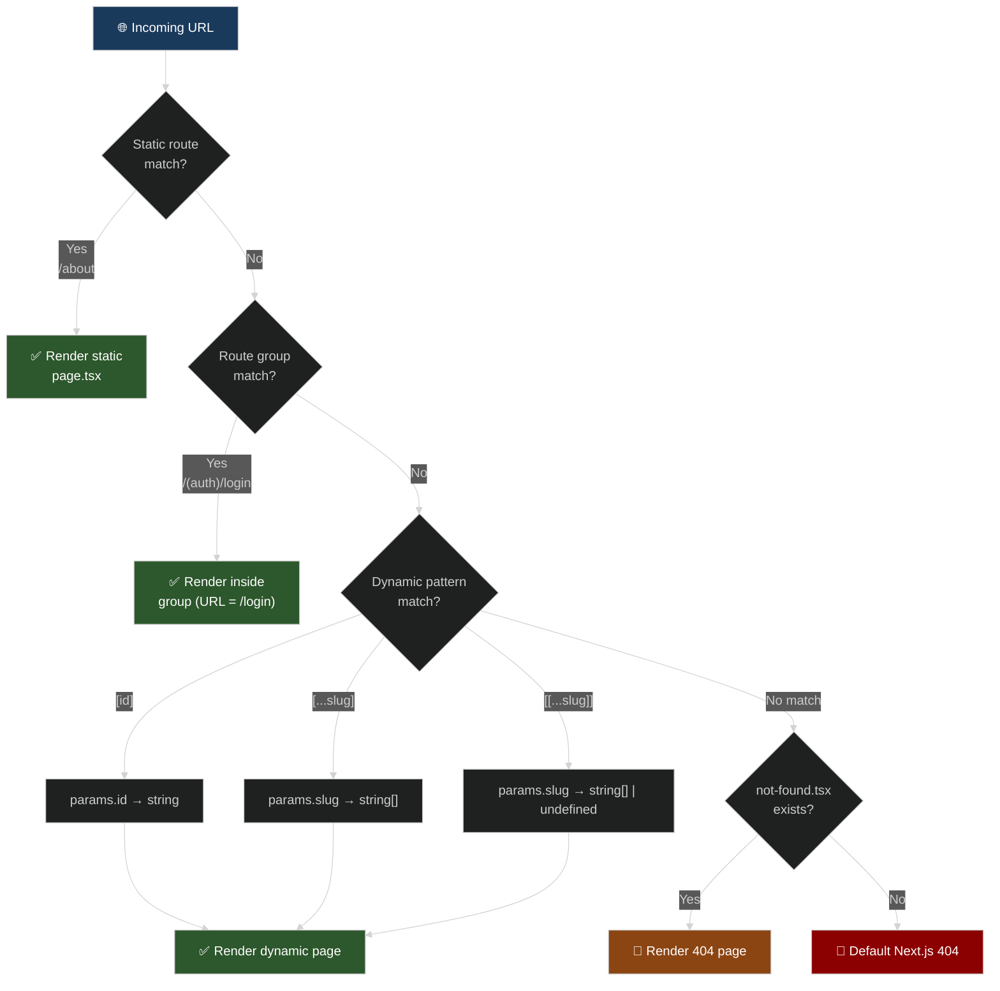

### B) Intercepting Routes — All Three Patterns Side by Side

```mermaid
%%{init: {'theme': 'dark'}}%%
flowchart TD
    subgraph SL ["(.) Same Level"]
        SL1["/gallery"] -->|"Click photo"| SL2["@modal/(.)gallery/[id]"]
        SL2 -->|"Shows"| SL3["🖼️ Photo Modal"]
    end

    subgraph OL ["(..) One Level Up"]
        OL1["/store/products"] -->|"Click product"| OL2["@modal(..)/store/products/[id]"]
        OL2 -->|"Shows"| OL3["🛒 Product Modal"]
    end

    subgraph TL ["(...) Two Levels Up"]
        TL1["/dashboard/team/members"] -->|"Click member"| TL2["@modal(...)/team/members/[id]"]
        TL2 -->|"Shows"| TL3["👤 Profile Modal"]
    end

    style SL fill:#1a3a5c,color:#fff
    style OL fill:#3a1a5c,color:#fff
    style TL fill:#1a5c3a,color:#fff
    style SL3 fill:#2d572c,color:#fff
    style OL3 fill:#2d572c,color:#fff
    style TL3 fill:#2d572c,color:#fff
```

### C) Intercepting Route Modal — Full Lifecycle

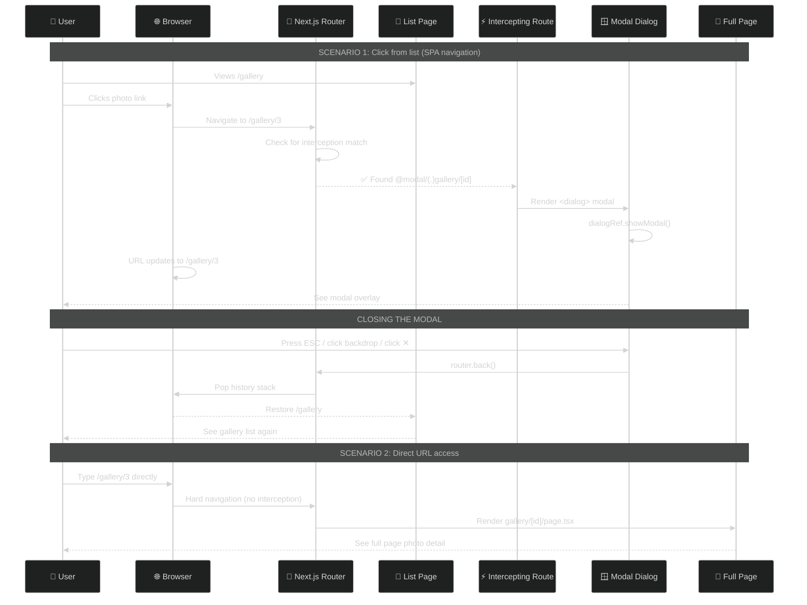

### D) Contact Form State Machine

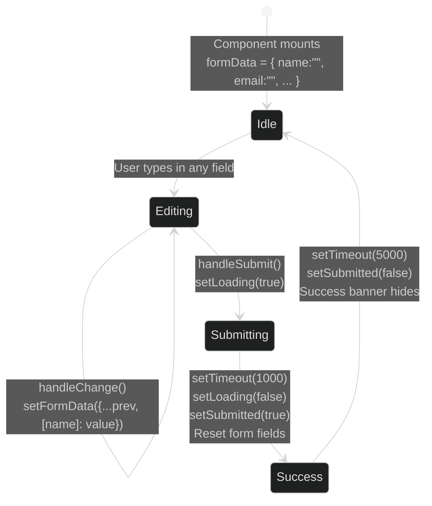

### E) Layout Nesting — How Layouts Wrap Pages

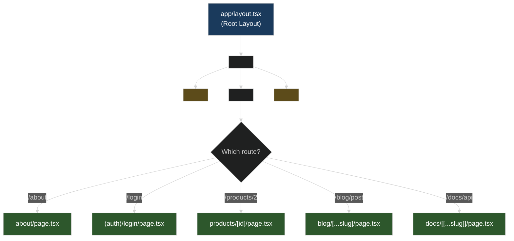

### F) Dynamic Route Type Decision Tree

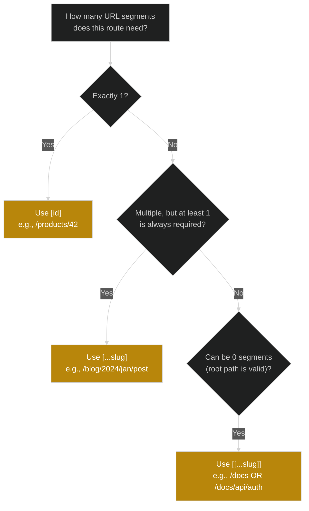

### G) Folder Naming Convention Cheat Sheet

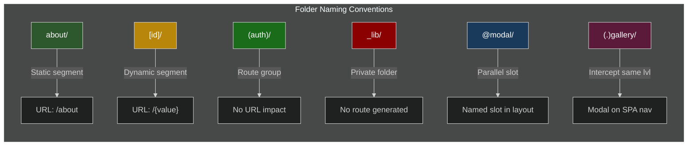

### H) Parallel Routes — Analytics Dashboard Layout

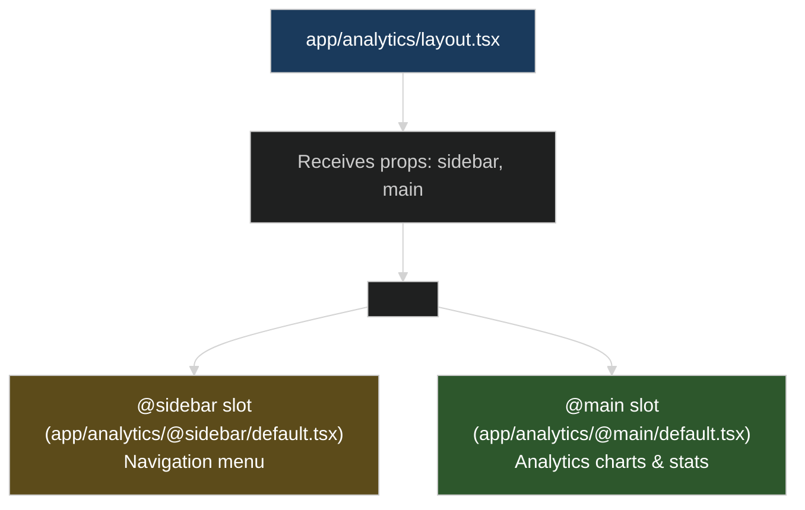

---

## 5) Summary / Key Takeaways

### 🏗️ Architecture

- **App Router = filesystem-driven routing.** Folder names → URL segments. Special files → behavior.
- **Layouts persist across navigations** — only `{children}` swaps. This gives you free performance optimization.
- **Server Components are the default.** Add `"use client"` only when you need hooks or browser events.

### 📁 Organization

- **Route Groups `()`** — organize folders without affecting URLs. Great for auth/admin/public segmentation.
- **Private Folders `_`** — co-locate utilities and components near routes without creating accidental pages.
- **Path Aliases `@/`** — avoid relative import hell with `tsconfig.json` path mapping.

### 🔗 Dynamic Routing

| Pattern       | Segments  | Required? | Use Case                             |
| ------------- | --------- | --------- | ------------------------------------ |
| `[id]`        | Exactly 1 | Yes       | Product pages, user profiles         |
| `[...slug]`   | 1 or more | Yes       | Blog posts, category hierarchies     |
| `[[...slug]]` | 0 or more | No        | Docs, wikis, settings with root page |

### ⚡ Intercepting Routes + Modals

- **Intercepting routes** = alternate UI during client-side navigation. Direct access shows full page.
- `(.)` same level, `(..)` one up, `(...)` two up.
- Use `@modal` parallel route slot to render modals alongside page content.
- `<dialog>` + `router.back()` = native modal with clean history management.
- **Always provide a full-page fallback** (`gallery/[id]/page.tsx`) for direct URL access and SEO.

### 🛡️ Error Handling

- `not-found.tsx` — Server Component, HTTP 404, no props, triggered by unmatched route or `notFound()`.
- `error.tsx` — **Must be Client Component**, receives `{ error, reset }`, provides "Try Again" UX.
- Both support nesting — closest ancestor handler wins.

### 🎨 UI Patterns

- `flex flex-col` + `grow` = sticky footer that works even on short pages.
- `hidden md:flex` / `md:hidden` = separate desktop and mobile layouts.
- `[name]: value` computed property = one handler for all form fields.
- `sticky top-0 z-50` = navigation that stays visible without being `position: fixed`.

---

## 6) Practical Revision Checklist

### 🚀 Setup

```bash
npm install     # or: bun install
npm run dev     # Starts at http://localhost:3000
```

### 🔍 Routes to Visit and Verify

| URL                                | What to Look For                                   |
| ---------------------------------- | -------------------------------------------------- |
| `/`                                | Home page with feature cards                       |
| `/about`                           | Grid layouts, team cards, col-span-2 pattern       |
| `/contact`                         | Form state management, loading/success states      |
| `/login`                           | Route group — URL is `/login` not `/auth/login`    |
| `/signup`                          | Same group, different gradient                     |
| `/forgot-password`                 | Same group, orange theme                           |
| `/products/1`                      | Simple `[id]` dynamic route                        |
| `/products/999`                    | Graceful fallback for unknown ID                   |
| `/blog/getting-started`            | Catch-all slug with 1 segment                      |
| `/blog/2024/january/new-year-post` | Catch-all slug with 3 segments                     |
| `/docs`                            | Optional catch-all (root = slug is undefined)      |
| `/docs/api/authentication/jwt`     | Optional catch-all (4 segments deep)               |
| `/gallery`                         | Photo grid → click for modal (`.` interception)    |
| `/gallery/1` (direct)              | Full page view (no interception)                   |
| `/store/products`                  | Product grid → click for modal (`..` interception) |
| `/dashboard/team/members`          | Team table → click for modal (`...` interception)  |

### ❓ Challenge Questions

1. **What's the difference between `[...slug]` and `[[...slug]]`?** _Hint: What happens at the root path?_
2. **Why does the modal use `router.back()` instead of `router.push("/gallery")`?** _Hint: Think about the browser history stack._
3. **Why must `error.tsx` be a client component but `not-found.tsx` can be a server component?**
4. **What would happen if you renamed `_components` to `components` (removing the `_`)?**
5. **If you refresh the browser while a modal is open at `/gallery/3`, what renders and why?**

---

## 7) Source Files Covered

This README was consolidated from the following sources:

### 📝 Notes & Summaries

- `INTERCEPTING_ROUTES_SUMMARY.md` — Complete interception guide
- `IMPLEMENTATION_SUMMARY.txt` — Implementation checklist and testing guide
- `PARALLEL_ROUTES_SUMMARY.txt` — Parallel routes concepts and dashboard example
- `ERROR_HANDLING_SUMMARY.txt` — Error boundaries and 404 handling

### 📄 Route Files (24 pages)

- `app/page.tsx`, `app/layout.tsx`, `app/layout-modal.tsx`
- `app/about/page.tsx`, `app/contact/page.tsx`
- `app/(auth)/login/page.tsx`, `signup/page.tsx`, `forgot-password/page.tsx`
- `app/products/[id]/page.tsx`
- `app/blog/[...slug]/page.tsx`
- `app/docs/[[...slug]]/page.tsx`
- `app/gallery/page.tsx`, `app/gallery/[id]/page.tsx`
- `app/@modal/(.)gallery/[id]/page.tsx`
- `app/store/products/page.tsx`, `app/store/products/[id]/page.tsx`
- `app/@modal(..)/store/products/[id]/page.tsx`
- `app/dashboard/page.tsx`, `app/dashboard/team/members/page.tsx`, `[id]/page.tsx`
- `app/@modal(...)/team/members/[id]/page.tsx`
- Guide pages: `examples`, `routing-guide`, `folder-structure-guide`, `intercepting-routes-guide`, `test-intercepting-routes`

### 🔧 Components & Config

- `components/Navigation.tsx`, `components/Footer.tsx`
- `app/_components/AuthCard.tsx`, `app/_lib/utils.ts`
- `package.json`, `tsconfig.json`, `next.config.ts`, `eslint.config.mjs`, `postcss.config.mjs`

### 🚫 Excluded

- `.next/` build artifacts
- `node_modules/`
- `bun.lock`

---

> 📌 **Last updated:** February 12, 2026
