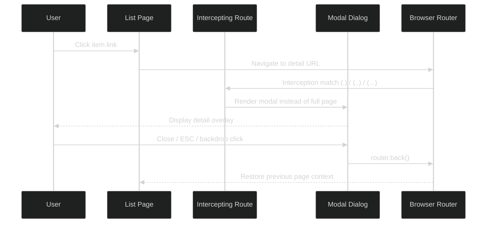
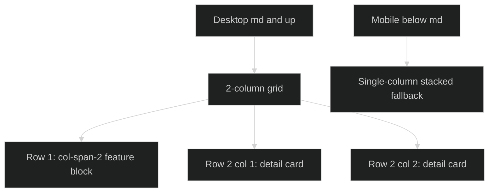
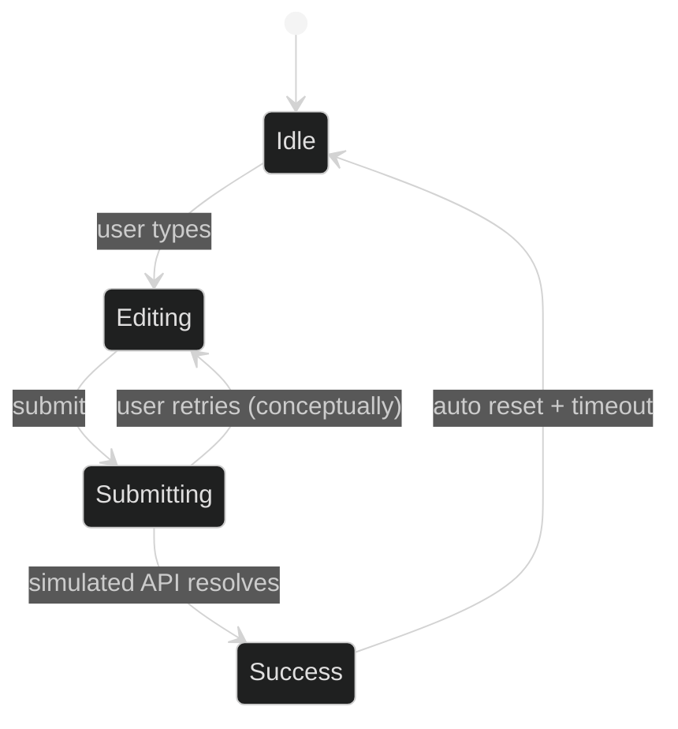

# Next.js Routing Mini Project - Master Revision Guide

This README is a standalone learning + revision guide for everything implemented in this directory. It consolidates the code examples, notes, and summary docs into one place so you do not need to open each file during revision.

Project stack:
- Next.js `16.1.6` (App Router)
- React `19`
- TypeScript
- Tailwind CSS `v4`

---

## 1) Table of Contents

- [2) Theoretical Concepts](#2-theoretical-concepts)
  - [2.1 App Router Mental Model](#21-app-router-mental-model)
  - [2.2 Dynamic Route Theory](#22-dynamic-route-theory)
  - [2.3 Route Groups Theory](#23-route-groups-theory)
  - [2.4 Private Folders Theory](#24-private-folders-theory)
  - [2.5 Intercepting Routes Theory](#25-intercepting-routes-theory)
  - [2.6 Parallel Routes (Concept + Current Status)](#26-parallel-routes-concept--current-status)
  - [2.7 Error and 404 Theory](#27-error-and-404-theory)
  - [2.8 Responsive UI Patterns Used](#28-responsive-ui-patterns-used)
- [3) Code & Patterns](#3-code--patterns)
  - [3.1 Root Layout + Global Shell](#31-root-layout--global-shell)
  - [3.2 Dynamic Route: Simple Slug `[id]`](#32-dynamic-route-simple-slug-id)
  - [3.3 Dynamic Route: Catch-All `[...slug]`](#33-dynamic-route-catch-all-slug)
  - [3.4 Dynamic Route: Optional Catch-All `[[...slug]]`](#34-dynamic-route-optional-catch-all-slug)
  - [3.5 Route Groups `(auth)`](#35-route-groups-auth)
  - [3.6 Private Folders `_components` and `_lib`](#36-private-folders-_components-and-_lib)
  - [3.7 Intercepting Route `(.)` Same Level](#37-intercepting-route--same-level)
  - [3.8 Intercepting Route `(..)` One Level Up](#38-intercepting-route--one-level-up)
  - [3.9 Intercepting Route `(...)` Two Levels Up](#39-intercepting-route--two-levels-up)
  - [3.10 Grid Pattern: Span-2 + Two Columns](#310-grid-pattern-span-2--two-columns)
  - [3.11 Client Form State Pattern](#311-client-form-state-pattern)
- [4) Visual Aids (Mermaid)](#4-visual-aids-mermaid)
- [5) Summary / Key Takeaways](#5-summary--key-takeaways)
- [6) Practical Revision Checklist](#6-practical-revision-checklist)
- [7) Source Files Covered](#7-source-files-covered)

---

## 2) Theoretical Concepts

### 2.1 App Router Mental Model

In Next.js App Router, folders define route segments and special file names (`page.tsx`, `layout.tsx`, etc.) define behavior. The project uses this model to teach routing through real examples rather than only theory.

Key rules:
- Every `page.tsx` is a route entry.
- `layout.tsx` wraps child pages and provides shared UI.
- Route segment naming controls parameter behavior:
  - Static: `about`
  - Dynamic: `[id]`
  - Catch-all: `[...slug]`
  - Optional catch-all: `[[...slug]]`
- Folder conventions add structure:
  - Group: `(name)` (organization, not URL)
  - Private: `_name` (excluded from routing)

### 2.2 Dynamic Route Theory

Dynamic routes map URL segments into runtime params.

- **Simple slug**: one segment
  - `app/products/[id]/page.tsx`
  - `/products/42` -> `id = "42"`
- **Catch-all**: one or more segments
  - `app/blog/[...slug]/page.tsx`
  - `/blog/a/b` -> `slug = ["a", "b"]`
- **Optional catch-all**: zero or more segments
  - `app/docs/[[...slug]]/page.tsx`
  - `/docs` -> `slug = undefined`
  - `/docs/api/auth` -> `slug = ["api", "auth"]`

Important logic rule from the codebase:
- In this project, dynamic pages use async params signatures consistent with modern Next.js examples, e.g. `params: Promise<...>` and `await params`.

### 2.3 Route Groups Theory

Route groups use parentheses to logically group routes without changing URL paths.

Example:
- File path: `app/(auth)/login/page.tsx`
- URL path: `/login` (not `/auth/login`)

Why this matters:
- Clean public URLs
- Better internal organization
- Easier shared layouts for specific feature groups (auth/admin/public)

### 2.4 Private Folders Theory

Private folders begin with `_` and are excluded from route generation.

Examples in this project:
- `app/_components/AuthCard.tsx`
- `app/_lib/utils.ts`

Why this matters:
- Prevent accidental routes
- Keep reusable logic near related routes
- Separate route entries from utilities/components

### 2.5 Intercepting Routes Theory

Intercepting routes let navigation target one route while rendering alternate UI (commonly modal UX).

Patterns implemented:
- `(.)` same level
- `(..)` one level up
- `(...)` two levels up

Core behavior:
- URL updates to destination route
- UI can render a modal instead of full-page transition
- Back button naturally closes modal and restores previous context

### 2.6 Parallel Routes (Concept + Current Status)

Concept from notes:
- Parallel routes use `@slot` directories to render multiple content streams in one layout.

Status in current code snapshot:
- Concept documented in `PARALLEL_ROUTES_SUMMARY.txt`.
- A live `app/analytics/@sidebar`, `@main` implementation is not present in the current filesystem snapshot.
- Intercepting modal examples reference a parallel-slot style (`@modal`) in docs; actual root `app/layout.tsx` currently accepts only `children` (no `modal` prop).

### 2.7 Error and 404 Theory

From the notes:
- `not-found.tsx` handles unmatched routes.
- `error.tsx` handles runtime errors and must be a client component.

Current status in this folder snapshot:
- Error handling is documented in `ERROR_HANDLING_SUMMARY.txt`.
- Corresponding `app/not-found.tsx` and `app/error.tsx` files are not currently present in this tree.

### 2.8 Responsive UI Patterns Used

The project repeatedly demonstrates teaching-friendly UI architecture with Tailwind:
- `grid md:grid-cols-*` for responsive switch from single-column to multi-column.
- `col-span-2` for emphasis sections.
- `hidden md:grid` + `md:hidden` to intentionally design separate desktop/mobile layouts.
- `sticky top-*` for persistent context sidebars/nav.

---

## 3) Code & Patterns

Each section includes:
- a crucial snippet
- why it works
- syntax tricks

### 3.1 Root Layout + Global Shell

```tsx
export default function RootLayout({
  children,
}: Readonly<{ children: React.ReactNode }>) {
  return (
    <html lang="en">
      <body className="... min-h-screen flex flex-col">
        <Navigation />
        <main className="grow">{children}</main>
        <Footer />
      </body>
    </html>
  );
}
```

**Key Insight**
- This creates one global shell: sticky nav on top, growing main content, footer at bottom.
- `flex flex-col` + `main.grow` ensures footer stays pushed down on short pages.

**Syntax / tricks**
- `Readonly<{ children: React.ReactNode }>` for strict layout props typing.
- Path alias imports via `@/components/...` configured in `tsconfig.json`.

---

### 3.2 Dynamic Route: Simple Slug `[id]`

```tsx
const ProductPage = async ({ params }: { params: Promise<{ id: string }> }) => {
  const { id } = await params;
  const product = products[id];
  return <p className="font-mono">id = "{id}"</p>;
};
```

**Key Insight**
- `[id]` maps exactly one segment.
- Excellent for object lookup by key (`products[id]`).

**Syntax / tricks**
- `Record<string, {...}>` for mock map data.
- Graceful fallback UI when key is missing.

---

### 3.3 Dynamic Route: Catch-All `[...slug]`

```tsx
const BlogPage = async ({ params }: { params: Promise<{ slug: string[] }> }) => {
  const { slug } = await params;
  const currentPath = slug.join("/");
  const post = blogPosts[currentPath];
};
```

**Key Insight**
- Catch-all gives an ordered segment array, making nested URL hierarchies easy to model.
- Joining into a stable key (`a/b/c`) enables quick map-based content retrieval.

**Syntax / tricks**
- Breadcrumb generation with `slug.slice(0, index + 1).join("/")`.
- Segment prettification by splitting hyphenated strings.

---

### 3.4 Dynamic Route: Optional Catch-All `[[...slug]]`

```tsx
const DocsPage = async ({ params }: { params: Promise<{ slug?: string[] }> }) => {
  const { slug } = await params;
  const currentPath = slug ? slug.join("/") : "";
};
```

**Key Insight**
- Optional catch-all is perfect when the route must support both root page and deep pages in one file.

**Syntax / tricks**
- `slug?: string[]` signals optional params shape.
- Normalize with empty-string fallback for map lookup.

---

### 3.5 Route Groups `(auth)`

```tsx
// file: app/(auth)/login/page.tsx
// URL: /login
```

**Key Insight**
- Route grouping gives architectural organization without polluting URL structure.

**Syntax / tricks**
- Parentheses folder naming convention only affects filesystem semantics.

---

### 3.6 Private Folders `_components` and `_lib`

```ts
// app/_lib/utils.ts
export function validateEmail(email: string): boolean {
  const emailRegex = /^[^\s@]+@[^\s@]+\.[^\s@]+$/;
  return emailRegex.test(email);
}
```

**Key Insight**
- `_` folders prevent routing side effects while encouraging feature-local utilities.

**Syntax / tricks**
- Utility return contracts with explicit object types (`validatePassword`).
- Reusable view wrapper via `AuthCard` in `_components`.

---

### 3.7 Intercepting Route `(.)` Same Level

```tsx
"use client";
const dialogRef = useRef<HTMLDialogElement>(null);
useEffect(() => {
  dialogRef.current?.showModal();
}, []);
const handleClose = () => router.back();
```

**Key Insight**
- `(.)` intercepts sibling-level route transitions for modal overlays while preserving URL semantics.

**Syntax / tricks**
- Native `<dialog>` for modal + backdrop.
- `router.back()` to close modal by popping history instead of hard redirect.

---

### 3.8 Intercepting Route `(..)` One Level Up

```tsx
// file: app/@modal(..)/store/products/[id]/page.tsx
// pattern: (..) -> intercept from one route level up
```

**Key Insight**
- Useful when trigger page and detail page are nested but interception point sits one level above.

**Syntax / tricks**
- Backdrop close detection:
  - `if (e.target === dialogRef.current) handleClose();`

---

### 3.9 Intercepting Route `(...)` Two Levels Up

```tsx
// file: app/@modal(...)/team/members/[id]/page.tsx
// pattern: (...) -> intercept from two levels up
```

**Key Insight**
- Enables modal interception in deeper dashboard hierarchies where single-parent ascent is not enough.

**Syntax / tricks**
- Shared modal pattern reused with different dataset and path depth.

---

### 3.10 Grid Pattern: Span-2 + Two Columns

From `app/about/page.tsx`:

```tsx
<div className="grid md:grid-cols-2 gap-8 hidden md:grid">
  <div className="col-span-2 ...">First row spans both columns</div>
  <div className="...">Second row left</div>
  <div className="...">Second row right</div>
</div>
```

**Key Insight**
- `col-span-2` elevates priority content while preserving two-column rhythm below.
- Great for “hero + detail pair” educational layouts.

**Syntax / tricks**
- Desktop-only structure with dedicated mobile fallback (`md:hidden` block).

---

### 3.11 Client Form State Pattern

From `app/contact/page.tsx`:

```tsx
"use client";
const [formData, setFormData] = useState({ name: "", email: "", subject: "", message: "" });
const handleChange = (e) => {
  const { name, value } = e.target;
  setFormData((prev) => ({ ...prev, [name]: value }));
};
```

**Key Insight**
- Demonstrates controlled form inputs with a single generic change handler.
- Teaches immutable updates and dynamic object keys.

**Syntax / tricks**
- `[name]: value` computed property updates the corresponding field.
- Async simulation pattern: loading + success state management.

---

## 4) Visual Aids (Mermaid)

### A) Dynamic Route Resolution

```mermaid
%%{init: {'theme': 'dark'}}%%
flowchart TD
  A[Incoming URL] --> B{Matches static route?}
  B -->|Yes| C[Render static page.tsx]
  B -->|No| D{Matches dynamic pattern?}
  D -->|[id]| E[params.id -> string]
  D -->|[...slug]| F[params.slug -> string array]
  D -->|[[...slug]]| G[params.slug -> string array or undefined]
  E --> H[Render dynamic page]
  F --> H
  G --> H
  D -->|No| I[No route matched]
```

### B) Route Group vs Private Folder Behavior

```mermaid
%%{init: {'theme': 'dark'}}%%
flowchart LR
  A[File in app/(auth)/login/page.tsx] --> B[URL = /login]
  C[File in app/_components/AuthCard.tsx] --> D[No URL route generated]
  E[File in app/_lib/utils.ts] --> F[Import only]
```

### C) Intercepting Route Modal Flow



### D) Responsive Grid Pattern (About Page)



### E) Contact Form State Lifecycle



---

## 5) Summary / Key Takeaways

- App Router is folder-driven: naming conventions are the routing language.
- Dynamic routing scales from simple IDs to full nested docs/blog hierarchies.
- Route groups keep URL clean while improving folder structure.
- Private folders stop accidental route exposure and improve architecture.
- Intercepting routes are UX-focused routing: URL changes + contextual modal.
- Native `<dialog>` + `router.back()` is a clean modal-close strategy.
- Responsive teaching patterns (grid + breakpoints + fallbacks) are used consistently.
- Existing notes include parallel/error concepts, but current filesystem snapshot is strongest on dynamic + intercepting examples.

---

## 6) Practical Revision Checklist

- Run app:
  - `npm install`
  - `npm run dev`
- Revise dynamic examples:
  - `/products/1`
  - `/blog/getting-started`
  - `/docs`
- Revise organization examples:
  - `/login`, `/signup`, `/forgot-password`
  - inspect `app/_components`, `app/_lib`
- Revise intercepting examples:
  - `/gallery` for `(.)`
  - `/store/products` for `(..)`
  - `/dashboard/team/members` for `(...)`
- Revision challenge:
  - explain when to choose `[...slug]` vs `[[...slug]]`
  - explain why modal closing uses `router.back()` not `router.push()`

---

## 7) Source Files Covered

This README is consolidated from:
- Code routes/components in `app/` and `components/`
- Config and setup files (`package.json`, `tsconfig.json`, `next.config.ts`, ESLint/PostCSS)
- Notes and summaries:
  - `INTERCEPTING_ROUTES_SUMMARY.md`
  - `IMPLEMENTATION_SUMMARY.txt`
  - `PARALLEL_ROUTES_SUMMARY.txt`
  - `ERROR_HANDLING_SUMMARY.txt`

Generated build artifacts in `.next/` were intentionally excluded from conceptual analysis.
