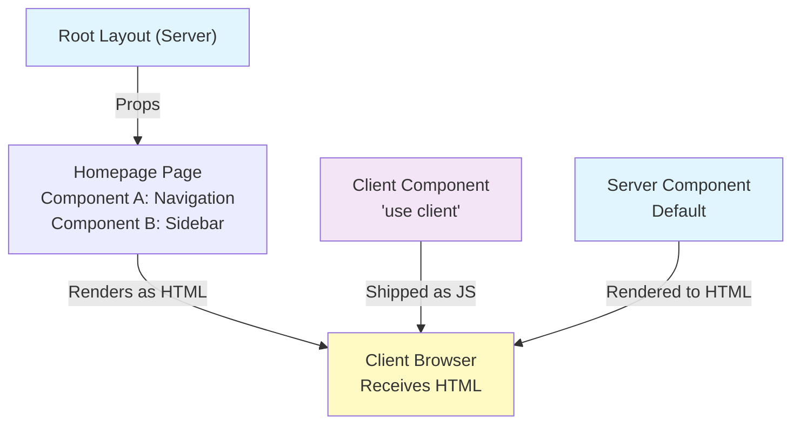
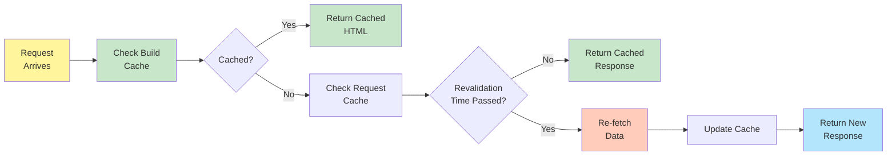

# Server vs Client Components in Next.js: Complete Revision Guide

## Table of Contents

1. [Core Theoretical Concepts](#core-theoretical-concepts)
2. [Architecture Overview](#architecture-overview)
3. [Server Components Deep Dive](#server-components-deep-dive)
4. [Client Components Deep Dive](#client-components-deep-dive)
5. [Data Fetching Strategies](#data-fetching-strategies)
6. [Caching & Revalidation](#caching--revalidation)
7. [Code Patterns & Implementation](#code-patterns--implementation)
8. [Real-World Decision Matrix](#real-world-decision-matrix)
9. [Common Pitfalls & Best Practices](#common-pitfalls--best-practices)
10. [Key Takeaways](#key-takeaways)

---

## Core Theoretical Concepts

### What are Server Components?

**Server Components** are React components that execute exclusively on the server during the build process or on-demand revalidation. They are the **default** in Next.js App Router unless explicitly marked with the `'use client'` directive.

**Key Principle:**
- Server components are compiled and executed on the server
- They **never** send their code to the browser
- The browser receives only the rendered HTML output
- They cannot use browser APIs or React hooks (useState, useEffect, etc.)

### What are Client Components?

**Client Components** are React components marked with the `'use client'` directive that execute in the user's browser. They run JavaScript in the client-side environment and have full access to browser APIs.

**Key Principle:**
- Client components are compiled and shipped as JavaScript to the browser
- They execute within the browser's JavaScript runtime
- They have access to React hooks and browser APIs
- They enable interactive, real-time user experiences

### The Hybrid Rendering Model

Next.js 13+ embraced a **hybrid rendering paradigm** that combines the best of both worlds:

```
┌─────────────────────────────────────────────────────────┐
│                    REQUEST ARRIVES                       │
└─────────────────────┬───────────────────────────────────┘
                      │
        ┌─────────────┴──────────────┐
        │                            │
   ┌────▼─────┐              ┌──────▼──────┐
   │ Server   │              │ Client      │
   │Component │              │ Component   │
   └────┬─────┘              └──────┬──────┘
        │                           │
        │ (Sync)                    │ (Hydration)
        │ Execute on Server         │ Execute on Browser
        │ Generate HTML             │ JavaScript Runtime
        │                           │
        └───────────┬───────────────┘
                    │
            ┌───────▼────────┐
            │ HTML + JS      │
            │ Sent to Browser│
            └───────┬────────┘
                    │
            ┌───────▼──────────┐
            │ Browser Renders  │
            │ HTML + Hydrates  │
            │ with JS          │
            └──────────────────┘
```

---

## Architecture Overview

### Component Tree Rendering

The rendering approach depends on where components are placed in the tree:



### Key Rules for Component Placement

| Rule | Explanation |
|------|-------------|
| **Server by default** | All components are server unless marked `'use client'` |
| **Nesting down** | A client component can contain server components (via children props) |
| **Nesting up** | A server component CANNOT contain a client component directly |
| **Module boundary** | The `'use client'` directive applies to the entire module and its imports |

---

## Server Components Deep Dive

### Why Use Server Components?

Server components solve several critical problems:

1. **Security**: Sensitive API keys and credentials never reach the browser
2. **Performance**: Heavy computations happen server-side, not client-side
3. **Database Access**: Direct database queries without exposing connection strings
4. **Large Dependencies**: Libraries are never shipped to the browser (tree-shaking included)
5. **SEO**: Content is rendered on the server, perfect for search engines

### Capabilities of Server Components

✅ **What You CAN Do:**
- Fetch data directly from databases
- Access environment variables securely
- Use sensitive API keys
- Keep large dependencies server-side
- Render initial UI based on data
- Search engines can index content immediately

❌ **What You CANNOT Do:**
- Use React hooks (`useState`, `useEffect`, `useContext`)
- Use browser APIs (`localStorage`, `window`, `navigator`)
- Use event listeners (onClick, onChange, etc.)
- Create interactive, real-time experiences
- Access user's device features

### Server Component Code Pattern

```typescript
// app/server/page.tsx

import { revalidatePath } from "next/cache";

interface Post {
  userId: number;
  id: number;
  title: string;
  body: string;
}

// Revalidate the page every 60 seconds (ISR)
export const revalidate = 60;

export default async function ServerPage() {
  // Fetch data from public API with cache invalidation
  const response = await fetch("https://jsonplaceholder.typicode.com/posts?_limit=5", {
    next: { revalidate: 60 }, // Cache for 60 seconds, then revalidate
  });
  const posts: Post[] = await response.json();

  return (
    <div className="p-8">
      <h1 className="text-3xl font-bold mb-6">Server Component - Posts from API</h1>
      <p className="text-gray-600 mb-6">✓ Data fetched on the server during build/revalidation</p>
      <div className="grid gap-4">
        {posts.map((post) => (
          <div key={post.id} className="border rounded-lg p-4 shadow">
            <h2 className="text-xl font-semibold mb-2">{post.title}</h2>
            <p className="text-gray-600">{post.body}</p>
            <p className="text-sm text-gray-400 mt-2">By User {post.userId}</p>
          </div>
        ))}
      </div>
    </div>
  );
}
```

#### Key Insights

1. **Async Component**: The component is declared as `async`, allowing direct `await` for data fetching
2. **Direct Fetch**: The `fetch()` happens on the server, not in useEffect
3. **No Client JS**: This entire component compiles to pure HTML with no JavaScript
4. **TypeScript Interface**: Type safety is maintained for data validation
5. **Revalidation Tag**: `export const revalidate = 60` enables ISR (Incremental Static Regeneration)

#### Syntax Tricks Used

- **`next: { revalidate: 60 }`** in fetch options → Tells Next.js to cache this response for 60 seconds
- **`export const revalidate`** → Global revalidation strategy for the page
- **Async/Await directly in component** → Only works in server components

---

## Client Components Deep Dive

### Why Use Client Components?

Client components enable the interactive, dynamic features users expect in modern web apps:

1. **Real-time Updates**: Fetch fresh data without page reload
2. **User Interactions**: Handle clicks, form submissions, state changes
3. **Browser APIs**: localStorage, geolocation, notifications
4. **Rich UX**: Animations, transitions, loading states
5. **Instant Feedback**: No server round-trip for every interaction

### Capabilities of Client Components

✅ **What You CAN Do:**
- Use React hooks (useState, useEffect, useContext, useReducer, etc.)
- Use browser APIs (localStorage, window, navigator)
- Create event listeners and handlers
- Manage local state and complex UI logic
- Implement real-time features
- Use context for state management

❌ **What You CANNOT Do:**
- Directly access databases
- Use secret API keys
- Safely access sensitive environment variables
- Execute computationally heavy operations (should still be done server-side)

### Client Component Code Pattern

```typescript
// app/client/page.tsx

'use client';

import { useEffect, useState } from 'react';

interface Post {
  userId: number;
  id: number;
  title: string;
  body: string;
}

export default function ClientPage() {
  const [posts, setPosts] = useState<Post[]>([]);
  const [loading, setLoading] = useState(true);
  const [error, setError] = useState<string | null>(null);

  useEffect(() => {
    const fetchPosts = async () => {
      try {
        setLoading(true);
        const response = await fetch('https://jsonplaceholder.typicode.com/posts?_limit=5');
        if (!response.ok) throw new Error('Failed to fetch posts');
        const data = await response.json();
        setPosts(data);
        setError(null);
      } catch (err) {
        setError(err instanceof Error ? err.message : 'An error occurred');
        setPosts([]);
      } finally {
        setLoading(false);
      }
    };

    fetchPosts();
  }, []);

  return (
    <div className="p-8">
      <h1 className="text-3xl font-bold mb-6">Client Component - Posts from API</h1>
      <p className="text-gray-600 mb-6">✓ Data fetched in the browser with useEffect</p>

      {loading && (
        <div className="text-center py-12">
          <p className="text-lg text-gray-500">Loading posts...</p>
        </div>
      )}

      {error && (
        <div className="bg-red-50 border border-red-200 rounded-lg p-4 mb-4">
          <p className="text-red-800">Error: {error}</p>
        </div>
      )}

      {!loading && posts.length > 0 && (
        <div className="grid gap-4">
          {posts.map((post) => (
            <div key={post.id} className="border rounded-lg p-4 shadow hover:shadow-lg transition">
              <h2 className="text-xl font-semibold mb-2">{post.title}</h2>
              <p className="text-gray-600">{post.body}</p>
              <p className="text-sm text-gray-400 mt-2">By User {post.userId}</p>
            </div>
          ))}
        </div>
      )}

      {!loading && posts.length === 0 && !error && (
        <p className="text-gray-500">No posts found</p>
      )}
    </div>
  );
}
```

#### Key Insights

1. **'use client' Directive**: Must be the first statement to mark this as a client component
2. **React Hooks**: Uses `useState` for state management and `useEffect` for side effects
3. **useEffect Dependency Array**: Empty `[]` means fetch runs once on mount
4. **Loading & Error States**: Client components can manage these interactively
5. **Conditional Rendering**: Shows different UI based on data fetching state

#### Syntax Tricks Used

- **`'use client'`** at top → Must be the first line of the file
- **`useEffect(() => {}, [])`** → Runs once on component mount (client-side)
- **`try-catch-finally`** → Proper error handling in async operations
- **Type guard: `err instanceof Error`** → Safe error handling with TypeScript

---

## Data Fetching Strategies

### Server-Side Data Fetching (Recommended for Static Content)

```typescript
// Server Component - Fetches once during build/revalidation
async function ServerComponent() {
  const data = await fetch('https://api.example.com/data', {
    next: { revalidate: 3600 } // Cache for 1 hour
  });
  const posts = await data.json();
  
  return <div>{/* Render posts */}</div>;
}
```

**Advantages:**
- ✅ Data is pre-rendered to static HTML
- ✅ Lightning-fast page loads (no client-side wait)
- ✅ Perfect for SEO
- ✅ No JavaScript overhead
- ✅ Can cache indefinitely with appropriate revalidation

**Disadvantages:**
- ❌ Cannot fetch new data on every request without revalidation
- ❌ Not suitable for frequently changing data
- ❌ Cannot respond to real-time user actions

---

### Client-Side Data Fetching (For Interactive Content)

```typescript
// Client Component - Fetches when component mounts
'use client';

function ClientComponent() {
  const [data, setData] = useState(null);

  useEffect(() => {
    fetch('https://api.example.com/data')
      .then(res => res.json())
      .then(data => setData(data));
  }, []);

  return <div>{/* Render data */}</div>;
}
```

**Advantages:**
- ✅ Fetches latest data when user visits/interacts
- ✅ Can show loading states
- ✅ Can handle errors gracefully
- ✅ Suitable for real-time, frequently-changing data

**Disadvantages:**
- ❌ JavaScript required (larger bundle)
- ❌ Initial page load includes loading state
- ❌ SEO impact (content not in initial HTML)
- ❌ User sees loading spinner before content

---

### Hybrid Approach (Best of Both Worlds)

```typescript
// Server Component fetches base data
async function HybridPage() {
  const initialPosts = await fetchPostsFromDB(); // Server-side
  
  return (
    <>
      <StaticPostsList initialPosts={initialPosts} />
      <InteractiveFilters /> {/* Client Component for real-time filtering */}
    </>
  );
}
```

This approach:
- Renders initial content instantly (server-fetched)
- Allows real-time interactions (client component)
- Optimizes both performance and interactivity

---

## Caching & Revalidation

### Understanding Next.js Caching Layers



### Revalidation Strategies

#### 1. **Time-Based Revalidation (ISR)**

```typescript
// Revalidate every 60 seconds
export const revalidate = 60;

export default async function Page() {
  const data = await fetch('https://api.example.com/data', {
    next: { revalidate: 60 }
  });
  // ...
}
```

**How It Works:**
1. First request is cached for 60 seconds
2. Subsequent requests within 60s return cached version
3. After 60s, next request triggers a re-fetch (in background)
4. While re-fetching, old cached data is served (stale-while-revalidate)
5. New data updates the cache

**Best For:** Blog posts, product listings, frequently updated content

---

#### 2. **On-Demand Revalidation**

```typescript
// In a Route Handler or Server Action
import { revalidatePath } from 'next/cache';

export async function updatePost(id: string) {
  // Update data in database
  await db.posts.update(id, newData);
  
  // Immediately invalidate the cache
  revalidatePath('/posts/[id]');
}
```

**How It Works:**
1. Data is cached indefinitely
2. When data changes (e.g., user updates), revalidation is triggered
3. Cache is immediately cleared and fresh data is fetched

**Best For:** Content management systems, user-generated content, real-time updates

---

#### 3. **No Caching (Dynamic Rendering)**

```typescript
// Fetch fresh data on every request
export const revalidate = 0; // or omit revalidate entirely

export default async function Page() {
  const data = await fetch('https://api.example.com/data', {
    next: { revalidate: 0 } // No caching
  });
  // ...
}
```

**How It Works:**
1. Every request triggers a new data fetch
2. No caching at all
3. Always returns fresh data

**Best For:** Real-time dashboards, live data feeds, user-specific content

---

### Fetch Request Caching

```typescript
// Same URL with same revalidate = cached (shared across requests)
const data1 = await fetch('https://api.example.com/posts', { next: { revalidate: 60 } });
const data2 = await fetch('https://api.example.com/posts', { next: { revalidate: 60 } });
// data1 === data2 (same cached response, only one network request)

// Different revalidation times = separate caches
const data3 = await fetch('https://api.example.com/posts', { next: { revalidate: 60 } });
const data4 = await fetch('https://api.example.com/posts', { next: { revalidate: 3600 } });
// Different caches, potentially different data
```

---

## Code Patterns & Implementation

### Pattern 1: Basic Server Component with Data Fetching

**When to Use:** Static content that doesn't need real-time updates

```typescript
// No 'use client' = Server Component
async function PostsList() {
  const posts = await fetchPosts(); // Direct server-side fetch
  
  return (
    <ul>
      {posts.map(post => (
        <li key={post.id}>{post.title}</li>
      ))}
    </ul>
  );
}
```

**Key Points:**
- Component is async (can await directly)
- No JavaScript sent to browser
- Data fetched at build/revalidation time
- Perfect for SEO

---

### Pattern 2: Basic Client Component with State Management

**When to Use:** Interactive features, form inputs, real-time filtering

```typescript
'use client';

function SearchPosts() {
  const [query, setQuery] = useState('');
  const [results, setResults] = useState([]);
  
  const handleSearch = async (e: React.ChangeEvent<HTMLInputElement>) => {
    const q = e.target.value;
    setQuery(q);
    
    if (q.length > 0) {
      const res = await fetch(`/api/search?q=${q}`);
      const data = await res.json();
      setResults(data);
    }
  };
  
  return (
    <>
      <input onChange={handleSearch} placeholder="Search..." />
      <ul>
        {results.map(post => (
          <li key={post.id}>{post.title}</li>
        ))}
      </ul>
    </>
  );
}
```

**Key Points:**
- `'use client'` directive required
- Uses React hooks (useState, useCallback, useEffect)
- Responds to user interactions immediately
- JavaScript is shipped to browser

---

### Pattern 3: Composition - Server + Client Components

**When to Use:** Most real-world applications need both

```typescript
// Server Component
async function PostsPage() {
  const initialPosts = await fetchPosts();
  
  return (
    <div>
      <h1>Posts</h1>
      <PostsList initialPosts={initialPosts} />
      <PostsFilter /> {/* Client Component for interactivity */}
    </div>
  );
}

// Client Component
'use client';
function PostsFilter() {
  const [filter, setFilter] = useState('all');
  
  return (
    <div>
      <select onChange={(e) => setFilter(e.target.value)}>
        <option>All</option>
        <option>Recent</option>
        <option>Popular</option>
      </select>
    </div>
  );
}
```

**Key Points:**
- Server component fetches base data
- Client component adds interactivity
- Each does what it's best at
- Optimal performance and UX

---

### Pattern 4: Error Handling in Client Components

**When to Use:** Production applications need robust error handling

```typescript
'use client';

function FetchWithErrorHandling() {
  const [data, setData] = useState(null);
  const [error, setError] = useState<string | null>(null);
  const [loading, setLoading] = useState(false);

  useEffect(() => {
    const fetchData = async () => {
      try {
        setLoading(true);
        setError(null);
        
        const res = await fetch('/api/data');
        if (!res.ok) throw new Error(`HTTP ${res.status}: Failed to fetch`);
        
        const result = await res.json();
        setData(result);
      } catch (err) {
        const message = err instanceof Error ? err.message : 'Unknown error';
        setError(message);
      } finally {
        setLoading(false);
      }
    };

    fetchData();
  }, []);

  if (loading) return <p>Loading...</p>;
  if (error) return <p className="error">Error: {error}</p>;
  if (!data) return <p>No data</p>;
  
  return <div>{/* Render data */}</div>;
}
```

**Key Points:**
- Three state variables: data, error, loading
- Try-catch-finally for proper cleanup
- Type guard for safe error handling
- Three different UI states

---

## Real-World Decision Matrix

Use this matrix to decide which component type to use:

| Scenario | Server ✅ | Client ⚠️ | Hybrid 🚀 |
|----------|-----------|----------|----------|
| Display blog posts | ✅✅✅ | | |
| Real-time chat | | ✅✅✅ | |
| E-commerce product list | | | ✅✅✅ |
| User authentication | | ✅✅✅ | |
| Analytics dashboard | | | ✅✅✅ |
| Static landing page | ✅✅✅ | | |
| Interactive form | | ✅✅✅ | |
| Database queries | ✅✅✅ | | |
| Filter/search results | | | ✅✅✅ |
| API key protection | ✅✅✅ | | |

---

## Common Pitfalls & Best Practices

### Pitfall 1: Putting 'use client' Everywhere

❌ **Bad:**
```typescript
'use client';

import { useState } from 'react';

export default function App() {
  return <ServerFetchComponent />; // This won't work!
}

async function ServerFetchComponent() {
  const data = await fetch('...');
  // ERROR: Can't use async in client component
}
```

✅ **Good:**
```typescript
// Keep server components in App Router, only mark interactive ones with 'use client'
export default async function App() {
  const data = await fetch('...');
  
  return (
    <>
      <StaticContent initialData={data} />
      <InteractiveFilters /> {/* Mark only this as 'use client' */}
    </>
  );
}

'use client';
function InteractiveFilters() {
  // Client-side interactivity here
}
```

**Lesson:** Use server components by default, only use 'use client' when needed.

---

### Pitfall 2: Blocking User Interaction with Long Server Operations

❌ **Bad:**
```typescript
// Server component that takes 10 seconds to fetch
export default async function Page() {
  const data = await slowDatabaseQuery(); // Blocks entire page
  
  return <div>{data}</div>;
}
```

✅ **Good:**
```typescript
// Fetch in parallel or use Suspense
import { Suspense } from 'react';

export default function Page() {
  return (
    <div>
      <Header /> {/* Renders immediately */}
      <Suspense fallback={<Loading />}>
        <SlowContent />
      </Suspense>
      <Footer /> {/* Renders immediately */}
    </div>
  );
}

async function SlowContent() {
  const data = await slowDatabaseQuery();
  return <div>{data}</div>;
}
```

**Lesson:** Use Suspense boundaries to prevent blocking.

---

### Pitfall 3: Fetching Data Without Caching

❌ **Bad:**
```typescript
// New fetch on EVERY request (expensive!)
export default async function Page() {
  const data = await fetch('https://api.example.com/posts');
  return <div>{data}</div>;
}
```

✅ **Good:**
```typescript
// Cache for 1 hour (60 * 60 = 3600 seconds)
export default async function Page() {
  const data = await fetch('https://api.example.com/posts', {
    next: { revalidate: 3600 }
  });
  return <div>{data}</div>;
}
```

**Lesson:** Always set appropriate revalidation times based on content freshness needs.

---

### Pitfall 4: Exposing Secrets in Client Components

❌ **Bad:**
```typescript
'use client';

const API_KEY = process.env.NEXT_PUBLIC_API_KEY || process.env.SECRET_API_KEY;
// SECRET_API_KEY is exposed to browser!

fetch('https://api.example.com/data', {
  headers: { 'Authorization': `Bearer ${API_KEY}` }
});
```

✅ **Good:**
```typescript
// Server Component
async function Page() {
  const data = await fetch('https://api.example.com/data', {
    headers: { 'Authorization': `Bearer ${process.env.SECRET_API_KEY}` }
  });
  return <div>{data}</div>;
}

// OR use an API route
'use client';
function ClientComponent() {
  useEffect(() => {
    fetch('/api/data'); // Your own endpoint handles auth
  }, []);
}
```

**Lesson:** Never expose secrets to clients. Use server components or backend routes.

---

### Best Practice 1: Combine Patterns Strategically

```typescript
// pages/posts.tsx - The Page Component (Server)
import { Suspense } from 'react';
import PostsList from '@/components/PostsList';
import SearchBox from '@/components/SearchBox';

export default function PostsPage() {
  return (
    <div>
      <h1>Posts</h1>
      <SearchBox /> {/* Client: Interactive search */}
      <Suspense fallback={<LoadingSkeleton />}>
        <PostsList /> {/* Server: Fetch initial data */}
      </Suspense>
    </div>
  );
}
```

**Why This Works:**
- Search box is interactive (client)
- Initial posts are fetched server-side (fast, cacheable)
- Suspense provides better UX (show search immediately)

---

### Best Practice 2: Use TypeScript for Data Validation

```typescript
// Define clear interfaces
interface Post {
  id: number;
  title: string;
  body: string;
  userId: number;
}

// Type your fetch responses
async function fetchPosts(): Promise<Post[]> {
  const res = await fetch('https://api.example.com/posts');
  if (!res.ok) throw new Error('Failed to fetch');
  
  const data: Post[] = await res.json();
  return data;
}

// Use in server component
async function PostsList() {
  const posts = await fetchPosts();
  return (
    <ul>
      {posts.map(post => (
        <li key={post.id}>{post.title}</li>
      ))}
    </ul>
  );
}
```

**Benefits:**
- Type safety catches errors early
- IDE autocomplete works perfectly
- Self-documenting code
- Runtime errors prevented

---

### Best Practice 3: Implement Proper Error Boundaries

```typescript
// components/ErrorBoundary.tsx
'use client';

import { ReactNode } from 'react';

export default function ErrorBoundary({
  children,
  fallback
}: {
  children: ReactNode;
  fallback: ReactNode;
}) {
  return (
    <div>
      <ErrorBoundaryWrapper fallback={fallback}>
        {children}
      </ErrorBoundaryWrapper>
    </div>
  );
}

// In your page
export default function Page() {
  return (
    <ErrorBoundary fallback={<p>Something went wrong</p>}>
      <PostsList />
    </ErrorBoundary>
  );
}
```

---

## Key Takeaways

### 1. **Server Components by Default**
- Assume every component is a server component
- Only use `'use client'` when you need browser features
- This optimizes bundle size and performance

### 2. **Understand the Trade-offs**

**Server Components:**
- ✅ Fast (no JS overhead)
- ✅ Secure (no secrets exposed)
- ✅ Great for SEO
- ❌ Less interactive
- ❌ No real-time updates

**Client Components:**
- ✅ Interactive & responsive
- ✅ Real-time updates possible
- ✅ Access browser APIs
- ❌ Slower initial load
- ❌ Larger JavaScript bundle

### 3. **Caching is Critical**

```
ISR (Time-based)        → Blog posts, product listings
On-Demand Revalidation  → CMS content, user updates
Dynamic (No Cache)      → Real-time dashboards, personalized content
```

### 4. **Data Fetching Location Matters**

| Where | Why | Example |
|-------|-----|---------|
| **Server** | Security, performance, SEO | Public API calls, database queries |
| **Client** | Interactivity, real-time | Search input, live chat |
| **API Route** | Backend logic, auth | Protected endpoints, complex queries |

### 5. **Error Handling is Essential**

Always handle:
- Network errors
- Invalid responses
- Timeouts
- User cancellations

### 6. **The Hybrid Approach is Optimal**

Most applications benefit from:
- Server components for data fetching
- Client components for interactivity
- Combined in strategic ways

### 7. **TypeScript Catches Issues Early**

Use interfaces and types consistently to prevent runtime errors and improve developer experience.

---

## Quick Reference Cheat Sheet

```typescript
// SERVER COMPONENT (Default)
async function Posts() {
  const data = await fetch('api');
  return <div>{data}</div>;
}

// CLIENT COMPONENT
'use client';
function Posts() {
  const [data, setData] = useState(null);
  useEffect(() => { fetch('api').then(...) }, []);
  return <div>{data}</div>;
}

// CACHING
export const revalidate = 60; // Time-based
const data = await fetch('url', { next: { revalidate: 60 } }); // Per-request

// ERROR HANDLING
try {
  const res = await fetch('url');
  if (!res.ok) throw new Error('Failed');
  const data = await res.json();
} catch (err) {
  const message = err instanceof Error ? err.message : 'Unknown';
}

// COMPOSITION
<Page>              {/* Server Component */}
  <Header />        {/* Server Component */}
  <Filters />       {/* Client Component */}
  <List />          {/* Server Component */}
</Page>
```

---

## Further Learning Resources

- Next.js Documentation: https://nextjs.org/docs/app/building-your-application/rendering
- React Server Components RFC: https://github.com/reactjs/rfcs/blob/main/text/0188-server-components.md
- Web Vitals: https://web.dev/vitals/
- HTTP Caching: https://developer.mozilla.org/en-US/docs/Web/HTTP/Caching

---

**Last Updated:** February 2026  
**Created for:** Next.js 14+ with App Router  
**Language:** TypeScript (with JavaScript examples)
