# 📡 Next.js Route Handlers — Complete Revision Guide

> **Section 15: Backend Route Handlers**
> This guide distills every concept, pattern, and technique from the codebase into a single, standalone revision document. You should never need to open the individual source files again.

---

## 📑 Table of Contents

1. [What Are Route Handlers?](#1-what-are-route-handlers)
2. [File Convention & Routing Rules](#2-file-convention--routing-rules)
3. [Supported HTTP Methods](#3-supported-http-methods)
4. [GET — Reading Data & Query Parameters](#4-get--reading-data--query-parameters)
5. [Dynamic Routes with `[id]`](#5-dynamic-routes-with-id)
6. [POST — Creating Resources](#6-post--creating-resources)
7. [PUT — Full Resource Replacement](#7-put--full-resource-replacement)
8. [PATCH — Partial Updates](#8-patch--partial-updates)
9. [DELETE — Removing Resources](#9-delete--removing-resources)
10. [PUT vs PATCH — The Critical Difference](#10-put-vs-patch--the-critical-difference)
11. [Working with Headers](#11-working-with-headers)
12. [Working with Cookies](#12-working-with-cookies)
13. [Consuming Route Handlers from Pages](#13-consuming-route-handlers-from-pages)
14. [Architecture Overview (Visual)](#14-architecture-overview-visual)
15. [Summary & Key Takeaways](#15-summary--key-takeaways)

---

## 1. What Are Route Handlers?

Route Handlers are Next.js's built-in way of creating **backend API endpoints** — the equivalent of Express.js routes, but integrated directly into the App Router's file system.

### Core Principles

- **No separate server needed** — your API lives alongside your pages inside the `app/` directory.
- **File-system based routing** — the path of the file determines the URL of the endpoint, just like pages.
- **Each file exports named functions** that correspond to HTTP methods (`GET`, `POST`, `PUT`, `PATCH`, `DELETE`).
- **Built on the Web APIs** — they use the standard `Request` and `Response` objects (via Next.js wrappers `NextRequest` and `NextResponse`).
- **Run on the server only** — they never ship to the client bundle.

### When to Use Route Handlers

| Use Case                           | Example                           |
| ---------------------------------- | --------------------------------- |
| Building a REST API                | `/api/users`, `/api/products`     |
| Handling form submissions          | `POST /api/contact`               |
| Webhooks from third-party services | `POST /api/stripe-webhook`        |
| Proxy for external APIs            | Hide API keys from the client     |
| Auth endpoints                     | Login, logout, session management |

---

## 2. File Convention & Routing Rules

Route Handlers must live inside a special file called **`route.ts`** (or `route.js`). This file tells Next.js: _"This directory is an API endpoint, not a page."_

```
app/
├── api/
│   ├── hello/
│   │   ├── route.ts          →  GET /api/hello
│   │   └── [id]/
│   │       └── route.ts      →  GET /api/hello/:id
│   ├── create-user/
│   │   └── route.ts          →  POST /api/create-user
│   ├── put-user/
│   │   └── [id]/
│   │       └── route.ts      →  PUT /api/put-user/:id
│   ├── patch-user/
│   │   └── [id]/
│   │       └── route.ts      →  PATCH /api/patch-user/:id
│   ├── delete-user/
│   │   └── [id]/
│   │       └── route.ts      →  DELETE /api/delete-user/:id
│   ├── headers-demo/
│   │   └── route.ts          →  GET|POST /api/headers-demo
│   └── cookies-demo/
│       └── route.ts          →  GET|POST|PATCH|DELETE /api/cookies-demo
└── page.tsx                   →  The homepage (consumes the API)
```

> [!IMPORTANT]
> A `route.ts` and a `page.tsx` **CANNOT coexist** in the same directory. If you need both an API endpoint and a page at the same URL path, put the route handler in a sub-directory like `api/`.

### Key Rule: One File, Multiple Methods

You can export **multiple HTTP methods** from a single `route.ts` file. Next.js routes the request to the correct function based on the HTTP method:

```typescript
// All in one file: app/api/create-user/route.ts
export async function POST(request) {
  /* ... */
}
export async function PUT(request) {
  /* ... */
}
export async function PATCH(request) {
  /* ... */
}
```

---

## 3. Supported HTTP Methods

Next.js Route Handlers support these HTTP method exports:


| Method    | Semantic Meaning                | Idempotent?            |
| --------- | ------------------------------- | ---------------------- |
| `GET`     | Read / Retrieve data            | ✅ Yes                 |
| `POST`    | Create a new resource           | ❌ No                  |
| `PUT`     | Replace an entire resource      | ✅ Yes                 |
| `PATCH`   | Update part of a resource       | ❌ No (conventionally) |
| `DELETE`  | Remove a resource               | ✅ Yes                 |
| `HEAD`    | Like GET but no body            | ✅ Yes                 |
| `OPTIONS` | Discover allowed methods (CORS) | ✅ Yes                 |

> [!NOTE]
> **Idempotent** means calling the method multiple times with the same input produces the same result. `POST` is not idempotent because calling it twice creates two resources.

---

## 4. GET — Reading Data & Query Parameters

The most fundamental route handler. It reads data and returns it as JSON.

### Basic GET with Query Parameter Filtering

```typescript
// app/api/hello/route.ts
import { NextRequest, NextResponse } from "next/server";

export const dummyUsers = [
  { id: 1, name: "Alice Johnson", email: "alice@example.com", age: 28 },
  { id: 2, name: "Bob Smith", email: "bob@example.com", age: 34 },
  { id: 3, name: "Carol White", email: "carol@example.com", age: 25 },
  { id: 4, name: "David Brown", email: "david@example.com", age: 41 },
];

export async function GET(request: NextRequest) {
  // Extract query params from the URL
  const { searchParams } = request.nextUrl;
  const name = searchParams.get("name");
  const age = searchParams.get("age");

  let filteredUsers = dummyUsers;

  if (name) {
    filteredUsers = filteredUsers.filter((user) =>
      user.name.toLowerCase().includes(name.toLowerCase()),
    );
  }

  if (age) {
    const ageNumber = parseInt(age);
    if (!isNaN(ageNumber)) {
      filteredUsers = filteredUsers.filter((user) => user.age === ageNumber);
    }
  }

  return NextResponse.json({
    total: filteredUsers.length,
    filters: { name: name || null, age: age || null },
    users: filteredUsers,
  });
}
```

### 🔑 Key Insight

- **`request.nextUrl`** gives you a parsed URL object. The `.searchParams` property is a standard `URLSearchParams` — no need for manual string splitting.
- Chained filtering: start with the full dataset and progressively narrow it. Each `if` block is independent, allowing **any combination of filters**.
- **`parseInt()` with `isNaN()` guard** — always validate numeric query params to avoid returning empty results from bad input.

### How Query Params Flow


### Syntax Tricks

| Pattern                        | What It Does                                                  |
| ------------------------------ | ------------------------------------------------------------- |
| `request.nextUrl.searchParams` | Access query parameters from the URL                          |
| `searchParams.get("key")`      | Returns `string \| null`                                      |
| `.includes(str.toLowerCase())` | Case-insensitive substring match                              |
| `NextResponse.json(data)`      | Creates a JSON response with `Content-Type: application/json` |

---

## 5. Dynamic Routes with `[id]`

Dynamic segments work identically to page routes — wrap the folder name in square brackets.

```typescript
// app/api/hello/[id]/route.ts
import { NextRequest, NextResponse } from "next/server";
import { dummyUsers } from "../../hello/route";

export async function GET(
  request: NextRequest,
  { params }: { params: Promise<{ id: string }> },
) {
  const { id } = await params;
  const user = dummyUsers.find((user) => user.id === parseInt(id));

  if (!user) {
    return NextResponse.json({ error: "User not found" }, { status: 404 });
  }

  return NextResponse.json(user);
}
```

### 🔑 Key Insight

- **`params` is a `Promise`** in Next.js 15+ (App Router). You must **`await`** it before using it. This is a breaking change from earlier versions where `params` was a synchronous object.
- The `id` from the URL is always a **string**, so you must parse it with `parseInt()` before comparing with numeric IDs.
- Always return a meaningful **404** if the resource is not found — this is standard REST convention.

### The `params` Pattern (Critical for Next.js 15+)


> [!WARNING]
> **Common mistake**: Forgetting to `await params`. In Next.js 15+, accessing `params.id` directly without awaiting **will fail silently or throw an error**.

### Function Signature Anatomy

```typescript
export async function GET(
  request: NextRequest, // ← 1st param: always the request
  { params }: { params: Promise<{ id: string }> }, // ← 2nd param: route context
);
```

The second argument is a **context object**. You destructure `params` out of it. The type of `params` reflects exactly what dynamic segments exist in the folder structure.

| Folder            | `params` Type                      |
| ----------------- | ---------------------------------- |
| `[id]`            | `{ id: string }`                   |
| `[slug]`          | `{ slug: string }`                 |
| `[...catch]`      | `{ catch: string[] }`              |
| `[category]/[id]` | `{ category: string, id: string }` |

---

## 6. POST — Creating Resources

POST handlers receive data in the **request body**, validate it, and create a new resource.

```typescript
// app/api/create-user/route.ts
import { NextRequest, NextResponse } from "next/server";
import { dummyUsers } from "../hello/route";

export async function POST(request: NextRequest) {
  const data = await request.json(); // Parse JSON body

  // ── Validation ──
  if (!data.name || !data.email || !data.age) {
    return NextResponse.json(
      { error: "Name, email and age are required" },
      { status: 400 }, // Bad Request
    );
  }

  // ── Uniqueness Check ──
  const emailExists = dummyUsers.some((user) => user.email === data.email);
  if (emailExists) {
    return NextResponse.json(
      { error: "Email already exists" },
      { status: 400 },
    );
  }

  // ── Generate ID & Create ──
  const newUser = {
    id:
      dummyUsers.length > 0
        ? Math.max(...dummyUsers.map((u) => u.id)) + 1 // Auto-increment
        : 1,
    name: data.name,
    email: data.email,
    age: data.age,
  };

  dummyUsers.push(newUser);

  return NextResponse.json(
    { success: true, users: dummyUsers, message: "User created successfully" },
    { status: 201 }, // 201 Created
  );
}
```

### 🔑 Key Insight

- **`request.json()`** is async — it parses the request body as JSON. Always `await` it.
- The **auto-increment ID** trick: `Math.max(...dummyUsers.map(u => u.id)) + 1` finds the highest existing ID and adds 1. The ternary guard handles the empty-array edge case.
- **Status `201 Created`** is the correct HTTP status for successful resource creation, not `200`.
- **Validation first, action second** — the "early return" pattern keeps the happy path clean.

### Request Lifecycle


---

## 7. PUT — Full Resource Replacement

PUT means: _"Replace the entire resource with what I'm sending."_ **Every field must be provided.**

### Version A: ID in the Request Body

```typescript
// app/api/create-user/route.ts (PUT handler alongside POST)
export async function PUT(request: NextRequest) {
  const data = await request.json();
  const { id, name, email, age, role } = data;

  if (!id) {
    return NextResponse.json({ error: "User ID is required" }, { status: 400 });
  }

  // ALL fields required — that's the PUT contract
  if (!name || !email || !age || !role) {
    return NextResponse.json(
      { error: "Name, email, age, and role are all required for PUT request" },
      { status: 400 },
    );
  }

  const userIndex = dummyUsers.findIndex((user) => user.id === id);
  if (userIndex === -1) {
    return NextResponse.json({ error: "User not found" }, { status: 404 });
  }

  // Complete replacement — not spreading, not merging
  dummyUsers[userIndex] = { id, name, email, age, role };

  return NextResponse.json(
    {
      success: true,
      user: dummyUsers[userIndex],
      message: "User replaced successfully",
    },
    { status: 200 },
  );
}
```

### Version B: ID in the URL (Dynamic Route)

```typescript
// app/api/put-user/[id]/route.ts
export async function PUT(
  request: NextRequest,
  { params }: { params: Promise<{ id: string }> },
) {
  try {
    const { id } = await params;
    const userId = parseInt(id);
    const data = await request.json();
    const { name, email, role, createdAt } = data;

    if (!name || !email || !role || !createdAt) {
      return NextResponse.json(
        {
          error:
            "All fields (name, email, role, createdAt) are required for PUT request",
        },
        { status: 400 },
      );
    }

    const userIndex = dummyUsers.findIndex((user) => user.id === userId);
    if (userIndex === -1) {
      return NextResponse.json({ error: "User not found" }, { status: 404 });
    }

    // Full replacement
    dummyUsers[userIndex] = { id: userId, name, email, role, createdAt };

    return NextResponse.json({
      success: true,
      message: "User replaced successfully (PUT)",
      user: dummyUsers[userIndex],
    });
  } catch (error) {
    return NextResponse.json(
      { error: "Invalid request body" },
      { status: 400 },
    );
  }
}
```

### 🔑 Key Insight

- **Two design patterns** for passing the ID — in the body (`{ id: 5, ... }`) or in the URL (`/api/put-user/5`). The URL approach is more RESTful and the industry standard.
- The `try...catch` block in Version B catches malformed JSON bodies — a real-world necessity.
- Notice the **direct assignment** (`dummyUsers[userIndex] = { ... }`) instead of spread (`...`). This is the hallmark of PUT: the old object is **completely overwritten**.

---

## 8. PATCH — Partial Updates

PATCH means: _"Update only the fields I'm sending. Keep everything else unchanged."_

### Version A: ID in the Request Body

```typescript
// app/api/create-user/route.ts (PATCH handler)
export async function PATCH(request: NextRequest) {
  const data = await request.json();
  const { id } = data;

  if (!id) {
    return NextResponse.json({ error: "User ID is required" }, { status: 400 });
  }

  const userIndex = dummyUsers.findIndex((user) => user.id === id);
  if (userIndex === -1) {
    return NextResponse.json({ error: "User not found" }, { status: 404 });
  }

  // Merge: keep old fields, overwrite with new ones (excluding 'id')
  const updatedUser = {
    ...dummyUsers[userIndex],
    ...Object.fromEntries(Object.entries(data).filter(([key]) => key !== "id")),
  };

  dummyUsers[userIndex] = updatedUser;

  return NextResponse.json({
    success: true,
    user: dummyUsers[userIndex],
    message: "User updated successfully",
  });
}
```

### Version B: ID in the URL (Dynamic Route — Cleaner)

```typescript
// app/api/patch-user/[id]/route.ts
export async function PATCH(
  request: NextRequest,
  { params }: { params: Promise<{ id: string }> },
) {
  const { id } = await params;
  const userId = parseInt(id);
  const data = await request.json();

  const userIndex = dummyUsers.findIndex((user) => user.id === userId);
  if (userIndex === -1) {
    return NextResponse.json({ error: "User not found" }, { status: 404 });
  }

  // Destructure out 'id' to prevent overwriting the original ID
  const { id: _, ...updates } = data;
  dummyUsers[userIndex] = { ...dummyUsers[userIndex], ...updates };

  return NextResponse.json({
    success: true,
    message: "User updated successfully (PATCH)",
    user: dummyUsers[userIndex],
  });
}
```

### 🔑 Key Insight

- **The spread operator is the star of PATCH**: `{ ...existingUser, ...updates }` merges old and new. Any key in `updates` overwrites the same key in `existingUser`; all other keys remain untouched.
- **Stripping `id` from updates** prevents the client from accidentally changing the resource's identity. Two elegant approaches:
  - **Destructuring**: `const { id: _, ...updates } = data;` — renames `id` to `_` (convention for "unused") and collects the rest.
  - **`Object.entries` + `filter`**: More explicit but verbose.

### Spread Merge Visualization

```mermaid
graph LR
    subgraph "Existing User"
        A1["id: 2"]
        A2["name: 'Bob'"]
        A3["email: 'bob@x.com'"]
        A4["age: 34"]
    end

    subgraph "PATCH Body (updates)"
        B1["name: 'Robert'"]
        B2["age: 35"]
    end

    subgraph "Result After Merge"
        C1["id: 2 ✅ kept"]
        C2["name: 'Robert' 🔄 updated"]
        C3["email: 'bob@x.com' ✅ kept"]
        C4["age: 35 🔄 updated"]
    end

    A1 --> C1
    A2 -.->|overwritten| C2
    A3 --> C3
    A4 -.->|overwritten| C4
    B1 --> C2
    B2 --> C4

    style A1 fill:#264653,stroke:#1d3557,color:#a8dadc
    style A2 fill:#264653,stroke:#1d3557,color:#a8dadc
    style A3 fill:#264653,stroke:#1d3557,color:#a8dadc
    style A4 fill:#264653,stroke:#1d3557,color:#a8dadc
    style B1 fill:#e76f51,stroke:#c1440e,color:#fefae0
    style B2 fill:#e76f51,stroke:#c1440e,color:#fefae0
    style C1 fill:#2d6a4f,stroke:#1b4332,color:#d8f3dc
    style C2 fill:#e9c46a,stroke:#f4a261,color:#264653
    style C3 fill:#2d6a4f,stroke:#1b4332,color:#d8f3dc
    style C4 fill:#e9c46a,stroke:#f4a261,color:#264653
```



---

## 9. DELETE — Removing Resources

DELETE uses the dynamic route `[id]` to identify which resource to remove.

```typescript
// app/api/delete-user/[id]/route.ts
import { NextRequest, NextResponse } from "next/server";
import { dummyUsers } from "../../hello/route";

export async function DELETE(
  request: NextRequest,
  { params }: { params: Promise<{ id: string }> },
) {
  const { id } = await params;
  const userId = parseInt(id);

  const userIndex = dummyUsers.findIndex((user) => user.id === userId);
  if (userIndex === -1) {
    return NextResponse.json({ error: "User not found" }, { status: 404 });
  }

  dummyUsers.splice(userIndex, 1); // Remove 1 element at userIndex

  return NextResponse.json(
    {
      success: true,
      users: dummyUsers,
      message: "User deleted successfully",
    },
    { status: 200 },
  );
}
```

### 🔑 Key Insight

- **`Array.splice(index, 1)`** mutates the array in-place, removing exactly one element. This is the standard pattern for in-memory deletion.
- The response returns the **remaining users list** after deletion — useful for the client to update its UI without a second API call.
- Always check for existence **before** deletion to avoid silent failures.

---

## 10. PUT vs PATCH — The Critical Difference

This is one of the most commonly confused concepts in REST APIs. The codebase demonstrates both side by side.

```mermaid
graph TB
    subgraph "PUT — Full Replace"
        direction TB
        P1["Send: {name, email, age, role}"]
        P2["ALL fields required"]
        P3["Missing field → 400 error"]
        P4["Old object completely overwritten"]
        P1 --> P2 --> P3 --> P4
    end

    subgraph "PATCH — Partial Update"
        direction TB
        PA1["Send: {age: 35}"]
        PA2["Only changed fields needed"]
        PA3["Missing fields stay unchanged"]
        PA4["Merge via spread operator"]
        PA1 --> PA2 --> PA3 --> PA4
    end

    style P1 fill:#e76f51,stroke:#c1440e,color:#fefae0
    style P2 fill:#e76f51,stroke:#c1440e,color:#fefae0
    style P3 fill:#e76f51,stroke:#c1440e,color:#fefae0
    style P4 fill:#e76f51,stroke:#c1440e,color:#fefae0
    style PA1 fill:#2a9d8f,stroke:#264653,color:#f1faee
    style PA2 fill:#2a9d8f,stroke:#264653,color:#f1faee
    style PA3 fill:#2a9d8f,stroke:#264653,color:#f1faee
    style PA4 fill:#2a9d8f,stroke:#264653,color:#f1faee
```



| Aspect             | PUT                             | PATCH                             |
| ------------------ | ------------------------------- | --------------------------------- |
| **Body**           | Must contain ALL fields         | Only the fields to change         |
| **Missing fields** | Returns `400 Bad Request`       | Remains unchanged                 |
| **Implementation** | Direct assignment `=`           | Spread merge `{ ...old, ...new }` |
| **Idempotent?**    | ✅ Yes                          | Typically no                      |
| **Use Case**       | "Replace this profile entirely" | "Just update the email"           |
| **REST Semantics** | Replace the resource            | Modify the resource               |

> [!TIP]
> **Rule of thumb**: If your form has ALL fields and the user edits any of them → use **PUT**. If you have a "change email" or "update status" feature → use **PATCH**.

---

## 11. Working with Headers

Headers are metadata sent with HTTP requests and responses. The codebase demonstrates **two distinct methods** for reading headers, plus how to write custom response headers.

### Reading Headers — Two Methods

```typescript
// app/api/headers-demo/route.ts
import { NextRequest, NextResponse } from "next/server";
import { headers } from "next/headers";

export async function GET(request: NextRequest) {
  // ═══ METHOD 1: Using next/headers (works in Server Components too) ═══
  const headersList = await headers();
  const userAgent = headersList.get("user-agent");
  const authorization = headersList.get("authorization");
  const customHeader = headersList.get("x-custom-header");

  // ═══ METHOD 2: Using request.headers (Route Handlers only) ═══
  const requestHeaders = new Headers(request.headers);
  const userAgent2 = requestHeaders.get("user-agent");
  const authorization2 = requestHeaders.get("authorization");

  // ═══ WRITING RESPONSE HEADERS ═══
  return NextResponse.json(
    { message: "Headers Demo" },
    {
      status: 200,
      headers: {
        "x-api-version": "1.0.0",
        "x-response-time": new Date().toISOString(),
        "x-custom-header": "Hello from API",
        "cache-control": "no-cache, no-store",
      },
    },
  );
}
```

### 🔑 Key Insight

| Method                          | Import                                   | Works In                           | Async?              |
| ------------------------------- | ---------------------------------------- | ---------------------------------- | ------------------- |
| `headers()` from `next/headers` | `import { headers } from "next/headers"` | Server Components + Route Handlers | ✅ `await` required |
| `request.headers`               | Built into `NextRequest`                 | Route Handlers only                | ❌ Synchronous      |

- **Method 1** is more versatile — it works in Server Components, Middleware, and Route Handlers.
- **Method 2** gives you direct access to the raw request headers, useful when you need to copy or transform them.
- **Response headers** are set in the second argument of `NextResponse.json()`, as a `headers` object.

### Common Response Headers

| Header            | Purpose                   | Example Value          |
| ----------------- | ------------------------- | ---------------------- |
| `cache-control`   | Control caching behavior  | `"no-cache, no-store"` |
| `x-api-version`   | API versioning            | `"1.0.0"`              |
| `x-response-time` | Performance tracking      | ISO timestamp          |
| `Set-Cookie`      | Set cookies on the client | `"name=value; Path=/"` |

### Headers Flow


---

## 12. Working with Cookies

Cookies are small pieces of data stored on the client and sent with every request. The codebase implements a **full CRUD** for cookies.

### Reading Cookies — Two Methods

```typescript
// app/api/cookies-demo/route.ts (GET)
import { NextRequest, NextResponse } from "next/server";
import { cookies } from "next/headers";

export async function GET(request: NextRequest) {
  // ═══ METHOD 1: cookies() from next/headers (Recommended) ═══
  const cookieStore = await cookies();
  const theme = cookieStore.get("theme")?.value || "not set";
  const userId = cookieStore.get("userId")?.value || "not set";
  const sessionId = cookieStore.get("sessionId")?.value || "not set";

  // ═══ METHOD 2: request.cookies (Direct access) ═══
  const theme2 = request.cookies.get("theme")?.value || "not set";
  const userId2 = request.cookies.get("userId")?.value || "not set";

  // Get ALL cookies at once
  const allCookies = Object.fromEntries(
    request.cookies.getAll().map((cookie) => [cookie.name, cookie.value]),
  );

  return NextResponse.json({
    readingCookies: { method1: theme, method2: theme2, allCookies },
  });
}
```

### Setting Cookies — With Security Options

```typescript
// app/api/cookies-demo/route.ts (POST)
export async function POST(request: NextRequest) {
  const cookieStore = await cookies();
  const body = await request.json();
  const { username, preferences } = body;

  // Set with full security options
  cookieStore.set("userId", username, {
    httpOnly: true, // ← Can't be read by JavaScript (XSS protection)
    secure: true, // ← Only sent over HTTPS
    sameSite: "strict", // ← Prevents CSRF attacks
    maxAge: 60 * 60 * 24 * 7, // ← 7 days in seconds
    path: "/", // ← Available on all routes
  });

  // Set preferences (less restrictive)
  cookieStore.set("userPreferences", JSON.stringify(preferences), {
    secure: true,
    sameSite: "lax", // ← Allows navigation from external links
    maxAge: 60 * 60 * 24 * 30, // ← 30 days
    path: "/",
  });

  // Short-lived session token
  cookieStore.set("sessionToken", `token-${Date.now()}`, {
    httpOnly: true,
    secure: true,
    sameSite: "strict",
    maxAge: 60 * 60, // ← 1 hour only
    path: "/",
  });

  return NextResponse.json({ message: "Cookies set successfully" });
}
```

### Updating & Deleting Cookies

```typescript
// PATCH — Update a cookie
export async function PATCH(request: NextRequest) {
  const cookieStore = await cookies();
  const { cookieName, newValue } = await request.json();

  cookieStore.set(cookieName, newValue, {
    maxAge: 60 * 60 * 24 * 7,
    path: "/",
  });

  return NextResponse.json({ message: `Cookie '${cookieName}' updated` });
}

// DELETE — Remove a cookie
export async function DELETE(request: NextRequest) {
  const cookieStore = await cookies();
  const cookieToDelete = request.nextUrl.searchParams.get("name");

  cookieStore.delete(cookieToDelete); // Sets maxAge to 0 internally

  return NextResponse.json({ message: `Cookie '${cookieToDelete}' deleted` });
}
```

### 🔑 Key Insight

- **`cookieStore.get("name")` returns an object** `{ name, value }`, not just the value. Use `?.value` to safely extract it.
- **`cookieStore.delete(name)`** doesn't really "delete" — it sets `maxAge: 0` which tells the browser to expire it immediately.
- **Security options explained**:


| Reading Method                  | Import                                   | Best For                           |
| ------------------------------- | ---------------------------------------- | ---------------------------------- |
| `cookies()` from `next/headers` | `import { cookies } from "next/headers"` | Server Components + Route Handlers |
| `request.cookies`               | Built into `NextRequest`                 | Route Handlers only                |
| `request.cookies.getAll()`      | Built-in                                 | Getting every cookie at once       |

---

## 13. Consuming Route Handlers from Pages

Your React pages (Server Components) can call your own route handlers using standard `fetch()`:

```typescript
// app/page.tsx
export default async function Home() {
  const baseUrl = process.env.NEXT_PUBLIC_API_URL || "http://localhost:3000";
  const response = await fetch(`${baseUrl}/api/hello`);
  const data = await response.json();

  return (
    <div>
      <h1>{JSON.stringify(data)}</h1>
    </div>
  );
}
```

### 🔑 Key Insight

- **Server Components can `fetch` directly** — no `useEffect` or `useState` needed. The component is `async` and awaits the response.
- **`process.env.NEXT_PUBLIC_API_URL`** provides a configurable base URL for different environments (dev, staging, production). The `NEXT_PUBLIC_` prefix makes it available on both server and client.
- The fallback `"http://localhost:3000"` ensures it works during local development even if the env variable isn't set.

> [!TIP]
> In a real app, you'd typically call your database or service layer directly from Server Components instead of routing through your own API. Route Handlers are primarily for **external clients** (mobile apps, third-party integrations, webhooks).

---

## 14. Architecture Overview (Visual)

### The Complete Route Handler Ecosystem


### The Common Pattern in Every Route Handler


---

## 15. Summary & Key Takeaways

### 🧠 Concepts to Remember

1. **Route Handlers** are backend API endpoints defined by `route.ts` files inside `app/`.
2. **Export named functions** matching HTTP method names (`GET`, `POST`, `PUT`, `PATCH`, `DELETE`).
3. **`params` is a Promise** in Next.js 15+ — always `await` it.
4. **PUT replaces entirely** (all fields required). **PATCH updates partially** (spread merge).
5. **Two ways to read headers/cookies**: `next/headers` functions (versatile) or `request` object (direct).
6. **Cookie security**: always set `httpOnly`, `secure`, and `sameSite` for sensitive cookies.
7. **`NextResponse.json(data, { status, headers })`** is your universal response builder.

### 📋 Quick Reference Cheat Sheet

| Task               | Code                                                         |
| ------------------ | ------------------------------------------------------------ |
| Read query param   | `request.nextUrl.searchParams.get("key")`                    |
| Read dynamic param | `const { id } = await params;`                               |
| Read JSON body     | `const data = await request.json();`                         |
| Return JSON        | `NextResponse.json(data, { status: 201 })`                   |
| Return error       | `NextResponse.json({ error: "msg" }, { status: 400 })`       |
| Read header        | `(await headers()).get("authorization")`                     |
| Read cookie        | `(await cookies()).get("name")?.value`                       |
| Set cookie         | `(await cookies()).set("name", "value", { httpOnly: true })` |
| Delete cookie      | `(await cookies()).delete("name")`                           |

### 🎯 HTTP Status Codes Used

| Code  | Meaning     | When to Use                        |
| ----- | ----------- | ---------------------------------- |
| `200` | OK          | Successful GET, PUT, PATCH, DELETE |
| `201` | Created     | Successful POST (new resource)     |
| `400` | Bad Request | Missing/invalid input              |
| `404` | Not Found   | Resource doesn't exist             |

### ⚡ Patterns Worth Memorizing

```typescript
// 1. The Dynamic Route Signature (Next.js 15+)
export async function METHOD(
  request: NextRequest,
  { params }: { params: Promise<{ id: string }> },
) {
  const { id } = await params;
}

// 2. The PATCH Spread Merge
const { id: _, ...updates } = data;
obj = { ...obj, ...updates };

// 3. The Auto-Increment ID
const newId = arr.length > 0 ? Math.max(...arr.map((x) => x.id)) + 1 : 1;

// 4. The Safe Cookie Read
const value = (await cookies()).get("name")?.value || "default";
```

---

> **🏁 You've covered the fundamentals of Next.js Route Handlers.** You now know how to create full CRUD APIs, handle dynamic routes, work with query parameters, manage headers and cookies with proper security options, and consume these endpoints from your pages. Next up: building a real app with these concepts (see `next-notes-taking-app/`).
