# 📝 Next.js Notes Taking App — Complete Revision Guide

> A full-stack CRUD (Create, Read, Update, Delete) application built with **Next.js Route Handlers**, **MongoDB/Mongoose**, and a **React client component**. This project demonstrates how to build a backend API _inside_ a Next.js app — no Express server needed.

---

## 📑 Table of Contents

- [1. Theoretical Concepts](#1-theoretical-concepts)
  - [1.1 What Are Route Handlers?](#11-what-are-route-handlers)
  - [1.2 App Router File Conventions for APIs](#12-app-router-file-conventions-for-apis)
  - [1.3 Server vs Client Components in This App](#13-server-vs-client-components-in-this-app)
  - [1.4 MongoDB + Mongoose in Next.js](#14-mongodb--mongoose-in-nextjs)
  - [1.5 The "use client" Directive](#15-the-use-client-directive)
- [2. Architecture Overview](#2-architecture-overview)
  - [2.1 Project Structure](#21-project-structure)
  - [2.2 Request Flow Diagram](#22-request-flow-diagram)
  - [2.3 CRUD Operations Map](#23-crud-operations-map)
- [3. Code & Patterns](#3-code--patterns)
  - [3.1 Database Connection — Singleton Pattern](#31-database-connection--singleton-pattern)
  - [3.2 Mongoose Model — Safe Registration](#32-mongoose-model--safe-registration)
  - [3.3 Route Handler: GET & POST](#33-route-handler-get--post)
  - [3.4 Route Handler: PATCH & DELETE (Dynamic Routes)](#34-route-handler-patch--delete-dynamic-routes)
  - [3.5 Server Component — The Entry Point](#35-server-component--the-entry-point)
  - [3.6 Client Component — Full CRUD UI](#36-client-component--full-crud-ui)
  - [3.7 Toast Notification Provider](#37-toast-notification-provider)
- [4. Visual Aids](#4-visual-aids)
  - [4.1 Full App Architecture](#41-full-app-architecture)
  - [4.2 CRUD State Machine](#42-crud-state-machine)
  - [4.3 Component Hierarchy](#43-component-hierarchy)
  - [4.4 API Route File Mapping](#44-api-route-file-mapping)
- [5. Summary & Key Takeaways](#5-summary--key-takeaways)

---

## 1. Theoretical Concepts

### 1.1 What Are Route Handlers?

Route Handlers are Next.js's built-in way to create **backend API endpoints** directly inside the `app/` directory. They replace the older `pages/api/*` convention from the Pages Router.

**Core principles:**

- A Route Handler lives in a file called **`route.ts`** (or `route.js`) inside the `app/` directory.
- The **file path** determines the URL. For example:
  - `app/api/notes/route.ts` → `GET /api/notes`, `POST /api/notes`
  - `app/api/notes/[id]/route.ts` → `PATCH /api/notes/123`, `DELETE /api/notes/123`
- You export **named functions** matching HTTP methods: `GET`, `POST`, `PUT`, `PATCH`, `DELETE`, `HEAD`, `OPTIONS`.
- Each function receives a `NextRequest` object and must return a `NextResponse`.
- Route Handlers run **only on the server** — they never ship to the client bundle.

> [!IMPORTANT]
> A directory can have **either** a `page.tsx` **or** a `route.ts`, but **not both**. They would conflict because both try to respond to the same URL.

**Why not Express?**

| Feature    | Express Server                | Next.js Route Handlers             |
| ---------- | ----------------------------- | ---------------------------------- |
| Deployment | Separate server process       | Deployed with your Next.js app     |
| Routing    | Manual setup (`app.get(...)`) | File-system based (automatic)      |
| TypeScript | Needs configuration           | Built-in support                   |
| Serverless | Requires adaptation           | Serverless-ready by default        |
| Hot Reload | Separate watcher              | Integrated with Next.js dev server |

### 1.2 App Router File Conventions for APIs

Next.js App Router uses a **convention-over-configuration** approach for API routes:

```
app/
 └── api/
      └── notes/
           ├── route.ts          ← Handles /api/notes (collection-level)
           └── [id]/
                └── route.ts     ← Handles /api/notes/:id (item-level)
```

**Rules:**

- **Static segments**: Folder names like `api`, `notes` map directly to URL segments.
- **Dynamic segments**: Folders wrapped in square brackets like `[id]` capture URL parameters.
- The `params` object is a **Promise** in Next.js 15+ and must be `await`-ed.

### 1.3 Server vs Client Components in This App

This project cleanly separates responsibilities:

| Component                        | Type                                  | Why?                                                |
| -------------------------------- | ------------------------------------- | --------------------------------------------------- |
| `app/page.tsx`                   | **Server Component**                  | Connects to DB on the server, renders initial HTML  |
| `components/NotesClient.tsx`     | **Client Component** (`"use client"`) | Handles user interactions, state, and API calls     |
| `components/ToasterProvider.tsx` | **Client Component** (`"use client"`) | Uses browser-only toast notifications               |
| `app/layout.tsx`                 | **Server Component**                  | Wraps the app, loads fonts, no interactivity needed |

**The key insight:** The server component (`page.tsx`) establishes the database connection, then delegates all interactivity to the client component. The client component communicates with the backend through `fetch()` calls to the Route Handler API.

### 1.4 MongoDB + Mongoose in Next.js

**The Problem:** Next.js re-imports modules during Hot Module Replacement (HMR) in development. This causes two specific issues:

1. **Multiple database connections** — Each re-import of `connectDB` could open a new connection.
2. **Model re-compilation errors** — Mongoose throws `"Cannot overwrite model once compiled"` if you call `mongoose.model()` again.

**The Solutions (applied in this project):**

1. **Connection guard** — Check `mongoose.connection.readyState` before connecting.
2. **Model guard** — Use the pattern `mongoose.models.Note || mongoose.model(...)`.

### 1.5 The "use client" Directive

The `"use client"` directive is placed at the **very top** of a file (before any imports) to mark it as a Client Component.

**When you MUST use it:**

- Using React hooks (`useState`, `useEffect`, etc.)
- Handling browser events (`onClick`, `onChange`, `onSubmit`)
- Using browser-only APIs (localStorage, window, document)
- Using libraries that require the browser (e.g., `react-hot-toast`)

**When you DON'T need it:**

- Fetching data on the server
- Accessing databases or file systems
- Rendering static content

---

## 2. Architecture Overview

### 2.1 Project Structure

```
next-notes-taking-app/
├── .env                          # MongoDB connection string
├── app/
│   ├── api/
│   │   └── notes/
│   │       ├── route.ts          # GET (list) + POST (create)
│   │       └── [id]/
│   │           └── route.ts      # PATCH (update) + DELETE (remove)
│   ├── globals.css               # Tailwind + CSS variables
│   ├── layout.tsx                # Root layout (server component)
│   └── page.tsx                  # Home page (server component)
├── components/
│   ├── NotesClient.tsx           # Full CRUD UI (client component)
│   └── ToasterProvider.tsx       # Toast notifications (client component)
├── lib/
│   └── db.ts                     # MongoDB connection utility
├── models/
│   └── Note.ts                   # Mongoose schema & model
└── package.json                  # Dependencies
```

### 2.2 Request Flow Diagram

```mermaid
sequenceDiagram
    participant User as 👤 User (Browser)
    participant Client as NotesClient.tsx
    participant API as Route Handler
    participant DB as MongoDB Atlas

    User->>Client: Types note & clicks "Create"
    Client->>API: POST /api/notes {title, content}
    API->>DB: Note.create({title, content})
    DB-->>API: Saved document
    API-->>Client: {success: true, note: {...}}
    Client->>Client: Updates state (adds note to list)
    Client-->>User: Shows toast "Note created!"
```



### 2.3 CRUD Operations Map

| Operation          | HTTP Method | Endpoint          | Mongoose Method               | Status Code |
| ------------------ | ----------- | ----------------- | ----------------------------- | ----------- |
| **List all notes** | `GET`       | `/api/notes`      | `Note.find().sort(...)`       | 200         |
| **Create a note**  | `POST`      | `/api/notes`      | `Note.create(...)`            | 201         |
| **Update a note**  | `PATCH`     | `/api/notes/[id]` | `Note.findByIdAndUpdate(...)` | 200         |
| **Delete a note**  | `DELETE`    | `/api/notes/[id]` | `Note.findByIdAndDelete(...)` | 200         |

---

## 3. Code & Patterns

### 3.1 Database Connection — Singleton Pattern

```typescript
// lib/db.ts

// mongoose is the ODM (Object Data Modeling) library that lets us
// interact with MongoDB using JavaScript objects instead of raw queries.
import mongoose from "mongoose";

// "async" because connecting to a remote database is an I/O operation
// that takes time — we don't want to block the server while waiting.
async function connectDB() {
  try {
    // 🛡️ CONNECTION GUARD — the most important line in this file.
    // mongoose.connection.readyState returns a number:
    //   0 = disconnected, 1 = connected, 2 = connecting, 3 = disconnecting
    // If we're already connected (1), skip — don't open another connection.
    // Without this check, Next.js hot-reload would open a new connection
    // every time you save a file during development.
    if (mongoose.connection.readyState === 1) {
      console.log("Already connected to MongoDB");
      return; // Early return — nothing more to do
    }

    // process.env.MONGODB_URI reads the connection string from the .env file.
    // The "|| ''" fallback prevents TypeScript from complaining about
    // a possibly undefined value. If .env is missing, mongoose.connect("")
    // will throw a clear connection error instead of a cryptic undefined error.
    await mongoose.connect(process.env.MONGODB_URI || "");
    console.log("Connected to MongoDB");
  } catch (error) {
    console.error("Error connecting to MongoDB", error);
    // We throw the error (not silently swallow it) so the caller
    // (route handler or page) knows the DB is unreachable and can
    // return a proper 500 error to the user.
    throw error;
  }
}

// Default export — so other files can import with: import connectDB from "../lib/db"
export default connectDB;
```

**🔑 Key Insight:**

The `readyState` check prevents opening multiple connections during development. Mongoose tracks connection states as numbers:

| Value | State         | Meaning         |
| ----- | ------------- | --------------- |
| `0`   | Disconnected  | No connection   |
| `1`   | Connected     | ✅ Ready to use |
| `2`   | Connecting    | In progress     |
| `3`   | Disconnecting | Closing         |

By checking for `readyState === 1`, we short-circuit if already connected.

**⚡ Syntax Trick:** The `process.env.MONGODB_URI || ""` fallback ensures TypeScript doesn't complain about `undefined`, while still failing gracefully if the env var is missing (Mongoose will throw a connection error).

---

### 3.2 Mongoose Model — Safe Registration

```typescript
// models/Note.ts
import mongoose from "mongoose";

// TypeScript interface — defines the SHAPE of a Note document.
// This gives us autocomplete and type-checking everywhere we use a Note.
interface INote {
  title: string;
  content: string;
  createdAt: Date; // Will be auto-managed by Mongoose (see timestamps below)
  updatedAt: Date; // Will be auto-managed by Mongoose (see timestamps below)
}

// A Mongoose Schema is like a blueprint. It tells MongoDB:
//   "Every document in the 'notes' collection must look like this."
// The <INote> generic links the schema to our TypeScript interface.
const noteSchema = new mongoose.Schema<INote>(
  {
    // Each field has a 'type' and optional validators:
    // - 'required: true' → Mongoose rejects .create() if field is missing
    // - 'maxLength: 100' → Mongoose rejects if string exceeds 100 chars
    title: { type: String, required: true, maxLength: 100 },
    content: { type: String, required: true, maxLength: 2000 },
    // Note: we don't define createdAt/updatedAt here — 'timestamps' handles it.
  },
  {
    // timestamps: true tells Mongoose to automatically:
    //   1. Add a 'createdAt' field set to Date.now() when a doc is first saved
    //   2. Add an 'updatedAt' field that gets refreshed on every .save() or .update()
    // You never need to manually manage these fields.
    timestamps: true,
  },
);

// ⚠️ THE CRITICAL PATTERN FOR NEXT.JS + MONGOOSE:
// mongoose.models.Note — checks if a model named "Note" was already registered.
// If YES → reuse it (prevents the HMR "OverwriteModelError" crash).
// If NO  → register it now with mongoose.model<INote>("Note", noteSchema).
// The "||" (logical OR) makes this a one-liner: use existing OR create new.
const Note = mongoose.models.Note || mongoose.model<INote>("Note", noteSchema);

export default Note;
```

**🔑 Key Insight — Why `mongoose.models.Note || ...`?**


Without this guard, every HMR reload would attempt to call `mongoose.model("Note", schema)` again, throwing: `OverwriteModelError: Cannot overwrite 'Note' model once compiled.`

**⚡ Syntax Tricks:**

- **`timestamps: true`** — Mongoose automatically creates and manages `createdAt` and `updatedAt` fields. You never manually set them.
- **`mongoose.Schema<INote>`** — TypeScript generic ensures the schema fields match the interface.
- **`maxLength`** — Built-in Mongoose validation. If a title exceeds 100 chars, `.create()` throws a validation error.

---

### 3.3 Route Handler: GET & POST

```typescript
// app/api/notes/route.ts

// NextRequest  — the incoming HTTP request object (URL, headers, body, etc.)
// NextResponse — helper to build HTTP responses (sets headers, status codes, etc.)
import { NextRequest, NextResponse } from "next/server";
import connectDB from "../../../lib/db";
import Note from "../../../models/Note";

// ─────────────────────────────────────────────────────
// GET /api/notes — Fetch all notes
// ─────────────────────────────────────────────────────
// By exporting a function named "GET", Next.js automatically routes
// all GET requests to /api/notes into this function. No router setup needed.
export async function GET(request: NextRequest) {
  try {
    // Step 1: Ensure we have a live MongoDB connection.
    await connectDB();

    // Step 2: Query the database.
    // Note.find()              → returns ALL documents in the "notes" collection
    // .sort({ createdAt: -1 }) → sort by createdAt in DESCENDING order
    //                            (-1 = newest first, 1 = oldest first)
    const notes = await Note.find().sort({ createdAt: -1 });

    // Step 3: Return a JSON response.
    // NextResponse.json() automatically sets Content-Type: application/json.
    // The second argument { status: 200 } sets the HTTP status code.
    // We include { success: true } so the frontend can easily check if the
    // request worked (instead of just checking the status code).
    return NextResponse.json({ success: true, notes }, { status: 200 });
  } catch (error) {
    // If anything goes wrong (DB down, query error), return a 500 error.
    // 500 = Internal Server Error — tells the client "it's our fault, not yours."
    return NextResponse.json(
      { error: "Failed to fetch notes" },
      { status: 500 },
    );
  }
}

// ─────────────────────────────────────────────────────
// POST /api/notes — Create a new note
// ─────────────────────────────────────────────────────
// Same file, different exported function name → handles POST requests.
export async function POST(request: NextRequest) {
  try {
    // Step 1: Parse the JSON body sent by the frontend.
    // Unlike Express (where body is pre-parsed by middleware),
    // Next.js requires you to manually await request.json().
    // Destructuring { title, content } pulls out only the fields we need.
    const { title, content } = await request.json();

    // Step 2: Connect to the database.
    await connectDB();

    // Step 3: Create a new document in MongoDB.
    // Note.create() validates against the schema (required, maxLength)
    // and then inserts the document. It returns the saved document
    // (including the auto-generated _id, createdAt, updatedAt).
    const note = await Note.create({ title, content });

    // Step 4: Return the created note with status 201.
    // 201 = Created — REST best practice for successful resource creation.
    // (200 = OK is for general success, 201 specifically means "new resource made")
    return NextResponse.json({ success: true, note }, { status: 201 });
  } catch (error) {
    return NextResponse.json(
      { error: "Failed to create note" },
      { status: 500 },
    );
  }
}
```

**🔑 Key Insights:**

1. **Named exports = HTTP methods.** Exporting `GET` makes this file respond to `GET /api/notes`. Exporting `POST` makes it respond to `POST /api/notes`. Both live in the same file.
2. **`request.json()` is async.** Unlike Express's `req.body` (which is pre-parsed by middleware), Next.js requires you to `await request.json()` to parse the JSON body.
3. **`NextResponse.json()`** is a helper that sets `Content-Type: application/json` automatically.
4. **Status 201** for creation (not 200) — this is REST best practice for resource creation.
5. **`.sort({ createdAt: -1 })`** — MongoDB sort: `-1` = descending (newest first), `1` = ascending (oldest first).

**⚡ Syntax Trick — Destructuring the body:**

```typescript
const { title, content } = await request.json();
```

This is cleaner than `const body = await request.json(); const title = body.title;` — destructuring extracts exactly what you need in one line.

---

### 3.4 Route Handler: PATCH & DELETE (Dynamic Routes)

```typescript
// app/api/notes/[id]/route.ts
//
// This file lives inside a [id] folder. The square brackets tell Next.js:
// "This is a DYNAMIC route — the 'id' part of the URL can be anything."
// Example: /api/notes/abc123 → id = "abc123"
//          /api/notes/xyz789 → id = "xyz789"

import { NextRequest, NextResponse } from "next/server";
import connectDB from "../../../../lib/db";
import Note from "../../../../models/Note";

// ─────────────────────────────────────────────────────
// PATCH /api/notes/:id — Update a specific note
// ─────────────────────────────────────────────────────
// Route handlers for dynamic routes receive a SECOND argument
// containing the URL parameters (in addition to the request).
export async function PATCH(
  request: NextRequest,
  // In Next.js 15+, params is a PROMISE, not a plain object.
  // Type: { params: Promise<{ id: string }> }
  // The { id: string } shape comes from the folder name [id].
  // If the folder was [slug], the type would be { slug: string }.
  { params }: { params: Promise<{ id: string }> },
) {
  try {
    // ⚠️ MUST await params — this is a Next.js 15+ breaking change.
    // In Next.js 14, params was a plain object (no await needed).
    const { id } = await params;

    // Parse the updated title and content from the request body.
    const { title, content } = await request.json();

    await connectDB();

    // findByIdAndUpdate(id, updateData, options):
    //   - id: the MongoDB _id to find
    //   - { title, content }: the fields to update
    //   - { returnDocument: "after" }: return the document AFTER the update
    //     (default is "before", which returns the OLD version — usually not useful)
    //     Note: this is equivalent to the older { new: true } option.
    const note = await Note.findByIdAndUpdate(
      id,
      { title, content },
      { returnDocument: "after" },
    );

    // Mongoose returns null if no document matched the id.
    // We must handle this ourselves — Mongoose does NOT auto-throw.
    if (!note) {
      return NextResponse.json({ error: "Note not found" }, { status: 404 });
    }

    return NextResponse.json({ success: true, note }, { status: 200 });
  } catch (error) {
    return NextResponse.json(
      { error: "Failed to update note" },
      { status: 500 },
    );
  }
}

// ─────────────────────────────────────────────────────
// DELETE /api/notes/:id — Delete a specific note
// ─────────────────────────────────────────────────────
export async function DELETE(
  request: NextRequest,
  // Same params pattern as PATCH — dynamic [id] from URL.
  { params }: { params: Promise<{ id: string }> },
) {
  try {
    const { id } = await params;

    await connectDB();

    // findByIdAndDelete(id):
    //   - Finds a document with this _id and removes it from the collection.
    //   - Returns the deleted document (or null if not found).
    //   - This is a single atomic operation (find + delete in one query).
    const note = await Note.findByIdAndDelete(id);

    // If no document was found with this id, return 404.
    if (!note) {
      return NextResponse.json({ error: "Note not found" }, { status: 404 });
    }

    // No note data to return on delete — just a success message.
    return NextResponse.json(
      { success: true, message: "Note deleted successfully" },
      { status: 200 },
    );
  } catch (error) {
    return NextResponse.json(
      { error: "Failed to delete note" },
      { status: 500 },
    );
  }
}
```

**🔑 Key Insights:**

1. **Dynamic route params are Promises (Next.js 15+).** The second argument to a route handler has a `params` property that is now a `Promise`. You must `await` it:

   ```typescript
   // ✅ Correct (Next.js 15+)
   const { id } = await params;

   // ❌ Wrong (would have worked in Next.js 14)
   const { id } = params;
   ```

2. **`findByIdAndUpdate` with `returnDocument: "after"`** — By default, Mongoose returns the document as it was _before_ the update. Using `{ returnDocument: "after" }` returns the updated version. (This is equivalent to the older `{ new: true }` option.)

3. **404 handling is manual.** Unlike some frameworks that auto-throw on not-found, Mongoose returns `null` if no document matches. You must check for this and return 404 yourself.

4. **PATCH vs PUT:** This project uses `PATCH` (partial update) instead of `PUT` (full replacement). `PATCH` is semantically correct here because we're only updating specific fields, not replacing the entire resource.

---

### 3.5 Server Component — The Entry Point

```tsx
// app/page.tsx
//
// This is a SERVER COMPONENT (the default in Next.js App Router).
// It runs on the server, NOT in the browser. This means:
//   ✅ Can directly access databases, file systems, env vars
//   ✅ Can be an async function (server components support async/await)
//   ❌ Cannot use useState, useEffect, onClick, or any browser APIs

import connectDB from "../lib/db";
import NotesClient from "../components/NotesClient";
import ToasterProvider from "../components/ToasterProvider";

// Notice: the function is "async" — this is ONLY possible in Server Components.
// Client Components cannot be async.
export default async function Home() {
  // This runs on the server during SSR (Server-Side Rendering).
  // It "warms up" the MongoDB connection so it's ready when
  // the client component makes its first API call (/api/notes).
  await connectDB();

  return (
    // React Fragment (<>...</>) lets us return multiple elements
    // without adding an extra <div> wrapper to the DOM.
    <>
      {/* ToasterProvider is a Client Component that renders the
          toast notification container. It must be rendered at the
          top level so toasts appear above all other content. */}
      <ToasterProvider />

      <div className="min-h-screen bg-gray-50">
        <div className="container mx-auto px-4 py-8">
          <div className="mb-8">
            <h1 className="text-4xl font-bold text-gray-900">My Notes</h1>
            <p className="text-gray-600 mt-2">
              Create, manage and organize your notes
            </p>
          </div>

          {/* NotesClient is a Client Component ("use client").
              It handles ALL user interactions: creating, editing,
              deleting notes. The server component renders the static
              shell, then hands off interactivity to this client component. */}
          <NotesClient />
        </div>
      </div>
    </>
  );
}
```

**🔑 Key Insight:**

This is an **async Server Component** — it can directly `await connectDB()`. This ensures the database connection is established server-side before the page renders. The `NotesClient` component (a Client Component) then takes over for interactivity.

**Why connect here and also in each route handler?**

- The `page.tsx` connection is for the **initial SSR** — it "warms up" the connection.
- Each route handler also calls `connectDB()` because route handlers execute independently. The `readyState` guard ensures no duplicate connections.

---

### 3.6 Client Component — Full CRUD UI

```tsx
// components/NotesClient.tsx (key patterns extracted)

// "use client" MUST be the very first line (before any imports).
// It tells Next.js: "This component runs in the browser."
// Without it, useState/useEffect/onClick would cause errors because
// those features only work in the browser, not on the server.
"use client";

import React, { useState, useEffect } from "react";
// react-hot-toast gives us toast.success() and toast.error() to show
// popup notifications. It's a browser-only library (needs DOM access).
import toast from "react-hot-toast";

// TypeScript interface — defines the exact shape of a Note object.
// This matches what MongoDB returns via our Mongoose model.
interface Note {
  _id: string; // MongoDB auto-generates a unique _id for every document
  title: string;
  content: string;
  createdAt: string; // ISO date string (e.g., "2024-01-15T10:30:00.000Z")
  updatedAt: string;
}

const NotesClient = () => {
  // ═══════════════════════════════════════════════════
  // STATE MANAGEMENT — each useState creates a reactive variable.
  // When the value changes, React re-renders the component.
  // ═══════════════════════════════════════════════════

  // The list of all notes. <Note[]> tells TypeScript it's an array of Note objects.
  const [notes, setNotes] = useState<Note[]>([]);

  // true while the initial fetch is happening → shows a "Loading..." message.
  const [loading, setLoading] = useState(true);

  // true while a create/update request is in-flight → disables the submit button
  // to prevent the user from clicking multiple times (double-submit protection).
  const [isSubmitting, setIsSubmitting] = useState(false);

  // Controlled form inputs for the "Create Note" form.
  // React controls the input value (not the DOM), so we always know the current value.
  const [title, setTitle] = useState("");
  const [content, setContent] = useState("");

  // Which note is currently being edited? null = none.
  // When set to a note's _id, that note's card switches from "read mode" to "edit mode".
  const [editingId, setEditingId] = useState<string | null>(null);
  const [editTitle, setEditTitle] = useState("");
  const [editContent, setEditContent] = useState("");

  // Which note is currently being deleted? null = none.
  // Used to show "Deleting..." only on the specific card being deleted.
  const [deletingId, setDeletingId] = useState<string | null>(null);

  // ═══════════════════════════════════════════════════
  // FETCH ON MOUNT
  // ═══════════════════════════════════════════════════
  // useEffect with an empty dependency array [] runs ONCE when the component
  // first mounts (appears on screen). It's the React equivalent of
  // "when the page loads, do this."
  useEffect(() => {
    fetchNotes(); // Call our API to get all notes from MongoDB
  }, []); // [] = no dependencies = run only once, not on every re-render

  // ═══════════════════════════════════════════════════
  // CREATE — POST /api/notes
  // ═══════════════════════════════════════════════════
  const handleSubmit = async (e: React.FormEvent<HTMLFormElement>) => {
    // e.preventDefault() stops the browser from reloading the page.
    // By default, submitting a <form> triggers a full page reload.
    // We want to handle the submission with JavaScript instead.
    e.preventDefault();

    // Client-side validation: .trim() removes whitespace.
    // If the user typed only spaces, treat it as empty.
    if (!title.trim() || !content.trim()) {
      toast.error("Title and content are required");
      return; // Stop here — don't send an empty request
    }

    setIsSubmitting(true); // Disable the button while request is in-flight

    try {
      // fetch() sends an HTTP request to our Route Handler.
      // "/api/notes" is a RELATIVE URL — the browser prepends the current domain.
      const response = await fetch("/api/notes", {
        method: "POST", // HTTP method
        headers: { "Content-Type": "application/json" }, // Tell the server we're sending JSON
        body: JSON.stringify({ title, content }), // Convert JS object to JSON string
      });

      // Parse the JSON response body.
      const data = await response.json();

      if (data.success) {
        // FUNCTIONAL STATE UPDATE: use the callback form (prev => ...) to get
        // the most current state. [data.note, ...prev] PREPENDS the new note
        // to the beginning of the array (newest appears first).
        setNotes((prev) => [data.note, ...prev]);

        // Clear the form inputs after successful creation.
        setTitle("");
        setContent("");

        toast.success("Note created successfully!");
      }
    } catch (error) {
      // Network error, server down, etc.
      toast.error("Error creating note.");
    } finally {
      // 'finally' runs whether the try succeeded or the catch caught an error.
      // This guarantees the button is re-enabled no matter what happens.
      setIsSubmitting(false);
    }
  };

  // ═══════════════════════════════════════════════════
  // UPDATE — PATCH /api/notes/:id
  // ═══════════════════════════════════════════════════
  const handleUpdate = async (noteId: string) => {
    // ... validation omitted for brevity ...

    // Template literal: `backtick string with ${variable}` lets us embed
    // the noteId directly into the URL.
    const response = await fetch(`/api/notes/${noteId}`, {
      method: "PATCH", // PATCH = partial update (only change specified fields)
      headers: { "Content-Type": "application/json" },
      body: JSON.stringify({ title: editTitle, content: editContent }),
    });

    const data = await response.json();

    if (data.success) {
      // Update the note in local state WITHOUT re-fetching from the server.
      // .map() creates a new array where ONLY the matching note is replaced.
      setNotes((prev) =>
        prev.map(
          (note) =>
            note._id === noteId
              ? // Spread operator: { ...note } copies all fields, then we
                // override title and content with the edited values.
                { ...note, title: editTitle, content: editContent }
              : note, // All other notes stay unchanged
        ),
      );
    }
  };

  // ═══════════════════════════════════════════════════
  // DELETE — DELETE /api/notes/:id
  // ═══════════════════════════════════════════════════
  const handleDelete = async (noteId: string) => {
    // Track which specific note is being deleted (for per-card loading state).
    setDeletingId(noteId);

    const response = await fetch(`/api/notes/${noteId}`, {
      method: "DELETE", // No body needed — the ID in the URL is enough
    });

    const data = await response.json();

    if (data.success) {
      // .filter() creates a new array containing every note EXCEPT the
      // one with the matching _id. This removes it from the UI instantly.
      setNotes((prev) => prev.filter((note) => note._id !== noteId));
    }
  };
  // ... JSX rendering ...
};
```

**🔑 Key Insights:**

1. **State-driven UI switching:** The `editingId` state controls whether a note card shows the read view or the edit form. Setting it to a note's `_id` switches that card to edit mode; setting it to `null` switches back.

2. **Functional state updates with `prev`:**

   ```typescript
   setNotes((prev) => [data.note, ...prev]);         // Create: prepend
   setNotes((prev) => prev.map(...));                  // Update: replace in-place
   setNotes((prev) => prev.filter(...));               // Delete: remove
   ```

   Using the **callback form** (`prev => ...`) is crucial. It prevents stale closures — you always operate on the latest state, not a potentially outdated snapshot.

3. **Double-submit prevention:** The `isSubmitting` flag disables the submit button while a request is in-flight. This prevents users from accidentally creating duplicate notes.

4. **`deletingId` for per-item loading state:** Instead of a global loading boolean, `deletingId` tracks which specific note is being deleted. This allows showing "Deleting..." only on the relevant card while others remain interactive.

5. **`try/catch/finally` pattern:** The `finally` block resets loading state regardless of success or failure — this is cleaner than resetting in both `try` and `catch`.

---

### 3.7 Toast Notification Provider

```tsx
// components/ToasterProvider.tsx

// "use client" — required because react-hot-toast uses browser APIs
// (DOM manipulation, setTimeout for auto-dismiss, etc.)
"use client";

// Toaster is the CONTAINER component that renders toast notifications.
// The actual toast.success() / toast.error() calls happen elsewhere,
// but the Toaster component MUST be rendered somewhere for them to appear.
import { Toaster } from "react-hot-toast";

export default function ToasterProvider() {
  return (
    <Toaster
      position="top-right" // Where on the screen toasts appear
      reverseOrder={false} // false = newest toast on top, true = newest at bottom
      gutter={8} // Gap (in pixels) between stacked toasts
      toastOptions={{
        // Default settings for ALL toast types:
        duration: 4000, // Auto-dismiss after 4 seconds (4000ms)
        style: {
          background: "#363636", // Dark gray background
          color: "#fff", // White text
        },
        // Override defaults for specific toast types:
        success: {
          duration: 3000, // Success toasts dismiss faster (3s)
          style: { background: "#10b981" }, // Green (Tailwind's emerald-500)
        },
        error: {
          duration: 4000, // Error toasts stay longer (4s)
          style: { background: "#ef4444" }, // Red (Tailwind's red-500)
        },
      }}
    />
  );
}
```

**🔑 Key Insight:**

`react-hot-toast` needs browser APIs (DOM, timers), so it **must** be a Client Component. By wrapping it in its own `"use client"` file, we keep the Server Component (`page.tsx`) clean. The toast calls (`toast.success(...)`, `toast.error(...)`) work from any Client Component because `react-hot-toast` uses a global store internally.

---

## 4. Visual Aids

### 4.1 Full App Architecture


### 4.2 CRUD State Machine

```mermaid
stateDiagram-v2
    [*] --> Loading: App mounts
    Loading --> DisplayNotes: fetchNotes() success
    Loading --> ErrorState: fetchNotes() fails

    DisplayNotes --> Creating: User fills form & submits
    Creating --> DisplayNotes: POST /api/notes → success
    Creating --> ErrorState: POST fails

    DisplayNotes --> Editing: User clicks "Edit"
    Editing --> DisplayNotes: PATCH /api/notes/id → success
    Editing --> DisplayNotes: User clicks "Cancel"
    Editing --> ErrorState: PATCH fails

    DisplayNotes --> Deleting: User clicks "Delete"
    Deleting --> DisplayNotes: DELETE /api/notes/id → success
    Deleting --> ErrorState: DELETE fails

    ErrorState --> DisplayNotes: Toast shown, state recovered
```



### 4.3 Component Hierarchy


### 4.4 API Route File Mapping


---

## 5. Summary & Key Takeaways

### 🧠 Concepts to Remember

1. **Route Handlers** are Next.js's replacement for Express-style API routes. They live in `route.ts` files and export functions named after HTTP methods (`GET`, `POST`, `PATCH`, `DELETE`).

2. **File-system routing for APIs:** The folder path `app/api/notes/[id]/route.ts` automatically handles URLs like `/api/notes/abc123`. No manual route definitions needed.

3. **`params` is a Promise in Next.js 15+.** Always `await` it: `const { id } = await params;`

4. **Mongoose in Next.js requires two guards:**
   - `readyState === 1` check in `connectDB()` to prevent duplicate connections.
   - `mongoose.models.Note || mongoose.model(...)` to prevent model re-compilation.

5. **Server Components can be `async`** — they can directly `await` database connections, file reads, or API calls.

6. **Client Components handle interactivity** — any component using `useState`, `useEffect`, or event handlers must have `"use client"` at the top.

### 🛠️ Patterns to Reuse

| Pattern                  | Where Used                  | Why It Matters                              |
| ------------------------ | --------------------------- | ------------------------------------------- |
| Connection singleton     | `lib/db.ts`                 | Prevents connection leaks in dev            |
| Model guard              | `models/Note.ts`            | Prevents HMR crash                          |
| `try/catch/finally`      | All route handlers + client | Clean error handling with state reset       |
| Functional state updates | `NotesClient.tsx`           | Prevents stale closure bugs                 |
| Per-item loading state   | `deletingId` state          | Better UX than global loading               |
| `"use client"` wrapper   | `ToasterProvider.tsx`       | Isolates client deps from server components |

### 📋 Quick Reference

```
Create: POST   /api/notes        → Note.create({...})       → 201
Read:   GET    /api/notes        → Note.find().sort({...})   → 200
Update: PATCH  /api/notes/[id]   → Note.findByIdAndUpdate()  → 200
Delete: DELETE /api/notes/[id]   → Note.findByIdAndDelete()  → 200
```

> [!TIP]
> **The core learning here:** Next.js Route Handlers let you build a full REST API alongside your frontend — zero backend infrastructure to manage. Combined with Mongoose and MongoDB Atlas, you get a production-ready full-stack app in a single project.
